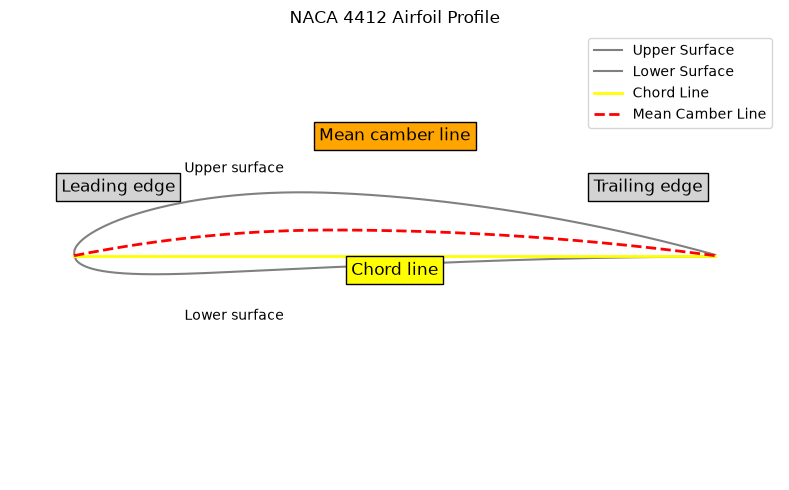

### Airfoil Design

When examining a typical airfoil, such as a wing viewed from the side, several design features stand out that play a significant role in the aircraft's aerodynamics and performance.

#### Camber and Surface Curvature
One of the most prominent characteristics is the difference in the **curvatures** (referred to as camber) of the upper and lower surfaces. The **upper surface camber** is typically more pronounced, meaning it has a greater curvature, while the **lower surface** is often relatively flat. This distinction between the upper and lower surfaces is crucial because it helps to create different airflow patterns, which contribute to generating lift.

#### Leading and Trailing Edges
The **Leading Edge** is the front part of the airfoil that first meets the airflow. It is rounded to help smooth the flow of air over the wing, reducing turbulence and drag. The **Trailing Edge**, on the other hand, is the rear part of the wing, which tapers to a narrow point. This tapered shape helps control the airflow as it exits the wing, further reducing drag and improving the aerodynamic efficiency of the wing.

#### Chord Line and Mean Camber Line
Two important reference lines are used to describe an airfoil’s shape. The **Chord Line** is a straight line connecting the **Leading Edge** and **Trailing Edge**. It serves as a baseline to measure the curvature of the wing. The distance from the chord line to the upper or lower surface at any point shows the magnitude of the camber at that point.

The **Mean Camber Line** is another reference line, which runs equidistant between the upper and lower surfaces of the airfoil. This line helps in determining the overall curvature of the wing, which affects how much lift the airfoil can generate. A greater distance between the mean camber line and the chord line often results in a higher lift capability.

#### Airfoil and Lift Generation
The unique shape of an airfoil is designed to exploit the behavior of air according to certain physical laws. Air passing over the curved upper surface moves faster than the air moving along the lower surface. This faster flow reduces the air pressure on top of the wing, while the slower-moving air underneath the wing creates a higher pressure area. Together, these pressure differences generate lift, the force that allows the airplane to rise off the ground.

- The **lower pressure above** and the **higher pressure below** the wing combine to lift the aircraft.
- **Newton’s Third Law** also contributes: the downward and backward deflection of airflow (known as **downwash**) produces an upward force on the wing.

#### Variability in Airfoil Designs
Different airfoils are optimized for different flight conditions. Thousands of airfoil shapes have been tested in wind tunnels and actual flights, but no single airfoil suits every flight requirement. For example, an airfoil with a **concave lower surface** can generate a lot of lift at low speeds but will reduce the aircraft's overall speed potential. On the other hand, a **streamlined airfoil** with minimal drag may not generate sufficient lift for takeoff at lower speeds. Hence, modern airfoils strike a balance between maximizing lift and minimizing drag.

#### Role of Angle of Attack
The **Angle of Attack** (AOA) is the angle between the **Chord Line** of the wing and the oncoming airflow. Adjusting this angle allows the wing to control the amount of lift generated. At higher angles of attack, more lift is produced due to the greater pressure differential between the upper and lower surfaces of the wing. However, if the angle of attack is too great, airflow can separate from the wing, leading to a **stall**, where lift dramatically decreases.

#### Wingtip Vortices and Winglets
While the two-dimensional view of a wing describes the lift generated by the upper and lower surfaces, a wing also has a three-dimensional effect at the wingtips. The **high-pressure air** from underneath the wing can curl around the tip to the **low-pressure air** on top, creating a swirling motion known as a **wingtip vortex**. This vortex reduces lift and increases drag, a phenomenon called **induced drag**.

To mitigate this, modern aircraft often incorporate **winglets**—small, upward or downward extensions at the wingtip. These devices help to block the swirling airflow, reducing the strength of the wingtip vortices and thereby improving the overall efficiency of the wing.

#### Symmetrical vs. Asymmetrical Airfoils
Most aircraft wings have asymmetrical airfoils, meaning the upper surface has more curvature than the lower surface, which maximizes lift. However, some aircraft, particularly those designed for high-speed flight or helicopters, use **symmetrical airfoils**, where the upper and lower surfaces are identical. In these cases, the lift is generated primarily through the angle of attack rather than through differences in surface curvature.

#### Center of Pressure and Aerodynamic Forces
The **Center of Pressure** is the point along the airfoil where the total sum of aerodynamic forces (lift and drag) acts. At different angles of attack, the center of pressure shifts:

- At **high angles of attack**, it moves forward.
- At **low angles of attack**, it moves aft.

This shift in the center of pressure is crucial for maintaining the aircraft’s balance and control during flight.

#### Related Scripts

- [Airfoil Angle of Attack](../../../../scripts/plots/airfoil_angle_attack/): draws a NACA 2412 airfoil pitched nose-up about its leading edge to several angles of attack, $10^\circ$ and $60^\circ$ by default, relative to a free stream flowing left to right.
- [NACA 4-Digit Airfoil Profile](../../../../scripts/plots/airfoil_profile/): draws an annotated NACA 4-digit airfoil profile (NACA 4412 by default) from its four-digit designation, labelling the leading edge, trailing edge, chord line and mean camber line.

#### Exercises

**Exercise 1.** A wing uses the NACA 2412 section with a chord of 1.5 m. In a NACA four-digit code the first digit is the maximum camber (% of chord), the second is its position (tenths of chord) and the last two are the maximum thickness (% of chord). Find the maximum distance between the mean camber line and the chord line, where it occurs, and the maximum thickness.

Answer

- Maximum camber: 2% of 1.5 m = 30 mm
- Its position: 40% of the chord, 0.6 m behind the leading edge
- Maximum thickness: 12% of the chord = 180 mm

A NACA 0012 of the same chord has the same thickness but a mean camber line that coincides with the chord line.

**Exercise 2.** Explain why a symmetrical airfoil produces no lift at zero angle of attack. Using the thin-airfoil result $c_l \approx 2\pi\alpha$ ($\alpha$ in radians), estimate its lift coefficient at $4^\circ$. Why do aerobatic aircraft often use symmetrical sections?

Answer

At zero angle of attack the upper and lower surfaces are mirror images, so the velocities and pressures on them are equal and the net force normal to the flow vanishes.

At $4^\circ = 0.0698$ rad, $c_l \approx 2\pi \times 0.0698 = 0.44$.

A symmetrical section behaves the same inverted as upright, so the aircraft can fly inverted with the same handling. A cambered section only mimics this at negative angles of attack, with lower maximum lift.

**Exercise 3.** A wing has aspect ratio $AR = 8$ and span efficiency $e = 0.80$ and flies at $C_L = 0.5$. Winglets raise the effective $e$ to 0.85. Using $C_{D_i} = C_L^2/(\pi e\,AR)$, find the induced drag coefficient before and after, and the percentage reduction.

Answer

- Before: $C_{D_i} = 0.25/(\pi \times 0.80 \times 8) = 0.0124$
- After: $C_{D_i} = 0.25/(\pi \times 0.85 \times 8) = 0.0117$

That is a reduction of about 5.9% in induced drag. By weakening the tip vortex, winglets act much like a modest increase in span, but they add weight and bending moment at the wing root.

**Exercise 4.** For a cambered airfoil the pitching moment about the aerodynamic center (at quarter chord) is $c_{m,ac} = -0.05$. The center of pressure lies at $x_{cp}/c = 0.25 - c_{m,ac}/c_l$. Find $x_{cp}$ at $c_l = 0.5$ and $c_l = 1.0$, and relate the result to the statement in these notes about how the center of pressure moves.

Answer

- At $c_l = 0.5$: $x_{cp}/c = 0.25 + 0.05/0.5 = 0.35$
- At $c_l = 1.0$: $x_{cp}/c = 0.25 + 0.05/1.0 = 0.30$

A larger angle of attack raises $c_l$ and moves the center of pressure forward, as the notes state. At small $c_l$ it moves far aft. Because the center of pressure moves, stability analyses use the fixed aerodynamic center and a constant $c_{m,ac}$ instead.

#### References

- Abbott, I. H., and von Doenhoff, A. E., *Theory of Wing Sections: Including a Summary of Airfoil Data*, Dover, 1959.
- Anderson, J. D., Jr., *Fundamentals of Aerodynamics*, 6th ed., McGraw-Hill Education, 2017.
- Federal Aviation Administration, *Pilot's Handbook of Aeronautical Knowledge*, FAA-H-8083-25B, 2016.
