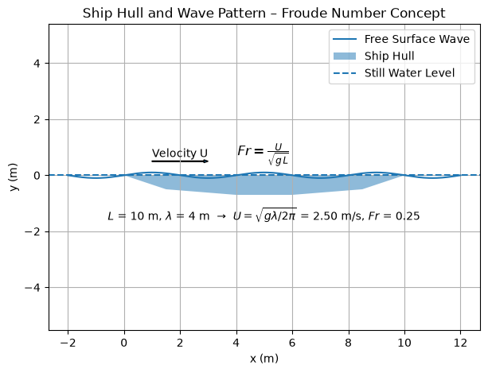

# Dimensional Analysis and Dimensionless Numbers

Dimensional analysis is a powerful tool in fluid mechanics that allows engineers and scientists to:
- Reduce the complexity of problems by identifying key dimensionless parameters
- Design scaled experiments and models
- Develop general correlations applicable across different scales and conditions
- Check the consistency of equations and identify missing physics

## Fundamental Dimensions

The fundamental dimensions in fluid mechanics are typically:

- **Length** $[L]$ - measured in meters, feet, etc.
- **Mass** $[M]$ - measured in kilograms, pounds, etc.  
- **Time** $[T]$ - measured in seconds
- **Temperature** $[\Theta]$ - measured in Kelvin, Celsius, etc.

Additional dimensions may include:
- **Electric current** $[I]$ - for electromagnetic phenomena
- **Amount of substance** $[N]$ - for chemical reactions

## Dimensional Consistency

Physical equations must be **dimensionally homogeneous** - all terms must have the same dimensions. This principle helps:
- Verify the correctness of derived equations
- Convert between unit systems
- Identify errors in analysis

### Example: Newton's Second Law

$$F = ma$$

Checking dimensions:
- Force: $[M L T^{-2}]$
- Mass × acceleration: $[M] \times [L T^{-2}] = [M L T^{-2}]$ ✓

## Buckingham Pi Theorem

**Statement**: If a physical relationship involves $n$ variables containing $k$ fundamental dimensions, then the relationship can be expressed in terms of $(n-k)$ dimensionless groups.

### Mathematical Formulation

For variables $q_1, q_2, ..., q_n$ with dimensions involving $k$ fundamental dimensions, there exist $(n-k)$ dimensionless groups $\pi_1, \pi_2, ..., \pi_{n-k}$ such that:

$$f(\pi_1, \pi_2, ..., \pi_{n-k}) = 0$$

### Procedure for Dimensional Analysis

1. **Identify variables**: List all relevant physical quantities
2. **Determine dimensions**: Express each variable in fundamental dimensions
3. **Count dimensions**: Identify number of fundamental dimensions $k$
4. **Form dimensionless groups**: Combine variables to create $(n-k)$ dimensionless parameters
5. **Verify**: Check that each group is indeed dimensionless

### Example: Drag on a Sphere

**Variables**:
- Drag force: $F_D$ $[M L T^{-2}]$
- Sphere diameter: $D$ $[L]$
- Fluid velocity: $V$ $[L T^{-1}]$
- Fluid density: $\rho$ $[M L^{-3}]$
- Fluid viscosity: $\mu$ $[M L^{-1} T^{-1}]$

**Analysis**: $n = 5$ variables, $k = 3$ dimensions → $(n-k) = 2$ dimensionless groups

**Result**:

$$\frac{F_D}{\rho V^2 D^2} = f\left(\frac{\rho V D}{\mu}\right)$$

This gives us the drag coefficient as a function of Reynolds number:

$$C_D = f(Re)$$

## Major Dimensionless Numbers in Fluid Mechanics

### Flow Dynamics

#### Reynolds Number (Re)

$$Re = \frac{\rho V L}{\mu} = \frac{V L}{\nu}$$

**Physical meaning**: Ratio of inertial forces to viscous forces

**Applications**:
- **Pipe flow**: $Re < 2300$ (laminar), $Re > 4000$ (turbulent)
- **External flow**: Transition around $Re \approx 5 \times 10^5$
- **Model scaling**: Matching $Re$ ensures dynamic similarity

#### Mach Number (Ma)

$$Ma = \frac{V}{a}$$

where $a = \sqrt{\gamma R T}$ is the speed of sound.

**Physical meaning**: Ratio of flow speed to sound speed

**Flow regimes**:
- $Ma < 0.3$: Incompressible flow
- $0.3 < Ma < 0.8$: Subsonic compressible
- $0.8 < Ma < 1.2$: Transonic
- $1.2 < Ma < 5$: Supersonic  
- $Ma > 5$: Hypersonic

#### Strouhal Number (St)

$$St = \frac{f L}{V}$$

**Physical meaning**: Ratio of unsteady to convective time scales

**Applications**:
- **Vortex shedding**: $St \approx 0.2$ for circular cylinders
- **Acoustic phenomena**: Characterizes oscillatory flows
- **Turbomachinery**: Blade passing frequencies

#### Froude Number (Fr)

$$Fr = \frac{V}{\sqrt{g L}}$$

**Physical meaning**: Ratio of inertial forces to gravitational forces

**Applications**:
- **Free surface flows**: Wave generation and propagation
- **Ship hydrodynamics**: Hull resistance and wake formation
- **Channel flow**: Critical flow conditions

### Heat Transfer

#### Prandtl Number (Pr)

$$Pr = \frac{\mu c_p}{k} = \frac{\nu}{\alpha}$$

**Physical meaning**: Ratio of momentum diffusivity to thermal diffusivity

**Typical values**:
- Air: $Pr \approx 0.7$
- Water: $Pr \approx 7$
- Oils: $Pr \approx 100-1000$
- Liquid metals: $Pr \approx 0.01$

#### Nusselt Number (Nu)

$$Nu = \frac{h L}{k}$$

**Physical meaning**: Ratio of convective to conductive heat transfer

**Applications**:
- Heat exchanger design
- Correlations: $Nu = f(Re, Pr, ...)$

#### Rayleigh Number (Ra)

$$Ra = \frac{g \beta \Delta T L^3}{\nu \alpha}$$

**Physical meaning**: Driving force for natural convection

**Critical values**: $Ra_c \approx 1708$ (horizontal layer)

#### Grashof Number (Gr)

$$Gr = \frac{g \beta \Delta T L^3}{\nu^2}$$

**Physical meaning**: Ratio of buoyancy to viscous forces

**Relationship**: $Ra = Gr \cdot Pr$

### Mass Transfer

#### Schmidt Number (Sc)

$$Sc = \frac{\nu}{D} = \frac{\mu}{\rho D}$$

**Physical meaning**: Ratio of momentum diffusivity to mass diffusivity

#### Sherwood Number (Sh)

$$Sh = \frac{k_m L}{D}$$

**Physical meaning**: Ratio of convective to diffusive mass transfer

#### Peclet Number (Pe)

$$Pe_{heat} = Re \cdot Pr = \frac{V L}{\alpha}$$

$$Pe_{mass} = Re \cdot Sc = \frac{V L}{D}$$

**Physical meaning**: Ratio of convective to diffusive transport

### Rotating Flows

#### Rossby Number (Ro)

$$Ro = \frac{V}{2 \Omega L}$$

**Physical meaning**: Ratio of inertial to Coriolis forces

**Applications**:
- Geophysical flows
- Rotating machinery
- Atmospheric and oceanic flows

#### Taylor Number (Ta)

$$Ta = \frac{4 \Omega^2 h^4}{\nu^2}$$

**Physical meaning**: Characterizes Taylor-Couette instability

### Compressible Flow

#### Knudsen Number (Kn)

$$Kn = \frac{\lambda}{L}$$

where $\lambda$ is the mean free path.

**Flow regimes**:
- $Kn < 0.01$: Continuum flow
- $0.01 < Kn < 0.1$: Slip flow
- $0.1 < Kn < 10$: Transition regime
- $Kn > 10$: Free molecular flow

#### Eckert Number (Ec)

$$Ec = \frac{V^2}{c_p \Delta T}$$

**Physical meaning**: Ratio of kinetic energy to thermal energy

### Multiphase Flows

#### Weber Number (We)

$$We = \frac{\rho V^2 L}{\sigma}$$

**Physical meaning**: Ratio of inertial forces to surface tension forces

**Applications**:
- Droplet formation and breakup
- Bubble dynamics
- Spray atomization

#### Capillary Number (Ca)

$$Ca = \frac{\mu V}{\sigma}$$

**Physical meaning**: Ratio of viscous forces to surface tension forces

#### Bond Number (Bo)

$$Bo = \frac{\rho g L^2}{\sigma}$$

**Physical meaning**: Ratio of gravitational forces to surface tension forces

### Turbulence

#### Turbulent Reynolds Number

$$Re_\tau = \frac{u_\tau \delta}{\nu}$$

where $u_\tau$ is friction velocity and $\delta$ is boundary layer thickness.

#### Richardson Number (Ri)

$$Ri = \frac{g \beta \frac{dT}{dz}}{(\frac{dU}{dz})^2}$$

**Physical meaning**: Ratio of buoyancy to shear effects in stratified flows

### Plasma Flows

#### Magnetic Reynolds Number (Re_m)

$$Re_m = \frac{\mu_0 \sigma V L}{1}$$

**Physical meaning**: Ratio of convective to diffusive magnetic effects

#### Hartmann Number (Ha)

$$Ha = B L \sqrt{\frac{\sigma}{\mu}}$$

**Physical meaning**: Ratio of magnetic to viscous forces

## Similarity and Scaling

### Dynamic Similarity

For complete dynamic similarity between model and prototype:
- **Geometric similarity**: Same shape, different size
- **Kinematic similarity**: Same velocity patterns
- **Dynamic similarity**: Same force ratios (dimensionless numbers)

### Scaling Laws

When dimensionless numbers are matched:

$$\left(\frac{F}{\rho V^2 L^2}\right)_{model} = \left(\frac{F}{\rho V^2 L^2}\right)_{prototype}$$

This allows force scaling:

$$F_{prototype} = F_{model} \times \frac{\rho_p V_p^2 L_p^2}{\rho_m V_m^2 L_m^2}$$

### Practical Scaling Considerations

#### Wind Tunnel Testing
- Match Reynolds number for viscous effects
- Match Mach number for compressibility effects
- Often impossible to match both simultaneously

#### Water Channel Testing
- Match Froude number for free surface effects
- Use different fluids to achieve appropriate scaling

#### Heat Transfer Scaling
- Match Reynolds and Prandtl numbers
- Scale temperature differences appropriately

## Applications in Engineering

### Aircraft Design
- **Wind tunnel testing**: Scale models with matched Re and Ma
- **Performance prediction**: Extrapolate to full-scale conditions
- **Optimization**: Use dimensionless correlations

### Automotive Engineering
- **Aerodynamic development**: Wind tunnel and road testing
- **Engine design**: Combustion and heat transfer scaling
- **Cooling systems**: Heat exchanger correlations

### Process Engineering
- **Heat exchanger design**: Nu = f(Re, Pr) correlations
- **Mixing processes**: Power number vs Reynolds number
- **Mass transfer**: Sh = f(Re, Sc) relationships

### Environmental Engineering
- **Atmospheric flows**: Richardson number for stability
- **Ocean currents**: Rossby number for rotation effects
- **Pollutant dispersion**: Peclet number for transport

## Historical Development

- **1914**: Buckingham formulated the Pi theorem
- **1883**: Reynolds established the Reynolds number
- **1904**: Prandtl introduced the Prandtl number
- **1908**: Nusselt developed heat transfer correlations
- **1915**: Froude number for ship hydrodynamics

## Modern Applications

### Computational Fluid Dynamics
- **Grid convergence**: Ensure numerical accuracy
- **Validation**: Compare with experimental correlations
- **Model development**: Use dimensionless formulations

### Experimental Design
- **Parameter studies**: Vary dimensionless numbers systematically
- **Data correlation**: Collapse data using appropriate scaling
- **Model testing**: Achieve dynamic similarity

Understanding dimensional analysis and dimensionless numbers is fundamental to fluid mechanics and enables engineers to design efficient experiments, develop general correlations, and scale results across different conditions and applications.

```
Inertial forces     ~ ρ U^2
Viscous forces      ~ μ (dU/dy) 
So,  Re ~ (ρ U L) / μ

If Re < ~2300 in a pipe => laminar
If Re >> 4000 => turbulent
```

#### Mach Number $(Ma)$

$$Ma = \frac{U}{c}$$

where:

- $U$ is the characteristic velocity of the flow (e.g., the speed of an aircraft),  
- $c$ is the speed of sound in the medium.
- Ratio of **flow velocity** to **speed of sound**.
- $Ma < 1$ $\rightarrow$ subsonic flow.  
- $Ma \approx 1$ $\rightarrow$ transonic regime.  
- $Ma > 1$ $\rightarrow$ supersonic flow.  
- $Ma \gg 1$ $\rightarrow$ hypersonic flow.  
- Aeronautics, rockets, high-speed turbines, nozzle design, shock waves, compressibility effects.

#### Froude Number $(Fr)$

$$Fr = \frac{U}{\sqrt{g L}}$$

where:

- $U$ is the characteristic flow velocity,  
- $g$ is gravitational acceleration,  
- $L$ is a characteristic length scale (e.g., ship hull length).
- Ratio of **inertial forces** to **gravitational forces**.
- Governs waves, free-surface flows, boat hull design.  
- Low $Fr$ $\rightarrow$ wave-making less significant, or “displacement” regime in ships.  
- High $Fr$ $\rightarrow$ planing hull regime, strong wave formation.  
- Ship hydrodynamics, open-channel flows, wave basins for maritime design.

Ship hull in water:




Waves form along hull. The severity of wave drag depends on $Fr = \frac{U}{\sqrt{g L}}$.


#### Weber Number $(We)$

$$We = \frac{\rho \, U^2 \, L}{\sigma},$$

where:

- $\sigma$ is surface tension,
- $\rho$ fluid density,
- $U$ velocity,
- $L$ length scale (e.g., droplet radius).
- Ratio of **inertial forces** to **surface tension** forces.
- Large $We$ $\rightarrow$ droplet breakup, atomization (in sprays).  
- Small $We$ $\rightarrow$ surface tension dominates (stable droplets).  
- Inkjet printing, droplet formation, fluid atomizers, multiphase flows.

#### Bond Number $(Bo)$

$$Bo = \frac{\rho \, g \, L^2}{\sigma},$$

- Ratio of **gravitational forces** to **surface tension** forces.
- High $Bo$ $\rightarrow$ gravitational effects dominate, big droplets flatten out.  
- Low $Bo$ $\rightarrow$ surface tension forms near-spherical shapes.  
- Bubble/droplet shapes, capillary rise, wetting phenomena.

#### Strouhal Number $(St)$

$$St = \frac{f \, L}{U},$$

where:

- $f$ is a characteristic frequency of oscillation (e.g., vortex shedding),
- $U$ is flow velocity,
- $L$ is characteristic length (e.g., cylinder diameter).
- Ratio of **inertial convection time** scale to **oscillation period**.
- Predicts unsteady phenomena like vortex shedding frequency behind bluff bodies.
- Wind turbine blade design, flow-induced vibrations, resonance in pipelines.

### Similarity and Model Testing

- To replicate **aerodynamic** phenomena in a wind tunnel, match **Re**, possibly **Ma** if compressibility is relevant.
- To replicate **ship hydrodynamics**, match **Fr** so wave behavior is consistent between model and full-sized vessel.

| **Scale Model (smaller)**                                   | **Real Object (full-scale)**                                      |
|-------------------------------------------------------------|-------------------------------------------------------------------|
| $\mathrm{Re}_{model} = \mathrm{Re}_{full}$                  | $\displaystyle \frac{\rho\, U\, L_{model}}{\mu} = \frac{\rho\, U\, L_{full}}{\mu}$  |
| $\mathrm{Ma}_{model} = \mathrm{Ma}_{full}$                  | $\displaystyle \frac{U_{model}}{c_{model}} = \frac{U_{full}}{c_{full}}$                |
| ...                                                         | ...                                                               |

If these dimensionless #s match => Flow physics in the model should mimic the real system.

### Example: A Wind Tunnel Test

Conducting a wind tunnel test is a critical step in evaluating and refining a new airplane wing design, especially within a controlled subsonic environment. This example outlines the systematic approach to performing such a test, emphasizing the importance of dimensionless numbers, geometric scaling, data collection, and extrapolation to real-world applications.

**I. Identify Relevant Dimensionless Numbers**

Dimensionless numbers play a pivotal role in ensuring that the wind tunnel test accurately replicates real-world aerodynamic conditions. The first critical dimensionless number to consider is the Reynolds number, defined as $Re = \frac{\rho U D}{\mu}$, where $\rho$ is the fluid density, $U$ is the flow velocity, $D$ is a characteristic length (such as wing chord), and $\mu$ is the dynamic viscosity of the fluid. A sufficiently high Reynolds number is essential to capture transitional or turbulent boundary-layer effects, which are crucial for understanding airflow behavior over the wing surface.

The second important dimensionless number is the Mach number, given by $Ma = \frac{U}{c}$, where $c$ is the speed of sound in the fluid. For instance, if the target flight Mach number is approximately 0.3, the wind tunnel must operate at a speed that achieves the same Mach number to account for compressibility effects. This ensures that the aerodynamic characteristics observed in the wind tunnel are representative of those that the wing would experience during actual flight.

**II. Scale the Geometry**

Scaling the geometry of the wing is a fundamental aspect of wind tunnel testing. Typically, the wing chord—the distance from the leading edge to the trailing edge of the wing—is scaled down to fit within the wind tunnel's dimensions. However, maintaining geometric similarity alone is insufficient for accurate aerodynamic predictions. It is imperative to preserve key dimensionless numbers such as Reynolds and Mach numbers.

Achieving both Reynolds and Mach numbers identical to full-scale conditions can be challenging due to physical and operational constraints of the wind tunnel. In cases where it is impossible to match both simultaneously, engineers must prioritize. For example, if compressibility effects are significant at the target Mach number, maintaining the Mach number might take precedence over the Reynolds number to ensure accurate representation of airflow characteristics. Conversely, if boundary-layer behavior is more critical, matching the Reynolds number would be prioritized to capture viscous effects accurately.

**III. Collect Aerodynamic Data (Lift, Drag, etc.)**

Once the geometric scaling and dimensionless parameters are established, the next step involves collecting comprehensive aerodynamic data. Key performance metrics such as lift and drag coefficients ($C_L$ and $C_D$) are measured using force balances and pressure sensors within the wind tunnel. Additionally, flow visualization techniques like smoke or dye injection may be employed to observe airflow patterns, boundary-layer development, and potential separation points on the wing surface.

Accurate data collection is essential for validating the wing design and identifying areas for improvement. By systematically varying wind tunnel conditions and observing the resulting aerodynamic responses, engineers can gain insights into the wing's performance under different flight scenarios. This data serves as the foundation for further analysis and optimization.

**IV. Extrapolate to Full Scale Using Dimensionless Coefficients (e.g., Lift Coefficient $C_L$, Drag Coefficient $C_D$)**

The ultimate goal of wind tunnel testing is to predict the aerodynamic performance of the full-scale wing based on the scaled model's data. Dimensionless coefficients such as the lift coefficient ($C_L$) and drag coefficient ($C_D$) facilitate this extrapolation. These coefficients normalize the aerodynamic forces, making them independent of the specific scale of the model and the test conditions.

### Steps for Dimensional Analysis

Dimensional analysis is a systematic method used to understand the relationships between different physical quantities by analyzing their dimensions. The following steps outline a structured approach to conducting dimensional analysis, particularly relevant in fluid mechanics and aerodynamic studies.

**I. List Variables**

The first step in dimensional analysis is to identify all the relevant physical quantities that influence the phenomenon under study. For a wind tunnel test of an airplane wing, variables might include:

| **Parameter** | **Definition**                                                                              |
|---------------|---------------------------------------------------------------------------------------------|
| $U$         | Velocity: The speed of the airflow relative to the wing.                                    |
| $\rho$      | Density: The mass per unit volume of the air.                                               |
| $\mu$       | Viscosity: A measure of the fluid's resistance to deformation.                              |
| $L$         | Length Scale: Characteristic dimensions of the wing, such as chord length or wingspan.      |
| $F$         | Force: Lift and drag forces acting on the wing.                                             |
| $P$         | Pressure: Air pressure acting on the wing surfaces.                                         |
| $T$         | Temperature: Ambient temperature affecting air properties.                                  |
| $c$         | Speed of Sound: Relevant for calculating Mach number.                                       |

Identifying these variables is crucial as it lays the groundwork for determining the fundamental dimensionless groups that govern the system's behavior.

**II. Count Dimensions**

Each physical quantity can be expressed in terms of fundamental dimensions, typically length $[L]$, mass $[M]$, and time $[T]$. For fluid mechanics problems, these three dimensions usually suffice. For example:

| **Parameter** | **Dimension**          |
|---------------|------------------------|
| $U$         | $[L, T^{-1}]$       |
| $\rho$      | $[M, L^{-3}]$       |
| $\mu$       | $[M, L^{-1}, T^{-1}]$|
| $F$         | $[M, L, T^{-2}]$    |
| $P$         | $[M, L^{-1}, T^{-2}]$|

Counting and categorizing the dimensions of each variable is essential for applying the Buckingham $\pi$-Theorem effectively.

**III. Apply Buckingham $\pi$-Theorem**

The Buckingham $\pi$-Theorem provides a foundation for reducing the complexity of physical problems by eliminating dimensional variables. The theorem states that if there are $n$ variables in a problem, and these variables involve $k$ fundamental dimensions, then the problem can be described using $(n - k)$ independent dimensionless groups.

For instance, in our wind tunnel test example:

- **Number of Variables ($n$)**: Suppose we have 6 variables ($U, \rho, \mu, L, F, P$).
- **Number of Fundamental Dimensions ($k$)**: 3 ($[L], [M], [T]$).

According to the theorem, we can expect $(6 - 3) = 3$ dimensionless groups. Identifying these groups helps in simplifying the analysis and focusing on the essential aspects that influence the system's behavior.

**IV. Form $\pi$-Groups**

Once the dimensionless groups are determined, the next step is to construct them by combining the original variables in a way that eliminates the fundamental dimensions. A common example in fluid mechanics is the Reynolds number ($Re$):

$$Re = \frac{\rho U L}{\mu}$$

This dimensionless group represents the ratio of inertial forces to viscous forces and is critical in predicting flow regimes (laminar or turbulent). Other relevant dimensionless numbers might include the Mach number ($Ma = \frac{U}{c}$) and the Strouhal number ($St = \frac{f L}{U}$), where $f$ is the frequency of vortex shedding.

**V. Interpret**

Each $\pi$-group carries physical significance, encapsulating the relationships between different forces, timescales, and energy balances within the system. For example:

- The *Reynolds Number (Re)* indicates the relative importance of inertial versus viscous forces, with high values suggesting turbulent flow and low values pointing to laminar flow.
- The *Mach Number (Ma)* represents the ratio of an object's speed to the speed of sound, providing insight into the effects of compressibility in the flow.
- The *Strouhal Number (St)* relates oscillatory flow phenomena to the flow velocity and a characteristic length, making it useful for studying vortex shedding and oscillations.

Understanding these interpretations allows engineers to predict and control aerodynamic behaviors effectively.

**VI. Use**

The final step involves applying the dimensionless groups to conduct experiments or simulations that are generalizable across different scales and conditions. By focusing on these dimensionless parameters, results obtained from scaled-down models or specific test conditions can be extrapolated to predict full-scale behavior accurately. This approach ensures that findings are not limited by the scale of the experiment but are applicable to a broader range of real-world scenarios.

### Practical Implications Across Industries

Dimensional analysis and the application of dimensionless numbers have far-reaching implications across various industries. These principles enable engineers and scientists to design, test, and optimize systems efficiently by focusing on the fundamental relationships governing their behavior.

**I. Aerospace**

In the aerospace industry, dimensionless numbers such as the Mach number ($Ma$), Reynolds number ($Re$), and Strouhal number ($St$) are integral to the design and testing of aircraft and spacecraft. The Mach number is crucial in designing airfoils and wings for supersonic fighters, ensuring that compressibility effects are appropriately accounted for at high speeds. The Reynolds number influences boundary-layer design, affecting drag and lift characteristics. The Strouhal number is relevant in studying vortex-induced vibrations, which can impact the structural integrity of re-entry vehicles.

Designing airfoils involves optimizing these dimensionless numbers to achieve desired performance characteristics, such as minimizing drag while maximizing lift. Additionally, during the testing phase, wind tunnel experiments rely on maintaining similarity in these dimensionless parameters to ensure that scaled models accurately represent full-scale behavior.

**II. Marine & Offshore**

In marine and offshore engineering, dimensionless numbers like the Froude number ($Fr$) and Reynolds number ($Re$) are essential for understanding wave-making resistance and viscous effects on ships and submarines. The Froude number relates the ship's speed to the gravitational wave-making forces, influencing hull design to minimize wave resistance and enhance fuel efficiency. The Reynolds number affects the boundary-layer development on the hull, impacting drag and overall maneuverability.

Scale-model tests are commonly conducted using these dimensionless numbers to predict the performance of full-scale vessels. For example, ocean platforms and offshore structures are tested in wave tanks to simulate real sea conditions, ensuring stability and structural integrity under various operational scenarios.

**III. Chemical Process**

In the chemical processing industry, dimensionless numbers such as the Reynolds number ($Re$), Weber number ($We$), and Damköhler number ($Da$) are pivotal in reactor design and operation. The Reynolds number governs the flow regime within reactor tubes or pipelines, influencing mixing and reaction rates. The Weber number characterizes droplet breakup in spray reactors, essential for processes like emulsification and aerosol generation. The Damköhler number compares chemical reaction rates to flow rates, determining the extent of reaction and reactor sizing.

Understanding these dimensionless numbers allows chemical engineers to design efficient reactors, optimize reaction conditions, and scale processes from laboratory to industrial scales. By focusing on these fundamental parameters, processes can be made more reliable, cost-effective, and scalable.

**IV. Automotive**

In the automotive industry, wind tunnel testing is a standard practice for evaluating vehicle aerodynamics. Dimensionless numbers such as the Reynolds number ($Re$) and, in some cases, the Mach number ($Ma$) are used to simulate airflow over vehicle bodies. Maintaining appropriate Reynolds numbers ensures that the flow characteristics around the vehicle are accurately represented, influencing drag and fuel efficiency.

Moreover, dimensionless aerodynamic coefficients like the lift coefficient ($C_L$) and drag coefficient ($C_D$) are used in shape optimization processes. By iterating on vehicle designs and evaluating these coefficients, engineers can enhance aerodynamic performance, reduce drag, and improve overall vehicle stability and handling. These optimizations contribute to better fuel economy and reduced environmental impact.

**V. Civil Engineering**

In civil engineering, dimensionless numbers are vital in the design and analysis of large structures subjected to wind and water flows. For instance, the Froude number ($Fr$) is used in open-channel flow studies, such as designing dam spillways and controlling water flow in canals. It relates the flow velocity to the gravitational wave-making forces, aiding in predicting wave heights and flow patterns.

Similarly, the Reynolds number ($Re$) and Strouhal number ($St$) are applied in assessing wind loading on tall buildings and understanding vortex-induced vibrations that can affect structural integrity. By using these dimensionless numbers, civil engineers can design structures that withstand aerodynamic forces, ensuring safety and longevity. Additionally, they enable the scaling of physical models used in wind tunnels and water flumes to predict the behavior of full-scale structures accurately.

### Common Pitfalls

- If Mach number ~0.3 or below, compressibility might be minor. Otherwise, Mach effects matter.
- High Reynolds might indicate viscosity has lesser global impact, but local boundary-layer phenomena are still crucial.
- Real flows can involve *Re, Ma, We, Fr,* etc. Deciding which to match in an experiment is often a design compromise.
- Scaling length can inadvertently scale gravitational or surface tension effects differently (Froude or Weber mismatches).
- Ensure measuring instruments can capture relevant frequencies or speeds. E.g., achieving full-scale Reynolds might require high-speed or high-density flows (cryogenic wind tunnels for aircraft models).

## Related Scripts

- [Froude Number vs. Flow Velocity](../../scripts/plots/froude_number/): plots the length-based Froude number $Fr = U/\sqrt{gL}$ against speed for hulls of 5, 10, 15, and 20 m, with reference lines at hull speed and at the approximate start of planing.
- [Ship Hull in Water](../../scripts/plots/ship_hull_in_water/): draws a side-view sketch of a ship hull sitting in a sinusoidal free-surface wave and annotates it with the Froude number $Fr = U/\sqrt{gL}$.

## Exercises

**Exercise 1.** A water main carries water at $V = 0.1$ m/s through a pipe of diameter $D = 0.02$ m, and a car travels at $V = 30$ m/s with length $L = 4$ m. Using $\nu = 1.0 \times 10^{-6}$ m²/s for water and $\nu = 1.5 \times 10^{-5}$ m²/s for air, compute both Reynolds numbers and classify the pipe flow.

<details>
<summary>Answer</summary>

$Re = VL/\nu$.

- Pipe: $Re = (0.1)(0.02)/(1.0 \times 10^{-6}) = 2000$. This is below 2300, so the flow is laminar.
- Car: $Re = (30)(4)/(1.5 \times 10^{-5}) = 8 \times 10^6$. Inertia dominates overall, although thin viscous boundary layers still matter at the body surface.

</details>

**Exercise 2.** The pressure drop $\Delta p$ over a length $L$ of a rough pipe depends on $\rho$, $V$, $D$, $\mu$, $L$ and the wall roughness height $\varepsilon$. Use the Buckingham Pi theorem to find how many dimensionless groups describe the problem, and write a suitable set.

<details>
<summary>Answer</summary>

There are $n = 7$ variables ($\Delta p, \rho, V, D, \mu, L, \varepsilon$) and $k = 3$ fundamental dimensions ($M, L, T$), so there are $n - k = 4$ groups. Taking $\rho$, $V$ and $D$ as repeating variables:

$$\frac{\Delta p}{\rho V^2} = f\left(\frac{\rho V D}{\mu}, \frac{L}{D}, \frac{\varepsilon}{D}\right)$$

that is, a pressure coefficient as a function of $Re$, the length ratio and the relative roughness. Because $\Delta p$ grows in proportion to $L$ in fully developed flow, this reduces to the Darcy form $\Delta p/(\rho V^2) = (L/D)\, \phi(Re, \varepsilon/D)$.

</details>

**Exercise 3.** A cylinder of diameter $D = 0.05$ m sits in a wind of $U = 10$ m/s. Taking $St \approx 0.2$, estimate the vortex-shedding frequency.

<details>
<summary>Answer</summary>

$f = St\, U / D = 0.2 \times 10 / 0.05 = 40$ Hz.

</details>

**Exercise 4.** A ship of length $L_p = 100$ m sails at $V_p = 10$ m/s. A 1:25 scale model ($L_m = 4$ m) is tested in a towing tank with water. (a) What model speed matches the Froude number? (b) What is the ratio $Re_m / Re_p$ at that speed, and what does it imply?

<details>
<summary>Answer</summary>

(a) Matching $Fr = V/\sqrt{gL}$ gives $V_m = V_p \sqrt{L_m/L_p} = 10\sqrt{4/100} = 2$ m/s.

(b) With the same water in both cases,

$$\frac{Re_m}{Re_p} = \frac{V_m L_m}{V_p L_p} = \frac{2 \times 4}{10 \times 100} = 0.008 = \frac{1}{125}$$

The model Reynolds number is 125 times too small, so Froude and Reynolds similarity cannot both hold. In practice wave resistance is scaled with $Fr$, and friction drag is corrected separately using a skin-friction correlation.

</details>

**Exercise 5.** A 1:10 scale model of a car is tested in the same air as the full-size car, which travels at $V_p = 20$ m/s. (a) What tunnel speed matches the Reynolds number? (b) Is that speed acceptable if $a = 343$ m/s? (c) With $Re$ matched, how does the prototype drag compare with the measured model drag?

<details>
<summary>Answer</summary>

(a) Same fluid, so $V_m L_m = V_p L_p$ and $V_m = 10 V_p = 200$ m/s.

(b) $Ma = 200/343 = 0.58$. That is well above 0.3, so compressibility effects would appear in the model but not in the prototype ($Ma = 0.06$). Matching $Re$ and $Ma$ at the same time is impossible here, which is why pressurized or cryogenic tunnels are used.

(c) Using the scaling law from the note,

$$F_p = F_m \frac{\rho_p V_p^2 L_p^2}{\rho_m V_m^2 L_m^2} = F_m \frac{20^2 \times 10^2}{200^2 \times 1^2} = F_m$$

With $\rho$ and $\mu$ unchanged and $VL$ held fixed, the drag force is the same on the model and on the prototype.

</details>

## References

- E. Buckingham, "On physically similar systems; illustrations of the use of dimensional equations", *Physical Review* 4(4), 345–376, 1914.
- G. I. Barenblatt, *Scaling, Self-Similarity, and Intermediate Asymptotics*, Cambridge University Press, 1996.
- F. M. White, *Fluid Mechanics*, 8th ed., McGraw-Hill Education, 2016.
- B. R. Munson, D. F. Young, T. H. Okiishi, W. W. Huebsch, *Fundamentals of Fluid Mechanics*, 6th ed., Wiley, 2009.
