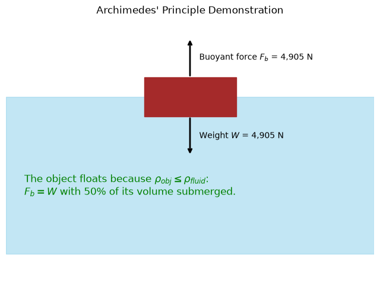

## Hydrostatics

**Hydrostatics** concerns itself with fluids at rest, focusing on how **pressure** and **forces** distribute in a fluid that is stationary (no flow, no shear). This foundational part of fluid mechanics explains everyday observations—like the fact that **pressure increases with depth** in a pool—and underpins the design of dams, submarines, and hydraulic systems.

### Equilibrium in a Static Fluid

When a fluid is at rest:

- There is **no velocity** field to track.
- All fluid parcels experience **no net acceleration**.  
- Gravitational forces are balanced by **pressure gradients** (and possibly other body forces, if present).

### Variation with Depth

Consider a fluid of **constant density** $\rho$ at rest under gravity $g$. Let $z$ be the vertical coordinate (positive upward). The fluid is taken to have a **free surface** at $z = 0$ with pressure $p_0$ (often atmospheric).

#### Governing Equation

From static equilibrium, the **hydrostatic equation** arises:

$$\frac{dp}{dz} = -\rho g.$$

Integrating from $z=0$ (where $p = p_0$) down to depth $z = -h$, we get:

$$p = p_0 + \rho g h.$$

Thus, at depth $h$ below the free surface, the pressure exceeds the surface pressure by $\rho g h$.

Pressure in a Tank:

```
Free surface (z=0)
  ~~~~~~~~~~~~~ p = p_0
       |
       |  (increasing depth -> h)
       V
  p = p_0 + ρ g h
```

- As depth **increases**, pressure **increases** linearly.
* Each **10 m** depth of water adds roughly **1 atmosphere** of pressure ($\approx 101{,}325 \text{ Pa}$).

### Forces on Submerged Surfaces

When a surface (like a dam wall or plate) is submerged, the fluid pressure **pushes** on it. Because **pressure acts normal** to surfaces in static fluids, we sum or integrate this pressure over the entire area to find the total force.

#### Vertical or Horizontal Plates


**Horizontal plate:** the pressure is the **same** across it (assuming negligible fluid density changes), simplifying force calculations to $F = p \times A$.


**Vertical (or inclined) plate:** pressure **varies with depth**, so the force must be found via integration:

$$F = \int_{A} p \, dA.$$

#### Example: Vertical Rectangular Plate

```
Water
~~~~~~ free surface
 | 
 | depth h1
 | ------ top of plate
 | |    |
 | |    |
 | ------ bottom of plate
 | depth h2
 V
```

- Width of plate = $b$ (into the page).  
- Extends from depth $h_1$ to $h_2$.  
- Pressure at any depth $h$ = $p(h) = p_0 + \rho g h$ 

$$dF = (p_0 + \rho g h) \cdot b dh$$

Taking $p_0$ as atmospheric pressure, which also acts on the dry side of the plate and cancels, only the gauge pressure $\rho g h$ contributes:

$$F = \int_{h_1}^{h_2} \rho g h \, b \, dh$$

$$F = \rho g b \left[\frac{h^2}{2}\right]_{h_1}^{h_2}$$

$$F = \rho g b \frac{(h_2^2 - h_1^2)}{2}$$

#### Center of Pressure

Since the fluid pressure **increases with depth**, the resultant force is not at the geometric center of the plate, but at a point **deeper**, known as the **center of pressure**. Locating this point requires moment balance about a reference axis.

### Buoyancy and Archimedes’ Principle

**Buoyancy** is the net **upward** force a fluid exerts on a submerged (or partially submerged) object, arising because **pressure at the bottom** of the object is higher than **pressure at the top**.

#### Archimedes’ Principle

> *The buoyant force on a body is equal to the weight of the fluid it displaces.*

$$F_b = \rho_{\text{fluid}} g V$$



- Compare with the object’s weight $W = \rho_{\text{object}} \cdot g \cdot V$.  
- If $\rho_{\text{object}} < \rho_{\text{fluid}}$, it **floats**.  
- If $\rho_{\text{object}} > \rho_{\text{fluid}}$, it **sinks**.  
- If densities match, it is **neutrally buoyant**.

### Stability of Floating Bodies

Beyond buoyancy, **stability** addresses whether a floating body will **return** to equilibrium when tilted or disturbed.

- **Center of gravity (G)**: where an object’s mass is concentrated.
- **Center of buoyancy (B)**: the centroid of the displaced fluid volume.

When the body tilts, **B** may shift. If **B** moves in such a way that a **restoring moment** forms (i.e., tries to push the body upright), the body is stable.

##### Metacentric Height

For many ship-like objects, we analyze stability via the **metacentric height (GM)**:

- A large positive $GM$ implies strong stability.  
- A small or negative $GM$ means the object can easily tip or capsize.

### Hydrostatics Applications

I. **Dams & Retaining Walls**  

- Must handle large lateral forces from water.  
- Structural design relies on the integrated force distribution and center of pressure.

II. **Submarines & ROVs**  

- Operate by adjusting **buoyancy** to dive or surface.  
- Hulls must withstand high external pressures at depth.

III. **Ships & Floating Vessels**  

- Must maintain suitable **stability** and **draft**.  
- Designers ensure that under loading conditions, the vessel floats safely without capsizing.

IV. **Hydraulic Systems**  

- Static fluid columns transmit force (e.g., car brakes, lifts).  
- Pressure differences $\Delta p = \rho g \Delta h$ are used to create mechanical advantages.

### Related Scripts

- [Archimedes' Principle Visualisation](../../../scripts/plots/archimedes_principle/): draws a block in a tank of fluid with its weight and buoyant force shown as arrows, and states whether the block floats or sinks according to Archimedes' principle.
- [Pressure Variation with Depth](../../../scripts/plots/pressure_variation_with_depth/): plots how hydrostatic pressure increases linearly with depth below the free surface of a fluid at rest.

### Exercises

**Exercise 1.** Estimate the gauge pressure at the bottom of the Mariana Trench (depth $h \approx 11000$ m), treating seawater as incompressible with $\rho = 1025$ kg/m³ and $g = 9.81$ m/s². Express it in atmospheres as well.

<details>
<summary>Answer</summary>

$p - p_0 = \rho g h = 1025 \times 9.81 \times 11000 = 1.106 \times 10^8$ Pa. That is about 110.6 MPa, or roughly 1090 atm.

In reality compressibility makes the water slightly denser at depth, so the true value is a little higher.

</details>

**Exercise 2.** A vertical rectangular gate of width $b = 2$ m spans depths $h_1 = 1$ m to $h_2 = 3$ m in water ($\rho = 1000$ kg/m³). Find the resultant hydrostatic force (gauge pressure) and the depth of the center of pressure.

<details>
<summary>Answer</summary>

Force:

$$F = \rho g b \frac{h_2^2 - h_1^2}{2} = 1000 \times 9.81 \times 2 \times \frac{9 - 1}{2} = 78480 \text{ N}$$

Center of pressure, from the moment balance:

$$h_{cp} = \frac{\int_{h_1}^{h_2} h \, (\rho g h) \, b \, dh}{\int_{h_1}^{h_2} \rho g h \, b \, dh} = \frac{2}{3}\frac{h_2^3 - h_1^3}{h_2^2 - h_1^2} = \frac{2}{3}\cdot\frac{26}{8} = 2.167 \text{ m}$$

This is below the centroid at 2 m, as expected.

</details>

**Exercise 3.** An iceberg ($\rho_{ice} = 917$ kg/m³) floats in seawater ($\rho = 1025$ kg/m³). What fraction of its volume is below the waterline?

<details>
<summary>Answer</summary>

At equilibrium the weight equals the buoyant force: $\rho_{ice} g V = \rho_{sw} g V_{sub}$. So $V_{sub}/V = 917/1025 = 0.895$.

About 89.5% of the iceberg is submerged and only 10.5% shows above the surface.

</details>

**Exercise 4.** A rectangular barge is 20 m long, 6 m wide, floats at a draft of 1.5 m, and has its center of gravity 2.0 m above the keel. Using $GM = KB + BM - KG$ with $BM = I/V$, where $I$ is the second moment of the waterplane area about the longitudinal axis and $V$ the displaced volume, find the metacentric height and decide whether the barge is stable in roll.

<details>
<summary>Answer</summary>

- $KB$: the center of buoyancy is at half the draft, $KB = 0.75$ m.
- $BM = \dfrac{L B^3/12}{L B d} = \dfrac{B^2}{12 d} = \dfrac{36}{18} = 2.0$ m.
- $GM = 0.75 + 2.0 - 2.0 = 0.75$ m.

$GM > 0$, so the barge is stable. Raising the cargo so that $KG$ exceeds 2.75 m would make $GM$ negative and the barge would capsize.

</details>

### References

- B. R. Munson, D. F. Young, T. H. Okiishi, W. W. Huebsch, *Fundamentals of Fluid Mechanics*, 6th ed., Wiley, 2009.
- F. M. White, *Fluid Mechanics*, 8th ed., McGraw-Hill Education, 2016.
- K. J. Rawson, E. C. Tupper, *Basic Ship Theory*, 5th ed., Butterworth-Heinemann, 2001.
