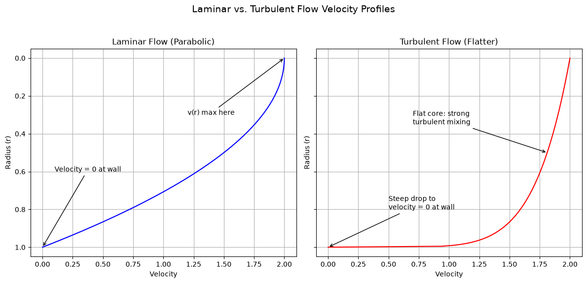
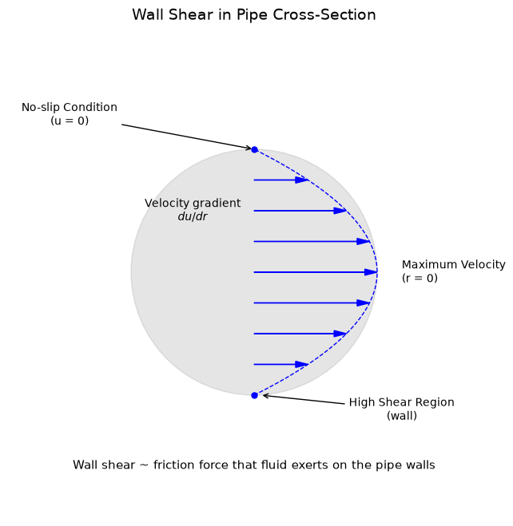

## Pipe Flow

Pipes are ubiquitous in industrial and municipal infrastructure, serving to **transport fluids** (liquids or gases) efficiently. Whether delivering drinking water to homes, carrying chemical reagents in manufacturing plants, or pumping oil across continents, the physics of **flow in pipes** underpins cost-effectiveness, safety, and reliability.

- The flow regime is determined by calculating the Reynolds number, which indicates if the flow is **laminar** or exhibits turbulent behavior.
- Pressure losses are computed using formulas like the Darcy-Weisbach equation, where energy loss is mainly attributed to **friction**.
- Wall shear stress is estimated by measuring the force per unit area on the pipe wall, with the effects of **shear** forces informing material choices.
- System requirements are defined by evaluating the desired flow rate, available pressure, and pumping energy, while the **flow** rate is used to size the system components.

### Flow Rate and Velocity Profile

#### Flow Rate $(Q)$

The volumetric flow rate $Q$ is given by:

$$Q = A \, V_{\text{avg}},$$

where:

- $A$ = cross-sectional area of the pipe ($\pi D^2/4$ for a circular pipe of diameter $D$).  
- $V_{\text{avg}}$ = average fluid velocity through the cross section.


In **practical design**, engineers pick a pipe diameter and desired flow velocity range to meet a target flow rate $Q$. For example, a chemical plant might specify $Q$ precisely to ensure reactants arrive at the correct ratio.

#### Velocity Profile

Because of **viscous effects** and the **no-slip condition** at the pipe wall, fluid velocity is **zero at the wall** and **maximum at the center**. This distribution depends heavily on the flow regime:

**Laminar flow:** smooth, orderly layers. Velocity profile is **parabolic**:

$$v(r) = v_{\text{max}} \left(1 - \left(\frac{r}{R}\right)^2\right),$$

where $r$ is the radial distance from the center and $R$ is the pipe radius.  

**Turbulent flow:** chaotic eddies and mixing. The velocity profile is **flatter** in the core, with steep gradients near the wall.

Here is the plot comparing Laminar vs. Turbulent Flow Velocity Profiles:



- The velocity profile in laminar flow is parabolic, with maximum speed at the center and zero speed at the pipe wall due to the no-slip condition, resulting in a **parabolic** distribution.
- The velocity profile in turbulent flow is flatter, showing a more uniform core with sharp drops near the walls because of mixing effects, leading to a **flatter** profile.

### Flow Regimes and Reynolds Number

The **Reynolds number** $(Re)$ helps classify flow as laminar or turbulent:

$$Re = \frac{\rho \, V_{\text{avg}} \, D}{\mu},$$

- $\rho$: fluid density
- $V_{\text{avg}}$: average velocity
- $D$: pipe diameter
- $\mu$: dynamic viscosity
- Laminar: $Re \lesssim 2{,}300$. Flow is smooth and orderly.
- Transitional: $2{,}300 \lesssim Re \lesssim 4{,}000$.
- Turbulent: $Re \gtrsim 4{,}000$. Flow is chaotic with eddies.

**Turbulent flow** is common in large pipes or high-velocity scenarios, while **laminar flow** is typical in microfluidics or very viscous fluids moving slowly.

### Wall Shear Stress ($\tau_w$)

$$\tau_w = -\mu \left.\frac{dv}{dr}\right|_{r=R} \quad (\text{laminar}),$$

but is more often related to the **pressure drop** via engineering correlations.

- Frictional losses increase when wall shear stress is high, resulting in a greater pressure drop that is notable in fluid systems.
- Material wear accelerates on surfaces experiencing high shear, particularly with abrasive or corrosive fluids, and the degradation is measurable over time.
- The boundary-layer thickness is affected by wall shear stress, which in turn influences convective heat transfer rates in thermal management, and this relationship is evident.

Here is the plot illustrating Wall Shear in Pipe Cross-Section:



- The velocity vectors illustrate a parabolic velocity profile with maximum speed at the center ($r=0$) and a gradual decrease toward the pipe walls, resulting in a parabolic flow structure.  
- The no-slip condition is observed at the pipe wall where the fluid velocity drops to zero.  
- The high shear region is located near the wall where the velocity gradient is steep and the shear stress reaches its peak.  
- The wall shear is defined as the frictional force exerted by the fluid on the pipe walls, and it is measured to assess material wear and energy losses.

#### Pressure Drop and Energy Considerations

As fluid moves through the pipe, friction converts mechanical energy into heat, causing a **pressure drop** $\Delta P$. Engineers often use the **Darcy-Weisbach equation**:

$$\Delta P = f \frac{L}{D} \, \frac{\rho \, V_{\text{avg}}^2}{2},$$

where:

- $L$: pipe length
- $D$: pipe diameter
- $\rho$: fluid density
- $V_{\text{avg}}$: average velocity
- $f$: friction factor (dimensionless), determined by flow regime and pipe roughness.

#### Friction Factor ($f$)

- Laminar flow: $f = \frac{64}{Re}$.
- Turbulent flow: empirical or semi-empirical correlations (e.g., Colebrook equation, Moody chart) account for **pipe roughness** ($\epsilon$).

Pipe Flow Schematic with Pressure Drop

```
  Inlet (higher pressure p_in)
    --->     ________
    ---> --->|        |
    --->     |  Flow  | --->   Outlet (lower pressure p_out)
    --->     |        |
             ‾‾‾‾‾‾‾‾
 
 Pressure drop Δp = p_in - p_out
 Over length L of pipe.
```

Minimizing $\Delta P$ reduces **pumping power** and operational costs. Strategies include selecting **larger diameters** (lower velocity, lower friction) or **smoother pipe materials**.

### Industrial Pipe Systems and Applications

I. **Oil & Gas Transmission** 

- **High pressures**, long distances.  
- Must control frictional losses, ensure pipeline integrity, handle multiphase flows, or high-temperature conditions.

II. **Municipal Water Supply**  

- Delivering water at acceptable pressure to residences.  
- Low friction losses for energy efficiency.  
- Typically handle moderate pressures, large diameters.

III. **Chemical & Process Industries**  

- Often require precise flow control to maintain reaction stoichiometry.  
- Material compatibility with corrosive or reactive fluids (e.g., stainless steel, lined pipes).  
- CIP (clean-in-place) for sanitary conditions in food/pharma.

IV. **Cooling Water Systems in Power Plants**  

- Large-diameter pipes for **massive** flow rates.  
- Minimal head loss is critical to avoid excessive pumping energy.  
- Sometimes use open channels vs. closed piping.

V. **Sanitary Piping (Food/Pharmaceutical)**  

- Smooth surfaces to prevent bacterial growth.  
- Must withstand cleaning/sterilization protocols without corroding or contaminating products.

### Pipe Material and Roughness

- Some pipe materials are strong and widely used, though they are prone to corrosion if not properly coated, which is expected in many installations.
- Materials that are corrosion-resistant are common in food and pharmaceutical systems despite their higher cost, and they are selected for their hygienic properties.
- Lightweight materials offer low cost and are effective under moderate pressure conditions, making them practical for certain applications.
- Pipes used in domestic plumbing are easy to form and offer some resistance to corrosion, which is beneficial for residential use.
- Roughness ($\epsilon$), indicated by epsilon, plays an important role in turbulent flow because it affects the friction factor, which is quantifiable in engineering analyses.
- Smooth pipes made of materials like plastic or polished metal reduce friction in turbulent flow, and they are considered efficient.
- Rough surfaces such as those found in cast iron pipes increase turbulence near the wall and raise friction levels, which is observable in flow measurements.

### Related Scripts

- [Flow Rate Through a Circular Pipe](../../../scripts/plots/flow_rate_pipe/): computes the volumetric flow rate $Q = \pi r^2 v$ of a circular pipe and draws a labelled side view of the pipe with flow arrows.
- [Laminar vs Turbulent Pipe Flow](../../../scripts/plots/laminar_vs_turbulent_pipe/): plots laminar and turbulent radial velocity profiles of pipe flow in side-by-side panels to show how much flatter the turbulent profile is.
- [Wall Shear in Pipe Cross-Section](../../../scripts/plots/wall_shear_pipe_cross_section/): sketches fully developed laminar (Hagen-Poiseuille) flow in a circular pipe, with velocity arrows whose lengths follow the parabolic profile $u(r) = u_{max}(1 - (r/R)^2)$.

### Exercises

**Exercise 1.** Water at 20 °C ($\rho = 998$ kg/m³, $\mu = 1.002 \times 10^{-3}$ Pa s) flows at $Q = 1$ L/s through a pipe of diameter $D = 50$ mm. Find $V_{\text{avg}}$ and $Re$, and classify the flow.

<details>
<summary>Answer</summary>

$V_{\text{avg}} = Q/A = 10^{-3}/(\pi \times 0.05^2/4) = 0.509$ m/s.

$Re = \rho V_{\text{avg}} D/\mu = 998 \times 0.509 \times 0.05/1.002 \times 10^{-3} = 2.54 \times 10^4$, which is turbulent.

</details>

**Exercise 2.** Oil ($\rho = 900$ kg/m³, $\mu = 0.1$ Pa s) flows at $V_{\text{avg}} = 0.5$ m/s through a pipe with $D = 20$ mm and $L = 10$ m. Find $Re$, the friction factor and the pressure drop from Darcy–Weisbach. Check the pressure drop against the Hagen–Poiseuille result $\Delta P = 32\mu L V_{\text{avg}}/D^2$.

<details>
<summary>Answer</summary>

$Re = 900 \times 0.5 \times 0.02/0.1 = 90$, which is laminar, so $f = 64/90 = 0.711$.

$$\Delta P = f\frac{L}{D}\frac{\rho V_{\text{avg}}^2}{2} = 0.711 \times 500 \times 112.5 = 40000 \text{ Pa}$$

Hagen–Poiseuille gives $32 \times 0.1 \times 10 \times 0.5/0.02^2 = 40000$ Pa. The two agree exactly.

</details>

**Exercise 3.** For laminar flow with $v(r) = v_{\text{max}}(1 - r^2/R^2)$: (a) show that $V_{\text{avg}} = v_{\text{max}}/2$; (b) find $\tau_w$ in terms of $V_{\text{avg}}$; (c) combine a force balance on the fluid in the pipe with the Darcy–Weisbach equation to derive $f = 64/Re$.

<details>
<summary>Answer</summary>

(a) $Q = \int_0^R v\, 2\pi r\,dr = \pi R^2 v_{\text{max}}/2$, so $V_{\text{avg}} = v_{\text{max}}/2$.

(b) $\tau_w = -\mu\, dv/dr|_R = 2\mu v_{\text{max}}/R = 8\mu V_{\text{avg}}/D$.

(c) A force balance on a fluid cylinder of length $L$ gives $\Delta P\, \pi R^2 = \tau_w\, 2\pi R L$, so $\Delta P = 4L\tau_w/D$. Setting this equal to Darcy–Weisbach, $f\frac{L}{D}\frac{\rho V_{\text{avg}}^2}{2}$, gives

$$f = \frac{8\tau_w}{\rho V_{\text{avg}}^2} = \frac{64\mu}{\rho V_{\text{avg}} D} = \frac{64}{Re}$$

</details>

**Exercise 4.** Water ($\rho = 998$ kg/m³, $\mu = 1.002 \times 10^{-3}$ Pa s) flows at $V_{\text{avg}} = 2$ m/s through $L = 100$ m of smooth pipe with $D = 0.1$ m. Solve the Colebrook equation $1/\sqrt{f} = -2\log_{10}\left(\frac{\epsilon/D}{3.7} + \frac{2.51}{Re\sqrt{f}}\right)$ with $\epsilon = 0$ by fixed-point iteration. Then find the pressure drop and the hydraulic pumping power $Q\,\Delta P$.

<details>
<summary>Answer</summary>

$Re = 998 \times 2 \times 0.1/1.002 \times 10^{-3} = 1.99 \times 10^5$.

Start from $f = 0.02$ and iterate $f \leftarrow \left[-2\log_{10}\left(2.51/(Re\sqrt{f})\right)\right]^{-2}$. It converges to $f = 0.0156$. The explicit Haaland formula gives 0.0155.

- $\Delta P = 0.0156 \times (100/0.1) \times 998 \times 2^2/2 = 3.12 \times 10^4$ Pa.
- $Q = \frac{\pi}{4}(0.1)^2 \times 2 = 0.0157$ m³/s.
- Power: $Q\,\Delta P = 491$ W.

The pump's shaft power must be larger than this, by dividing by the pump efficiency.

</details>

### References

- F. M. White, *Fluid Mechanics*, 8th ed., McGraw-Hill Education, 2016.
- L. F. Moody, "Friction factors for pipe flow", *Transactions of the ASME* 66, 671–684, 1944.
- C. F. Colebrook, "Turbulent flow in pipes, with particular reference to the transition region between the smooth and rough pipe laws", *Journal of the Institution of Civil Engineers* 11, 1939.
- B. R. Munson, D. F. Young, T. H. Okiishi, W. W. Huebsch, *Fundamentals of Fluid Mechanics*, 6th ed., Wiley, 2009.
