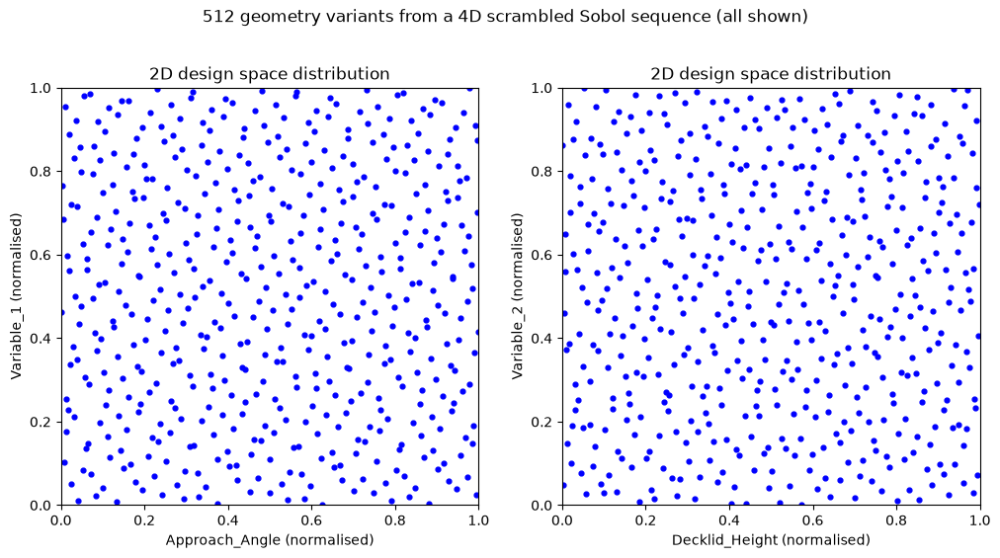

## Choosing and Validating a Dataset of Meshes

Building ML models for aerodynamics requires a dataset of high-quality computational meshes that faithfully represent diverse vehicle shapes and flow conditions. Poorly chosen or inconsistent meshes introduce systematic errors that propagate into ML predictions. The problem is to design a mesh dataset that balances coverage of the design space, mesh quality, and computational cost while ensuring reproducibility and physical accuracy.

Choosing and Validating a Dataset of Meshes can feel like orchestrating an elaborate dance between computational power, engineering insights, and statistical rigor. A well-chosen dataset ensures that aerodynamic simulations faithfully capture critical phenomena, while a thorough validation process confirms that every mesh in the collection meets the necessary standards for accuracy and reliability. The following notes walk through each step, highlighting how to define the design space, select a sampling strategy, assure mesh quality, and validate the final collection of geometries. Examples and ASCII diagrams appear throughout, making it easier to connect abstract concepts with practical actions.

### Defining the Design Space  

Engineers usually begin by identifying the geometric and flow parameters that have the largest impact on aerodynamic performance. Realistic car shapes might vary in approach angle, decklid height, or overall vehicle width. Setting the range for these parameters calls for both practical constraints (such as regulations or manufacturing limits) and engineering knowledge of what significantly shifts the flow. For instance, approach angle might span from 0° to 10° if it is used to simulate slight upward or downward tilts of the front end. Decklid height could range from a typical sedan profile to a more elevated configuration, while vehicle width might fluctuate within limits that reflect different body styles.

### Sampling Strategy  

Once the design space is defined, the next consideration is how to pick the geometric configurations that will populate the dataset. Many engineers rely on uniform sampling to ensure that each sub-region of the design space has representation, often employing low-discrepancy sequences such as Sobol or Halton. These sequences place sample points in a manner that avoids clumping, reducing the risk of missing pockets of critical aerodynamic behavior. The intended resolution for each parameter—meaning how many distinct samples to generate—balances the need for thorough coverage against the computational cost of mesh creation and simulation. In automotive aerodynamics, high dimensionality (several design variables at once) quickly escalates the number of required samples, so a well-considered strategy is crucial.

### Mesh Quality Considerations  

A robust sampling approach only pays off if each mesh is created with enough resolution and minimal distortion. Detailed features like sharp edges, underbody details, and boundary layer regions near the vehicle’s skin can significantly alter drag, lift, and separation patterns. Many engineers refine meshes more aggressively in these sensitive zones, a process sometimes referred to as local refinement. The shape and size of each cell matter, because poorly shaped (e.g., high skew or aspect ratio) elements can degrade both simulation stability and accuracy. Ensuring consistent mesh resolution across the entire dataset reduces variability caused by differing mesh standards instead of true aerodynamic differences.

Two commonly monitored cell quality metrics are:

- **Equiangle Skewness**: Measures how far a cell’s angles deviate from those of an ideal element (equilateral triangle in 2D, regular tetrahedron in 3D):

$$S_{\text{eq}} = \max\!\left(\frac{\theta_{\max} - \theta_{\text{ideal}}}{180^\circ - \theta_{\text{ideal}}},\; \frac{\theta_{\text{ideal}} - \theta_{\min}}{\theta_{\text{ideal}}}\right)$$

where $\theta_{\max}$ and $\theta_{\min}$ are the largest and smallest angles in the cell. Values range from 0 (ideal) to 1 (degenerate); cells with $S_{\text{eq}} > 0.85$ should typically be flagged or removed.

- **Aspect Ratio**: The ratio of the longest cell edge (or dimension) to the shortest. In boundary-layer regions, high aspect ratios are intentional (thin, stretched cells aligned with the flow), but in the free stream, values above 100 can degrade solver convergence.



A simple ASCII diagram can illustrate how local refinement fits into a typical mesh generation process:

```
        Geometry & CAD
       +---------------+
       |   Define car  |
       |   surfaces    |
       +-------+-------+
               |
               v
  +------------+-------------+
  |   Global Coarse Mesh     |
  |   (Initial block or      |
  |    automated approach)   |
  +------------+-------------+
               |
               v
  +------------+-------------+
  | Local Refinement Regions |
  | (Near edges, boundary    |
  |  layers, underbody)      |
  +------------+-------------+
               |
               v
       Final Refined Mesh
       +---------------+
       |   Ready for   |
       |   Simulation  |
       +---------------+
```

### Consistency and Completeness  

Consistency across the mesh dataset is essential for fair comparisons. If half of the meshes have refined boundary layers and the other half do not, observed differences could stem from meshing inconsistency rather than true aerodynamic behavior. Coverage checks confirm that all relevant areas of the design space see adequate sampling. For instance, if approach angle is set to vary from 0° to 10°, the dataset should include multiple increments (like 0°, 2°, 4°, 6°, 8°, 10°) or however many increments you decided for that parameter. Missing data might skew any machine learning training or any subsequent aerodynamic analysis.

### Geometric Fidelity  

Geometric fidelity refers to whether the final mesh correctly represents the intended vehicle shape. CAD models typically serve as the gold standard for geometry, and it is common practice to overlay the mesh surface geometry on top of the CAD design to check for agreement. Surface smoothness is another priority. Sudden jumps or artifacts can create unphysical flow effects or numerical instabilities during simulation. When the surface geometry matches the CAD within tight tolerances, engineers gain confidence that the aerodynamic solutions will reflect reality.

### Aerodynamic Validation  

Validating the dataset’s accuracy often involves comparing a subset of the meshes against wind tunnel experiments or against higher-fidelity CFD analyses. Even if one cannot test every mesh, assessing at least a few ensures that the pipeline (CAD geometry, meshing, solver settings) reproduces known aerodynamic metrics such as drag or lift coefficients. In some cases, real-world vehicle tests provide absolute benchmarks. Checking a small portion of the dataset can reveal systematic errors like inaccurate boundary conditions, poor near-wall resolution, or overlooked geometry details. If a discrepancy is large, it might indicate that the entire set requires reevaluation before proceeding with large-scale machine learning work.

### Statistical Analysis and Coverage  

Engineers and data scientists frequently use coverage analysis to confirm that samples are well distributed across all parameters. A two-dimensional parameter study (e.g., decklid height and vehicle width) can be visualized as points spread on a plane. When more parameters are involved, advanced statistical tools or discrepancy metrics measure how uniformly the points fill the hypercube representing the design space. Sensitivity analysis helps identify which parameters most strongly influence drag or lift so that no crucial variable is undersampled.

One might run a partial correlation test that reveals whether approach angle has a stronger correlation with drag than decklid height or if the interactions between two parameters are important. Observing results that align with known aerodynamic principles, such as a small approach angle lowering drag up to a certain point, confirms that the dataset and simulation pipeline capture physical reality rather than noise or numerical artifacts.

### Performance Metrics  

Simulations in automotive aerodynamics typically produce drag coefficient $C_D$, lift coefficient $C_L$, and side force coefficient $C_Y$. Checking if the solution converges to stable values is an important step, typically involving a criterion such as:

$$| C_D^{(n)} - C_D^{(n-1)} | < \epsilon$$

where $C_D^{(n)}$ is the drag coefficient at iteration $n$ and $\epsilon$ is a small tolerance, often in the range of 1e-4 to 1e-6 for aerodynamic metrics. If the dataset leads to stable, reproducible solutions for each sample, the mesh design is likely solid. Comparing computed coefficients to known experimental results or established reference simulations cements confidence in the overall process.

### Visual Inspection  

Numerical metrics go a long way, but visualization can reveal subtle issues that numbers alone might obscure. Tools like ParaView or Tecplot help display surface meshes, flow fields, and streamlines. If a geometry has unintended gaps or overlapping surfaces, such errors are often more easily noticed visually. Inspecting the flow field can reveal unnatural recirculations or boundary layer detachments that differ from prior knowledge or simpler test cases.

### HPC and Scalability  

Generating and validating a high-fidelity mesh dataset typically involves large-scale computations, especially when dozens or hundreds of configurations need to be simulated. Parallelizing both mesh generation (where possible) and CFD runs can save weeks of total compute time. An ASCII-style diagram illustrates the typical HPC pipeline:

```
               HPC Cluster
          +-------------------+
          |  Many Compute     |
          |  Nodes           |
          +---------+---------+
                    |
                    v
  +-----------------+-----------------+
  | Parallel Mesh Generation          |
  | (If software supports distributed |
  |  meshing tasks)                   |
  +-----------------+-----------------+
                    |
                    v
  +-----------------+-----------------+
  | Parallel CFD Simulations          |
  | (Simultaneous runs for multiple   |
  |  designs)                         |
  +-----------------+-----------------+
                    |
                    v
  +-----------------+-----------------+
  | Central Data Storage & Monitoring|
  | (Check progress, gather logs,    |
  |  maintain uniform settings)       |
  +-----------------+-----------------+
                    |
                    v
  +-----------------+-----------------+
  | Post-Processing & Validation      |
  | (Statistical checks, coverage,    |
  |  param correlations)             |
  +-----------------------------------+
```

Efficient job scheduling software, such as SLURM or PBS, coordinates the runs. The ultimate goal is to integrate simulation output back into a repository of validated results that feed machine learning algorithms or additional engineering analyses.

### Tools and Techniques

Various commercial and open-source solutions can handle mesh generation and validation. Packages like ANSYS and STAR-CCM+ include built-in meshing wizards with advanced refinement options. OpenFOAM offers a range of mesh generation and manipulation utilities that can be automated via scripts. Visualization through ParaView or Tecplot fosters both qualitative and quantitative checks, while Python libraries such as NumPy, SciPy, and Matplotlib support coverage calculations, sensitivity analyses, and error measurement. HPC clusters make it possible to run these tasks at scale, executing multiple simulations in parallel and combining the results in a timely manner.

### Setting Up the Problem

Start by listing the geometric and flow parameters that define your design space, along with their physical ranges. Use a low-discrepancy sampling strategy such as Sobol, Halton, or Latin hypercube to distribute sample points uniformly across the parameter space, avoiding gaps and clusters. For each sampled configuration, define mesh quality criteria up front: maximum cell skewness (typically below 0.85), aspect ratio limits (under 100 in boundary layers), and a target $y^+$ value consistent with your turbulence model (e.g., $y^+ \approx 1$ for resolved boundary layers or $y^+ \approx 30{-}50$ for wall functions). Automate the mesh generation pipeline using scripted workflows in tools like OpenFOAM's `snappyHexMesh` or ANSYS meshing journals so that every configuration follows the same refinement rules and quality checks. Build in automated quality gates that reject or flag meshes exceeding skewness or aspect ratio thresholds before any simulation runs. Select a small validation subset (5–10% of the dataset) and compare its CFD results against wind tunnel experiments or high-fidelity reference simulations (e.g., LES or DNS). Track discrepancies in $C_D$ and $C_L$ to confirm that errors remain within acceptable tolerances, typically within 5% of experimental values. Document every parameter choice, software version, and solver setting to ensure full reproducibility. Iterate on mesh resolution and refinement zones if validation reveals systematic bias, then re-run the affected portion of the dataset.

### Key Takeaways

- Define the design space parameters and their physical ranges before generating any meshes, ensuring complete coverage of the configurations relevant to your ML model.
- Use low-discrepancy sampling methods (Sobol, Halton, Latin hypercube) to distribute samples uniformly and avoid gaps in the parameter space.
- Enforce consistent mesh quality criteria (skewness, aspect ratio, $y^+$) across the entire dataset to prevent meshing artifacts from contaminating ML training data.
- Automate mesh generation and quality checks through scripted pipelines so that every configuration is treated identically and results are reproducible.
- Validate a representative subset of meshes against experimental data or high-fidelity simulations to catch systematic errors early in the process.
- Document all choices, from parameter ranges to solver settings, so that the dataset can be reproduced or extended by others.

### Related Scripts

- [Design Space Distribution via Sobol Sequences](../../../scripts/plots/design_space_distribution/): draws a four-dimensional scrambled Sobol design of 512 geometry variants and plots two 2D projections of it, showing how evenly a low-discrepancy sequence covers a design space.

### Exercises

**Exercise 1.** A triangular surface cell has interior angles $30^\circ$, $60^\circ$ and $90^\circ$. A second triangle has angles $8^\circ$, $52^\circ$ and $120^\circ$. Compute the equiangle skewness $S_{\text{eq}}$ of each cell and decide whether either should be flagged using the $S_{\text{eq}} > 0.85$ threshold.

<details>
<summary>Answer</summary>

For triangles $\theta_{\text{ideal}} = 60^\circ$.

First cell: $\frac{90 - 60}{180 - 60} = 0.25$ and $\frac{60 - 30}{60} = 0.5$, so $S_{\text{eq}} = 0.5$. The cell is acceptable.

Second cell: $\frac{120 - 60}{180 - 60} = 0.5$ and $\frac{60 - 8}{60} = 0.867$, so $S_{\text{eq}} \approx 0.87$. This exceeds 0.85 and the cell should be flagged. Note that the small $8^\circ$ angle, not the obtuse $120^\circ$ angle, sets the value.

</details>

**Exercise 2.** A prism layer starts with a first cell height $h_1 = 2 \times 10^{-5}$ m and grows geometrically with ratio $r = 1.2$ over $N = 15$ layers. The surface cells are 4 mm wide. Find the total prism-layer thickness and the aspect ratios of the first and last layers. Are these aspect ratios a problem?

<details>
<summary>Answer</summary>

The layer heights form a geometric series, so the total thickness is

$$H = h_1 \frac{r^N - 1}{r - 1} = 2 \times 10^{-5} \cdot \frac{1.2^{15} - 1}{0.2} \approx 1.44 \times 10^{-3} \text{ m}.$$

The last layer has height $h_1 r^{N-1} \approx 2.57 \times 10^{-4}$ m.

Aspect ratios: first layer $4 \times 10^{-3} / 2 \times 10^{-5} = 200$, last layer $4 \times 10^{-3} / 2.57 \times 10^{-4} \approx 15.6$.

An aspect ratio of 200 is intentional inside the boundary layer, where the cells are aligned with the flow. The limit of about 100 quoted in the note applies to free-stream cells. Two other things are worth checking: the total thickness must cover the expected boundary-layer thickness, and the jump from the 0.26 mm last layer to the 4 mm core cells (a factor of about 15) should be smoothed with more layers or a transition zone.

</details>

**Exercise 3.** Four design parameters (approach angle, decklid height, vehicle width, ride height) are to be sampled. A full-factorial design with 6 levels per parameter is compared with a 128-point Sobol sequence. Each case (meshing plus RANS) costs 400 core-hours, and the cluster has 2000 cores that can run cases in parallel. Compare the total cost and wall-clock time, and explain why the Sobol set may still give adequate coverage.

<details>
<summary>Answer</summary>

Full factorial: $6^4 = 1296$ cases, $1296 \times 400 = 518{,}400$ core-hours, or $518{,}400 / 2000 = 259.2$ h (about 10.8 days) on the full cluster.

Sobol: $128 \times 400 = 51{,}200$ core-hours, or 25.6 h. That is about 10 times cheaper.

Coverage: the factorial design has only 6 distinct values per axis, and each value is repeated 216 times. The 128 Sobol points have 128 distinct values per axis and low discrepancy in the lower-dimensional projections as well. For training a surrogate, a space-filling design usually gives more information per simulation. The factorial cost also grows as $L^d$ when parameters are added, which quickly becomes unaffordable.

</details>

**Exercise 4.** A dataset contains 400 meshes. Following the note, choose a validation subset of 5–10%. One validated case gives $C_D = 0.312$ against a wind-tunnel value of $0.295$; another gives $0.301$ against the same reference. Which cases pass the 5% tolerance, and what would you investigate if the first case is typical of the subset?

<details>
<summary>Answer</summary>

The validation subset is 20 to 40 cases.

Errors: $|0.312 - 0.295| / 0.295 = 5.8\%$ (fails) and $|0.301 - 0.295| / 0.295 = 2.0\%$ (passes).

If most validation cases over-predict drag by about 6%, the error is systematic rather than random. Candidates to check are near-wall resolution ($y^+$) and the wall treatment, the turbulence model, boundary conditions that differ from the tunnel (ground motion, wheel rotation, blockage), geometric simplifications, and whether $C_D$ is iteratively converged. A systematic bias should be fixed before the dataset is used for training, because the ML model will learn it.

</details>

**Exercise 5.** The drag history over the last iterations of a run is 0.30412, 0.30405, 0.30401, 0.30399, 0.30406, 0.30398. With $\epsilon = 10^{-4}$, is the criterion $| C_D^{(n)} - C_D^{(n-1)} | < \epsilon$ satisfied? Explain why this criterion alone can be misleading and propose a more robust check.

<details>
<summary>Answer</summary>

The successive differences are $-7 \times 10^{-5}$, $-4 \times 10^{-5}$, $-2 \times 10^{-5}$, $+7 \times 10^{-5}$ and $-8 \times 10^{-5}$. All are below $10^{-4}$ in magnitude, so the criterion is met.

It can mislead because it only looks at one iteration. A steady drift of $5 \times 10^{-5}$ per iteration passes the test every time, yet over 1000 iterations it changes $C_D$ by 0.05, about 16%. A slowly oscillating solution can also pass while its mean is still moving.

A more robust check compares averages over windows (for example, the mean $C_D$ over the last 500 iterations against the previous 500), requires the equation residuals to have dropped by several orders of magnitude, and checks that the standard deviation of $C_D$ within the window is small.

</details>

### References

- Thompson, J. F., Soni, B. K., & Weatherill, N. P. (Eds.), *Handbook of Grid Generation*, CRC Press, 1999.
- Sobol', I. M., "On the distribution of points in a cube and the approximate evaluation of integrals", *USSR Computational Mathematics and Mathematical Physics* 7(4), 1967.
- McKay, M. D., Beckman, R. J., & Conover, W. J., "A Comparison of Three Methods for Selecting Values of Input Variables in the Analysis of Output from a Computer Code", *Technometrics* 21(2), 1979.
- Roache, P. J., *Verification and Validation in Computational Science and Engineering*, Hermosa Publishers, 1998.
- Ahmed, S. R., Ramm, G., & Faltin, G., "Some Salient Features of the Time-Averaged Ground Vehicle Wake", SAE Technical Paper 840300, 1984.
