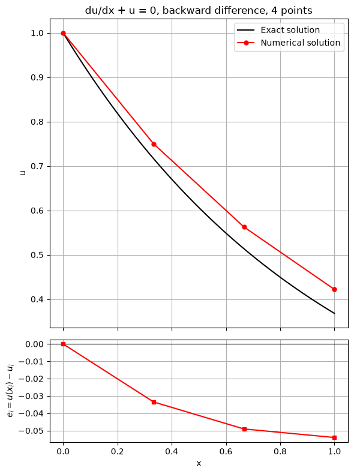

# The Strategy of CFD

The primary strategy of Computational Fluid Dynamics (CFD) is to transform a continuous problem domain into a discrete domain using a grid. This discretization process allows the continuous equations governing fluid flow to be solved numerically.

## Continuous Domain

- **Definition**: Flow variables (e.g., pressure $p$) are defined at every point within the domain.
- **Example**: In a 1D continuous domain, pressure is a function of position $x$:
  
$$
  p = p(x), \quad 0 < x < 1 
  $$

- **Governing Equations**: Typically partial differential equations (PDEs) with boundary conditions describe the flow behavior throughout the domain.

### Visualization

- **Continuous Domain**: The variable $x$ ranges continuously from 0 to 1.

```
|_____________| 
```

## Discrete Domain

- **Definition**: Flow variables are defined only at specific grid points.
- **Grid Creation**: The continuous domain is divided into a finite number of points.
- **Example**: Pressure in a discrete 1D domain is defined at $N$ grid points:

$$
p_i = p(x_i), \quad i = 1, 2, \ldots, N 
$$

- **Governing Equations**: Continuous PDEs and boundary conditions are transformed into coupled algebraic equations, relating flow variable values at discrete points.

### Visualization

- **Discrete Domain**: The domain is divided into $N$ discrete points, such as $x_1, x_2, \ldots, x_N$.

```
|---|---|---|---|---|
```

## What CFD Expects a Programming Language to Do

Before delving into the numerical computations, it's essential to understand the typical steps involved in a CFD simulation. The process usually follows four major steps based on the Eulerian method.

```
+----------------------------------+
| Pre-processing: Flow field       |
| initialization                   |
+----------------------------------+
              |
              v
+----------------------------------+
| Solve the discretized N-S        |
| equations                        |<---------|
+----------------------------------+          |
              |                               |
              v                               |
+--------------------+        No              |
|      Converged?    |------------------------|
+--------+-----------+
         | 
         | Yes
         v
+-----------------------------+
| Post-processing: Flow field |
| visualization               |
+-----------------------------+
```

This flowchart summarizes the CFD simulation process, highlighting the iterative nature of solving the discretized equations and checking for convergence before moving on to visualization and analysis of the results.

### Step 1: Pre-Processing

In the pre-processing phase, several key tasks must be completed to set up the CFD simulation:

1. **Define Data Structures**:
   - **Purpose**: Organize the physical parameters of the flow field.
   - **Method**: Typically use 2D or 3D arrays to store parameters like velocity components (U and V), pressure (P), and density. These arrays represent the computational grid where each cell or node holds values of the physical parameters.

2. **Set Initial Values**:
   - **Purpose**: Provide starting points for the simulation.
   - **Method**: Initialize flow variables with appropriate initial values. For example, set the initial velocity, pressure, and density throughout the computational domain based on estimated or known conditions.

``` 
  Staggered-Grid                     Field Data
+------------------+          +------------------+
| .  .  .  .  .  . |          |   P              |
| .  .  .  .  .  . |          | 0.0  0.0  0.0 ...|
| .  .  .  .  .  . |          | 0.0  0.0  0.0 ...|
| .  .  .  .  .  . |          | 0.0  0.0  0.0 ...|
| .  .  .  .  .  . |          | ...  ...  ... ...|
| .  .  .  .  .  . |          +------------------+
| .  .  .  .  .  . |
| .  .  .  .  .  . |          +------------------+
| .  .  .  .  .  . |          |   U              |
| .  .  .  .  .  . |          | 0.0  0.0  0.0 ...|
| .  .  .  .  .  . |  =====>  | 0.0  0.0  0.0 ...|
| .  .  .  .  .  . |          | 0.0  0.0  0.0 ...|
| .  .  .  .  .  . |          | ...  ...  ... ...|
| .  .  .  .  .  . |          +------------------+
| .  .  .  .  .  . |
| .  .  .  .  .  . |          +------------------+
| .  .  .  .  .  . |          |   V              |
| .  .  .  .  .  . |          | 0.0  0.0  0.0 ...|
| .  .  .  .  .  . |          | 0.0  0.0  0.0 ...|
| .  .  .  .  .  . |          | 0.0  0.0  0.0 ...|
| .  .  .  .  .  . |          | ...  ...  ... ...|
+------------------+          +------------------+
```

### Step 2: Discretization

The most time-consuming part of a CFD simulation is finding the solution to the discretized Navier-Stokes equations. These equations are partial differential equations (PDEs) that describe the flow of incompressible fluids. Discretization involves approximating the solutions to these PDEs using algebraic polynomials of discrete values.

For example, the Laplace operator of a scalar function can be represented using a five-point discrete scheme:

```
   ∇²f ≈  1/Δx² (-4 * f[i,j] + f[i-1,j] + f[i+1,j] + f[i,j-1] + f[i,j+1])
       
    PDE                        Discretized Form
    ∇²f    ----------------->  +--------------------+
                               | f[i-1, j]          |
                               |        |           |
                               |        v           |
                        f[i, j-1] -> f[i,j] <- f[i, j+1]
                               |        ^           |
                               |        |           |
                               | f[i+1, j]          |
                               +--------------------+
```


#### Discretizing the Navier-Stokes Equations

1. **Equations**:
   - The Navier-Stokes equations describe fluid motion using PDEs, including terms for momentum, continuity, and energy.
   - For incompressible fluids, these equations can be complex and require simplification and approximation through discretization.

2. **Discretization Techniques**:
   - **Finite Difference Method (FDM)**: Approximates derivatives by differences between adjacent grid points.
   - **Finite Volume Method (FVM)**: Integrates the governing equations over control volumes around each grid point, ensuring conservation laws.
   - **Finite Element Method (FEM)**: Uses variational methods to approximate solutions, often employed for complex geometries.

3. **Example**: Discretizing a Simple PDE
   - Consider a simple PDE:
     
$$
     \frac{\partial u}{\partial x} + u = 0
     $$

   - Using FDM, approximate the derivative as:
     
$$
     \frac{u_i - u_{i-1}}{\Delta x} + u_i = 0
     $$

   - Rearrange to get a discrete equation:
     
$$
     -u_{i-1} + (1 + \Delta x)u_i = 0
     $$


#### Assembly of Discrete System and Application of Boundary Conditions

1. **Application to Grid Points**:
   - Apply the discrete equation to each grid point. For a 1D grid with $N$ points:
     
$$
     -u_{i-1} + (1 + \Delta x)u_i = 0 \quad \text{for} \ i = 2, 3, \ldots, N-1
     $$

   - Special treatment is required at boundaries where not all neighboring points exist.

2. **Boundary Conditions**:
   - Define conditions at the boundaries to close the system of equations.
   - **Example**: At the left boundary ($i = 1$), a Dirichlet boundary condition might be applied:
     
$$
     u_1 = 1
     $$

   - This boundary condition is used to replace the discrete equation at $i = 1$.

3. **System of Equations**:
   - Combine all discrete equations and boundary conditions into a matrix system. For a simple 4-point grid:

$$
\begin{bmatrix}
1 & 0 & 0 & 0 \\
-1 & 1 + \Delta x & 0 & 0 \\
0 & -1 & 1 + \Delta x & 0 \\
0 & 0 & -1 & 1 + \Delta x
\end{bmatrix}
\begin{bmatrix}
u_1 \\
u_2 \\
u_3 \\
u_4
\end{bmatrix}
=
\begin{bmatrix}
1 \\
0 \\
0 \\
0
\end{bmatrix}
$$

   - This system represents the discrete approximation of the continuous problem.

4. **General Application**:
   - For more complex problems, apply the discrete equations to interior grid points and a combination of discrete equations and boundary conditions to points near boundaries.
   - This results in a larger system of simultaneous algebraic equations, solved using numerical methods.

5. **Boundary Conditions in CFD Codes**:
   - Commercial CFD codes like FLUENT provide various boundary condition options such as velocity inlet, pressure inlet, and pressure outlet.
   - Proper specification of boundary conditions is crucial. Incorrect conditions can lead to inaccurate or unstable results.
   - Thoroughly read the documentation for each boundary condition option to understand its application and impact on the simulation.

### Step 3: Solving the Linear System

Once the equations are discretized, the next step is to solve the resulting linear system $Ax = b$. The choice of solver depends on the size and sparsity of matrix $A$:

1. **Direct Solver**:
   - **Suitable for**: Smaller systems where computational resources are sufficient.
   - **Method**: Uses techniques like Gaussian elimination or LU decomposition to find the solution in a finite number of steps.

2. **Iterative Solver**:
   - **Preferred for**: Larger, sparse systems due to efficiency.
   - **Method**: Uses iterative techniques such as Conjugate Gradient or GMRES (Generalized Minimal Residual) to approximate the solution.

#### Parallelization

Parallelization is critical in modern CFD simulations to speed up both the discretization and solution phases by distributing computations across multiple processors:

- **Discretization**: Each processor can handle different parts of the domain, reducing the overall time required.
- **Solving the Linear System**: Parallel solvers distribute the matrix operations, significantly accelerating the solution process for large systems.

#### Solution of Discrete System

The discrete system (Equation 10) for a simple 1D example can be solved to obtain unknown values at the grid points. For $\Delta x = \frac{1}{3}$, the solutions are:


$$
u_1 = 1, \quad u_2 = \frac{3}{4}, \quad u_3 = \frac{9}{16}, \quad u_4 = \frac{27}{64}
$$


##### Exact Solution

The exact solution for this 1D example is:


$$
u_{exact} = \exp(-x)
$$


##### Comparison of Solutions

The figure below compares the discrete solution obtained on the four-point grid with the exact solution, showing that the error is largest at the right boundary (approximately 14.7%).



##### Practical Considerations

In practical CFD applications, the discrete system may have thousands to millions of unknowns. Efficiently solving such large systems requires optimization techniques:

1. **Naive Gaussian Elimination**:
    - **Problem**: Computationally expensive for large systems and impractical for large-scale problems.
   
2. **Optimized Matrix Inversion**:
    - **Iterative Solvers**: Conjugate Gradient, GMRES are efficient for large, sparse systems.
    - **Preconditioning**: Techniques to improve the convergence rate of iterative solvers.
    - **Parallel Computing**: Distributing computations across multiple processors to accelerate the solution process.

By optimizing the matrix inversion and leveraging advanced computational techniques, modern CFD codes can solve complex problems efficiently.

#### Grid Convergence

Grid convergence ensures that as the number of grid points $N$ increases and $\Delta x$ decreases, the numerical solution's error decreases, improving the agreement between numerical and exact solutions.

##### Effect of Increasing Grid Points

Increasing the number of grid points $N$ and decreasing $\Delta x$ should reduce numerical errors. For example, solving the same 1D problem with $N = 8$ and $N = 16$:


##### Grid Converged Solutions

When numerical solutions obtained on different grids agree within a user-specified level of tolerance, they are referred to as "grid converged" solutions. This ensures that the numerical solution is independent of the grid size, reflecting the true behavior of the physical system being modeled.

#### Importance of Grid Convergence

Grid convergence applies to both finite-difference and finite-volume approaches. Ensuring the solution is grid converged to an acceptable level of tolerance is vital for every CFD problem to guarantee accuracy.

### Step 4: Post-Processing

In the post-processing stage, we visualize the flow field data obtained from the simulation. Common visualization techniques include:

1. **Vector Plots**:
   - **Purpose**: Represent the direction and magnitude of flow.
   
2. **Contour Plots**:
   - **Purpose**: Show levels of specific flow variables such as pressure or velocity, providing insight into the flow behavior.

Effective post-processing helps in interpreting and analyzing the simulation results, facilitating better understanding and decision-making.

## Purpose in CFD

This note details the four-step CFD workflow: pre-processing (data structures, initial conditions), discretization (converting PDEs to algebraic equations), solving the linear system ($Ax = b$), and post-processing (visualization). It provides a practical roadmap for implementing any CFD solver and explains the concepts of grid convergence and solution accuracy.

## Input / Output

| Aspect | Details |
|---|---|
| **Inputs** | Domain geometry, grid spacing $\Delta x$, boundary conditions (Dirichlet, Neumann), fluid properties, initial field values (velocity $U$, $V$, pressure $P$) |
| **Outputs** | Discrete solution arrays ($u_1, u_2, \dots, u_N$), residual history, converged velocity and pressure fields, contour and vector plots |

## Related Scripts

- [Backward-Facing Step Flow (SIMPLE Algorithm)](../../../scripts/simulations/backward_facing_step_simple/): solves steady 2D laminar incompressible flow over a backward-facing step with the finite volume method and the SIMPLE pressure–velocity coupling algorithm.
- [Grid Convergence Comparison](../../../scripts/plots/comparing_grid_convergence/): illustrates grid convergence by plotting the model numerical solutions $u_N(x) = e^{-x(1 + x/N)}$ for $N = 4, 8, 16$ against the exact solution $u(x) = e^{-x}$ on $[0, 1]$.
- [Lid-Driven Cavity Flow Simulation](../../../scripts/simulations/lid_driven_cavity/): solves the 2D incompressible Navier-Stokes equations for flow in a square cavity driven by a moving lid at a Reynolds number of 100 and animates the velocity field.
- [Mean Velocity Magnitude: Experiment vs CFD Comparison](../../../scripts/plots/mean_velocity_magnitude/): plots a mock experimental profile and a mock CFD scale-resolving simulation (SRS) profile of the normalised mean velocity magnitude $|U|/U_0$ along an under-body centreline.
- [Numerical vs. Exact Solution Comparison](../../../scripts/plots/numerical_vs_exact_solution/): solves $du/dx + u = 0$ with $u(0) = 1$ by a first-order finite-difference scheme and compares the result with the exact solution $u(x) = e^{-x}$, plotting the pointwise error.

## Exercises

**Exercise 1.** Repeat the example $\frac{\partial u}{\partial x} + u = 0$, $u_1 = 1$, with the same backward difference on a 5-point grid ($\Delta x = 1/4$). Give all nodal values and the percentage error at $x = 1$.

<details>
<summary>Answer</summary>

Each equation $-u_{i-1} + (1 + \Delta x)u_i = 0$ gives $u_i = u_{i-1}/1.25$.

$u = (1, 0.8, 0.64, 0.512, 0.4096)$.

The exact value is $e^{-1} \approx 0.3679$, so the error at $x = 1$ is $(0.4096 - 0.3679)/0.3679 \approx 11.3\%$, down from 14.7% on the 4-point grid.

</details>

**Exercise 2.** The discrete solution at $x = 1$ is $u_N = (1 + \Delta x)^{-(N-1)}$. Compute the error at $x = 1$ for $N = 4$, 8 and 16 ($\Delta x = 1/3$, $1/7$, $1/15$) and the observed order of accuracy $p = \ln(e_1/e_2)/\ln(\Delta x_1/\Delta x_2)$ between successive grids.

<details>
<summary>Answer</summary>

$u_4 = 0.421875$, $u_8 \approx 0.392696$ and $u_{16} \approx 0.379812$.

The errors are $0.05400$, $0.02482$ and $0.01193$.

$p \approx \ln(0.05400/0.02482)/\ln(7/3) \approx 0.92$, then $p \approx \ln(0.02482/0.01193)/\ln(15/7) \approx 0.96$.

$p$ approaches 1, the formal order of the backward difference. This is what a grid-convergence study should show before the solution is called grid converged.

</details>

**Exercise 3.** Use the solutions at $x = 1$ on grids with $\Delta x = 1/4$, $1/8$ and $1/16$ ($N = 5$, 9, 17) for Richardson extrapolation with refinement ratio $r = 2$. Compute the observed order and the extrapolated value, and compare with the extrapolation that assumes $p = 1$.

<details>
<summary>Answer</summary>

$f_3 = 0.409600$ (coarse), $f_2 \approx 0.389744$ and $f_1 \approx 0.379085$ (fine).

$$p = \frac{\ln\left((f_3 - f_2)/(f_2 - f_1)\right)}{\ln 2} \approx 0.90, \qquad f_{\text{ext}} = f_1 + \frac{f_1 - f_2}{2^p - 1} \approx 0.36673.$$

This is within $-0.0011$ of $e^{-1} = 0.367879$, whereas the finest grid alone is off by $+0.0112$.

With $p = 1$: $f_{\text{ext}} = 2f_1 - f_2 \approx 0.36843$, an error of $+0.00055$. Extrapolation cuts the error by a factor of 10 to 20 at no extra cost.

</details>

**Exercise 4.** Apply the five-point Laplacian with $\Delta x = \Delta y = h = 0.1$ to (a) $f = x^2 + y^2$ and (b) $f = x^4$ at the point $(1, 0)$. Compare with the exact values and explain the error in (b).

<details>
<summary>Answer</summary>

(a) Each second difference of a quadratic is exact: $(f_{i+1,j} - 2f_{i,j} + f_{i-1,j})/h^2 = 2$ in each direction. The stencil gives $\nabla^2 f = 4$, which is exact.

(b) Only the $x$ direction contributes: $((1.1)^4 + (0.9)^4 - 2)/0.01 = (1.4641 + 0.6561 - 2)/0.01 = 12.02$. The exact value is $12x^2 = 12$.

The difference of 0.02 matches the leading truncation term $\frac{h^2}{12} f'''' = \frac{0.01}{12} \times 24 = 0.02$, which confirms second-order accuracy.

</details>

**Exercise 5.** A 2D problem with $N = 10^6$ unknowns uses the five-point stencil. Compare the memory to store $A$ as a dense matrix of doubles with a compressed sparse row (CSR) format using 8-byte values and 4-byte column indices and row pointers. What does this imply for the choice of solver?

<details>
<summary>Answer</summary>

Dense: $10^{12}$ entries $\times$ 8 bytes $= 8$ TB.

CSR: about $5 \times 10^6$ nonzeros, so $5 \times 10^6 \times (8 + 4)$ bytes for values and column indices plus $(10^6 + 1) \times 4$ bytes for row pointers, about 64 MB in total.

Only sparse storage is feasible. Direct factorization creates fill-in that destroys sparsity, so large CFD systems are solved with iterative methods (CG, GMRES, multigrid) that only need matrix–vector products, as described in Step 3.

</details>

## References

- Anderson, J. D., *Computational Fluid Dynamics: The Basics with Applications*, McGraw-Hill, 1995.
- Versteeg, H. K., & Malalasekera, W., *An Introduction to Computational Fluid Dynamics: The Finite Volume Method*, 2nd ed., Pearson Education, 2007.
- Ferziger, J. H., Perić, M., & Street, R. L., *Computational Methods for Fluid Dynamics*, 4th ed., Springer, 2020.
- Roache, P. J., *Verification and Validation in Computational Science and Engineering*, Hermosa Publishers, 1998.
- Saad, Y., *Iterative Methods for Sparse Linear Systems*, 2nd ed., SIAM, 2003.
