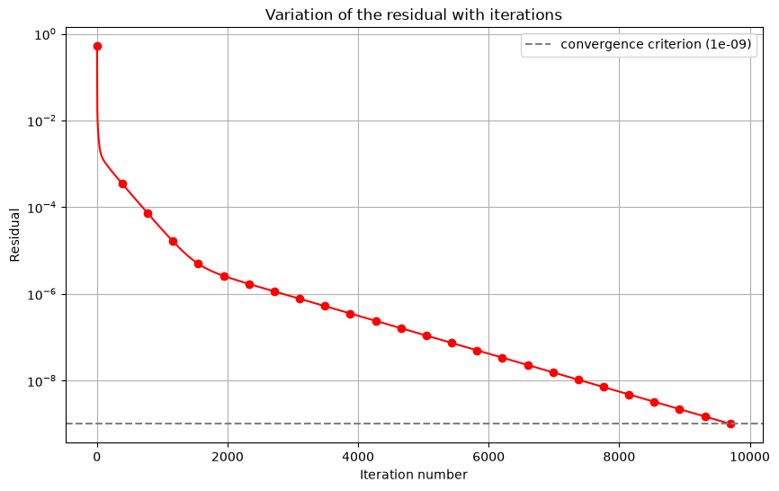

# Iterative Convergence

## Approach to True Solution

- As we get closer to the true solution $u$, the errors from both linearization and matrix inversion diminish.
- The iterative process continues until the residual—a measure of the difference between the guess $u_g$ and the updated solution $u$ computed from it—becomes sufficiently small.
- This makes sure that the final approximation is an accurate representation of the true solution.

## Residual Definition

The residual $R$ is defined as the root mean square (RMS) of the difference between the updated solution $u$ obtained in the current sweep and the guess $u_g$ used to compute it, over all grid points:

$$R \equiv \sqrt{\frac{1}{N} \sum_{i=1}^{N} (u_i - u_{gi})^2}$$

- Here, $N$ is the total number of grid points.
- The residual quantifies the overall error in the current solution approximation.

## Scaling the Residual

- Scaling the residual with the average value of $u$ transforms it into a relative measure, which is often more meaningful than an absolute error.
- For example, an unscaled residual of 0.01 might be insignificant if the average $u$ is 5000 but important if the average $u$ is only 0.1.
- The scaled residual is defined as:

$$R = \sqrt{\frac{1}{N} \sum_{i=1}^{N} (u_i - u_{gi})^2} \left(\frac{N}{\sum_{i=1}^{N} u_i}\right)$$

- This normalization makes sure that the convergence criterion adapts to the magnitude of the solution.

## Iterative Process

For a nonlinear 1D example, the iterative process follows these steps:

- Initial Guess:  
Begin by setting the initial guess at all grid points equal to the left boundary value, for example, $u_{gi}^{(1)} = 1$.

- Update Strategy:  
In each iteration, update the guess $u_g$ by sweeping through the grid (typically from right to left), sequentially updating points (e.g., updating $u_4$, then $u_3$, and finally $u_2$).

- Residual Calculation:  
After each sweep, compute the residual $R$ using the formula above to measure the error between the current solution and the guess.

- Convergence Criterion:  
Continue the iterations until the residual falls below a threshold (for example, $10^{-9}$). This indicates that further iterations yield insignificant changes.

## Python Implementation

Carrying out this iterative procedure in Python is an excellent way to understand the mechanics of convergence. A typical implementation would:

- Initialize the grid and guess values.
- Iterate through a loop where the solution is updated according to the chosen finite-difference scheme.
- Compute and record the residual at each iteration.
- Plot the residual versus iteration number to visualize convergence.
Below is a representative graph showing the residual versus iteration number. Notice the logarithmic scale on the ordinate (y-axis). In this example, the iterative process converges to a residual smaller than $10^{-9}$ in just 6 iterations.

## Solution Comparison

The following comparison demonstrates the convergence of the iterative process:

- Exact Solution:  
The exact solution is given by $u_{\text{exact}} = \frac{1}{x + 1}$.

- Iterative Solutions:  
Solutions obtained after 2, 4, and 6 iterations are plotted alongside the exact solution.

- Observation:  
The solutions after 4 and 6 iterations are indistinguishable on the graph, indicating that convergence has been achieved.

- Accuracy Note:  
Although the iterative convergence error is on the order of $10^{-9}$, the overall error is dominated by the truncation error (on the order of $10^{-1}$) due to the coarse grid resolution.

## Points to Note

Understanding Residuals:
- Residuals are a key diagnostic tool in iterative solvers, providing insight into how close the current solution is to the true solution.
- Monitoring the residual helps identify issues like slow convergence or oscillatory behavior, prompting adjustments in solver settings or numerical schemes.

Different Residual Definitions:
- Various CFD codes may use different definitions of the residual. It is important to consult the documentation for the specific code to understand the formulation used, making sure proper interpretation and comparison of results.

Choosing Convergence Criteria:
- The convergence criteria for each conservation equation should be chosen based on the specific problem and code. Starting with default values is often a good idea, but these may need fine-tuning for higher accuracy or efficiency.
- Adjusting the criteria based on initial simulation results can help balance computational cost and solution accuracy.

Scaling and Normalization:
- Proper scaling of the residual makes sure that it is a relative measure, making it meaningful across different problems and solution magnitudes.
- Normalizing the residual helps in setting appropriate convergence thresholds that are neither too strict nor too lenient.

## Purpose in CFD

Monitoring convergence is essential in every iterative CFD solver. This note defines the residual $R$ (RMS difference between successive iterates), explains why scaling the residual is important, walks through the iteration loop, and gives guidance on choosing convergence thresholds. Plots of residual versus iteration number are a standard diagnostic in CFD practice.

## Input / Output

| Aspect | Details |
|---|---|
| **Inputs** | Initial guess $u_g$, grid points $N$, update formula, convergence threshold (e.g., $10^{-9}$) |
| **Outputs** | Converged solution $u$, residual history $R$ vs. iteration number, comparison with exact solution $u_{\text{exact}}$ |

## Related Scripts

- [Backward-Facing Step Flow (SIMPLE Algorithm)](../../../scripts/simulations/backward_facing_step_simple/): solves steady 2D laminar incompressible flow over a backward-facing step with the finite volume method and the SIMPLE pressure–velocity coupling algorithm.
- [Variation of Residual with Iteration](../../../scripts/plots/variation_of_residual/): solves the 1D Laplace equation with Gauss-Seidel iteration on a 100-point grid and plots the normalised residual against iteration number on a logarithmic scale.

## Exercises

**Exercise 1.** In the 4-point example ($\Delta x = 1/3$), the guess before the third sweep is $u_g = (1, 0.791304, 0.660870, 0.660870)$, and the sweep produces $u = (1, 0.791288, 0.650354, 0.559811)$. Compute the residual $R$ and the scaled residual.

Answer

The differences are $(0, -1.65 \times 10^{-5}, -0.010516, -0.101059)$.

$$R = \sqrt{\frac{0 + 2.7 \times 10^{-10} + 1.106 \times 10^{-4} + 1.0213 \times 10^{-2}}{4}} \approx 0.0508.$$

The scaled residual is $R \times N / \sum u_i = 0.0508 \times 4/3.001 \approx 0.0677$.

**Exercise 2.** Carry out the full iteration for $\frac{du}{dx} + u^2 = 0$ on 4 points: initial guess $u_g = 1$ everywhere, update $u_i = (u_{g,i-1} + \Delta x\, u_{gi}^2)/(1 + 2\Delta x\, u_{gi})$ for $i = 4, 3, 2$ in each sweep, then set $u_g = u$. Record $R$ after each sweep and check the claim in the note that $R < 10^{-9}$ after 6 iterations. Why is convergence slow at first and fast later?

Answer

$R$ after each sweep: $0.1732$, $0.0985$, $0.0508$, $5.07 \times 10^{-3}$, $2.62 \times 10^{-5}$, $4.67 \times 10^{-10}$. The claim holds.

In each right-to-left sweep every point uses the old value of its left neighbour, so the boundary information $u_1 = 1$ travels only one grid point per sweep. It takes three sweeps to reach $u_4$. After that each point's linearization is effectively a Newton step with an accurate neighbour, and the error falls quadratically.

**Exercise 3.** The converged 4-point solution has $u_4 = 0.549622$, while $u_{\text{exact}}(1) = 0.5$. What is the relative discretization error, and how does it compare with the iterative tolerance $10^{-9}$? How many grid points does this first-order scheme need for an error at $x = 1$ below 1%?

Answer

$(0.549622 - 0.5)/0.5 \approx 9.9\%$, an absolute error of about 0.05. That is roughly $5 \times 10^7$ times larger than the iterative tolerance.

Solving the converged discrete equations on finer grids gives errors of 4.6% ($N = 8$), 2.2% ($N = 16$) and 1.1% ($N = 32$). The first grid below 1% is $N = 36$ ($\Delta x = 1/35$), with an error of 0.98%.

Once the iterative error is one or two orders of magnitude below the discretization error, further iterations are wasted. Refining the grid is what improves accuracy.

**Exercise 4.** In a larger problem the residual history settles into $R = 1.0 \times 10^{-2}$, $5.0 \times 10^{-3}$, $2.5 \times 10^{-3}$. Estimate the convergence rate and how many more iterations are needed to reach $10^{-9}$. What would you change if this is too slow?

Answer

The ratio is 0.5 per iteration (linear convergence). The iterations needed are $\ln(10^{-9}/2.5 \times 10^{-3})/\ln 0.5 \approx 21.3$, so 22 more.

If this is too slow: relax the tolerance to match the discretization error (see Exercise 3), improve the initial guess, use Newton linearization or a better linear solver (preconditioning, multigrid), or tune the relaxation factors. Check the residual definition used by the code before comparing thresholds.

## References

- Ferziger, J. H., Perić, M., & Street, R. L., *Computational Methods for Fluid Dynamics*, 4th ed., Springer, 2020.
- Versteeg, H. K., & Malalasekera, W., *An Introduction to Computational Fluid Dynamics: The Finite Volume Method*, 2nd ed., Pearson Education, 2007.
- Roache, P. J., *Verification and Validation in Computational Science and Engineering*, Hermosa Publishers, 1998.
- Saad, Y., *Iterative Methods for Sparse Linear Systems*, 2nd ed., SIAM, 2003.
