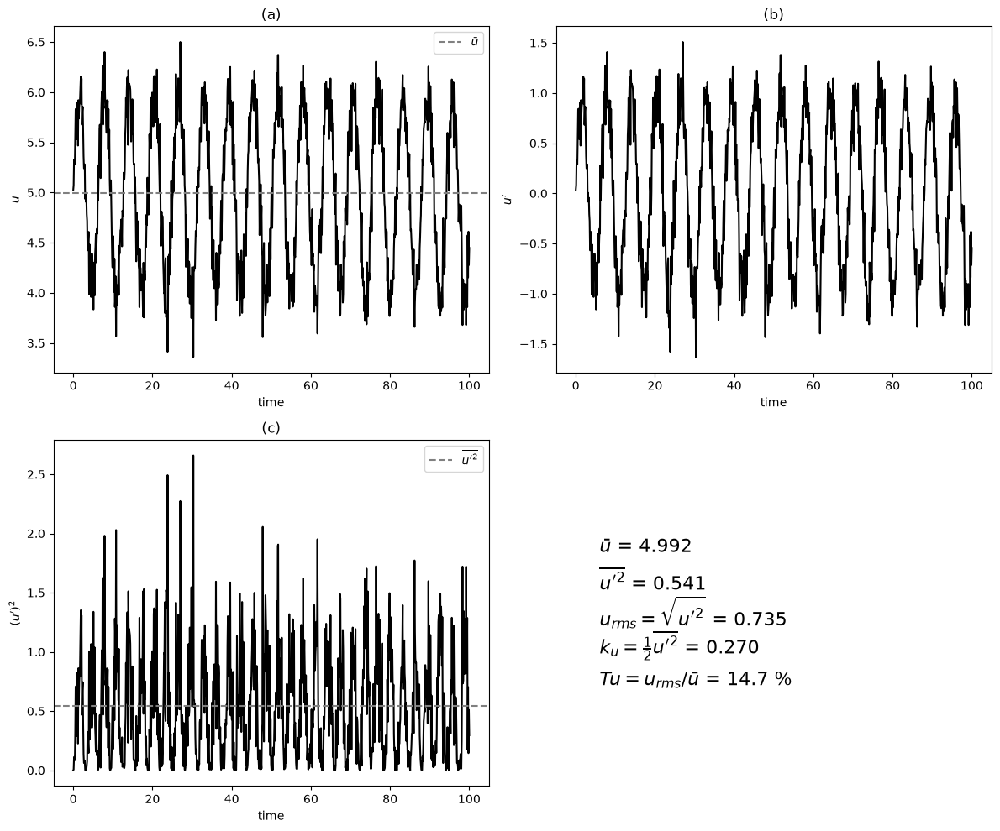

# Turbulence Modeling

Turbulence modeling is one of the most challenging aspects of Computational Fluid Dynamics (CFD) due to the complicated, chaotic, and multiscale nature of turbulent flows. In turbulent flows, a wide range of interacting eddies and fluctuating structures exists, and resolving all of these scales directly (as in Direct Numerical Simulation) is often computationally unfeasible for most engineering applications. Instead, engineers rely on turbulence models to approximate the effects of these fluctuations on the mean flow.

## Flow States: Laminar vs. Turbulent

Understanding the differences between laminar and turbulent flow is important to turbulence modeling.

### Laminar Flow

- Characteristics:
- The velocity field is smooth and orderly in both space and time.
- Fluid particles move along well-defined streamlines or "laminae" that slide past one another.
- There is little to no mixing perpendicular to the flow direction.
- Conditions:
- Typically observed at low-to-moderate Reynolds numbers, where viscous forces dominate and damp out disturbances.
- The flow remains stable, and any perturbations are quickly dissipated by the fluid’s viscosity.

### Turbulent Flow

- Characteristics:
- The flow exhibits large, seemingly random fluctuations in velocity and pressure.
- Turbulent flow is characterized by chaotic eddies and vortices of varying scales.
- Energy is cascaded from larger eddies to smaller ones, finally dissipating as heat due to viscosity.
- Conditions:
- Occurs at high Reynolds numbers, where inertial forces overcome viscous damping, leading to instability and chaotic motion.
- The mixing in turbulent flows enhances momentum, heat, and mass transfer.

## Flow Variable History

One common way to analyze turbulent flows is to study the time history of flow variables, such as velocity, at a fixed point in space.

- Typical Time History of a Flow Variable $u$:
- Shows the instantaneous values of a velocity component over time.
- A dashed line or other visual indicator is often used to represent the long-term average (mean) value of the variable.
This approach helps to distinguish between the underlying mean flow and the superimposed turbulent fluctuations.

## Types of Averages

Averaging is a key concept in turbulence modeling because the instantaneous flow field is highly irregular. By applying various averaging techniques, we obtain a smoother, more tractable field that still captures the necessary physics.

I. Time Average

II. Volume Average

III. Ensemble Average

### Ensemble Average

- Definition:
- The ensemble average is calculated by repeating an experiment or simulation multiple times and averaging the quantity (e.g., velocity) at the same spatial location and time.
- Practicality:
- Although conceptually rigorous, ensemble averaging is rarely feasible in practice due to the need for multiple independent realizations. Instead, time or volume averages are often used under the assumption that they are statistically equivalent to the ensemble average (this is the ergodic hypothesis).

### Time Average (Stationary Flow)

- Definition:

$$\overline{u}(y) \equiv \lim_{\tau \to \infty} \frac{1}{2\tau} \int_{-\tau}^{\tau} u(y,t) \, dt$$

- This formula represents the mean value of a flow variable over a long period and is particularly applicable to statistically stationary flows where the statistics do not change with time.

### Velocity Fluctuation

- Definition:

$$u' \equiv u - \overline{u}$$

- Here, $u'$ represents the deviation of the instantaneous velocity from its mean value. By definition, the time average of the fluctuations is zero: $\overline{u'} = 0$.

### Measuring Fluctuation Strength

- Square of the Fluctuating Quantity:
- The mean of the square of the fluctuations, $\overline{u'^2}$, provides a measure of the turbulence intensity and is always a positive value.
- This measure is often used to quantify the energy contained in the turbulent fluctuations.

## Example Illustrations

I. Time History of Velocity:

- A plot showing the instantaneous velocity at a point over time with a dashed line indicating the mean velocity. This visualization helps separate the turbulent fluctuations from the underlying mean flow.
- Dashed line indicates the average velocity.

   
II. Fluctuating Component of Velocity:

- A graph illustrating $u'$, the deviation of the instantaneous velocity from the mean, highlighting the random nature of turbulence.

III. Square of the Fluctuating Velocity:

- A plot displaying $u'^2$ over time, with the dashed line representing its time average. This is a direct measure of the turbulent kinetic energy associated with the fluctuations.

## Governing Equations for Turbulent Flow

### Similarity to Laminar Flow

- The important equations governing fluid flow—the Navier–Stokes equations—remain the same for both laminar and turbulent flows.
- However, in turbulent flow, the presence of rapid fluctuations necessitates additional techniques, such as averaging and modeling, to capture the effects of turbulence.

### Solution Approaches

I. Direct Numerical Simulations (DNS)

- Description:  
 DNS involves solving the full, unaveraged Navier–Stokes equations without any turbulence models, resolving all scales of motion.

- Advantages:  
 Provides the most detailed and accurate representation of turbulence.

- Limitations:  
 Extremely computationally expensive and typically limited to simple geometries and low Reynolds numbers.

II. Reynolds-Averaged Navier-Stokes (RANS) Equations

- Description:  
 RANS equations result from applying an averaging process (typically time averaging) to the Navier–Stokes equations, resulting in equations for the mean flow quantities.

- Advantages:  
 Computationally efficient and widely used in industrial applications.

- Limitations:  
 Require turbulence models (closure approximations) to represent the effects of the turbulent fluctuations (e.g., Reynolds stresses), which can introduce significant uncertainties.

## The Closure Problem in RANS

When the Navier–Stokes equations are averaged, additional terms known as Reynolds stresses appear. These stresses represent the momentum transfer due to turbulent fluctuations and are not directly determined by the mean flow equations. This introduces the closure problem, which requires additional modeling to relate the Reynolds stresses to the mean flow variables.

### Example: Fully Developed Turbulent Flow in a Channel

- Geometry:
- Consider a channel of height $2H$.
- Objective:
- Solve for the mean velocity profile $\overline{u}(y)$ across the channel.

### Averaged Navier-Stokes Equation

A simplified form of the averaged momentum equation in the streamwise ($x$) direction may be written as:

$$\frac{d}{dy} \overline{u'v'} + \frac{1}{\rho} \frac{dp}{dx} = \nu \frac{d^2 \overline{u}(y)}{dy^2}$$

with boundary conditions such as:

$$\begin{aligned}
& y = 0: \quad \frac{d\overline{u}}{dy} = 0, \\
& y = H: \quad \overline{u} = 0,
\end{aligned}$$

where:

- $\nu = \mu/\rho$ is the kinematic viscosity.
- $\overline{u'v'}$ is the Reynolds shear stress, a term that requires modeling in terms of $\overline{u}(y)$ and its derivatives.

### Reynolds Stress Modeling (Closure Approximation)

- Importance:  
The accuracy of RANS-based predictions depends critically on how well the Reynolds stresses are modeled. Common approaches include eddy-viscosity models, which relate the Reynolds stresses to the mean velocity gradients using a turbulent viscosity concept.

## Turbulence Parameters

Turbulence models often involve additional transport equations for turbulence quantities, which provide insight into the state of the turbulent flow and help close the RANS equations.

I. Turbulent Kinetic Energy (k)

- Definition:

 $$k = \frac{1}{2} \left( \overline{u'^2} + \overline{v'^2} + \overline{w'^2} \right)$$

- Role:  
 Represents the energy contained in the turbulent fluctuations.

- Typical Magnitudes:  
 In highly turbulent flows, $k$ may account for a few percent (often up to 5%) of the kinetic energy of the mean flow.

II. Turbulent Energy Dissipation Rate (ε)

- Definition (with summation over $i, j = 1, 2, 3$):

 $$\epsilon = \nu \, \overline{\frac{\partial u_i'}{\partial x_j} \frac{\partial u_i'}{\partial x_j}}$$

 Strictly, this is the pseudo-dissipation. The true dissipation is $2\nu \, \overline{s_{ij}' s_{ij}'}$ with $s_{ij}' = \frac{1}{2}\left(\frac{\partial u_i'}{\partial x_j} + \frac{\partial u_j'}{\partial x_i}\right)$; the two are equal in homogeneous turbulence.

- Role:  
 Measures the rate at which turbulent kinetic energy is dissipated into heat due to viscosity.

- Significance:  
 Accurate modeling of $\epsilon$ is necessary for predicting the decay and spatial distribution of turbulence.

## Turbulence Modeling in CFD

- k-ε Models:
- These models are among the most widely used in industrial CFD simulations.
- They involve solving two additional transport equations—one for the turbulent kinetic energy $k$ and one for the dissipation rate $\epsilon$—to close the RANS equations.
- Advantages:  
Simplicity and robustness in many engineering applications.

- Limitations:  
May struggle to accurately capture complicated flows with strong anisotropy or near-wall phenomena without further modifications or additional models.

- Other Models:
- k-ω Models:  
Often provide improved performance in the near-wall region.

- Reynolds Stress Models (RSM):  
Offer a more detailed representation by directly modeling the transport equations for the Reynolds stresses, at the expense of higher computational cost.

- Large Eddy Simulation (LES):  
Resolves the larger turbulent scales while modeling only the smallest scales, providing a compromise between DNS and RANS in terms of computational cost and fidelity.

Turbulence modeling remains an active area of research, with ongoing efforts to improve the accuracy of models and reduce the reliance on empirical closure approximations. The integration of data-driven approaches and advanced computational methods continues to push the boundaries of what is achievable in turbulent flow simulations.

## Purpose in CFD

Most engineering flows are turbulent. Because resolving every eddy (DNS) is prohibitively expensive, CFD relies on turbulence models. This note explains laminar vs. turbulent regimes, Reynolds decomposition ($u = \overline{u} + u'$), the RANS closure problem, key turbulence parameters ($k$, $\epsilon$), and widely used model families (k-ε, k-ω, RSM, LES). Selecting and tuning a turbulence model is one of the most impactful decisions in a CFD simulation.

## Input / Output

| Aspect | Details |
|---|---|
| **Inputs** | Mean velocity field $\overline{u}$, Reynolds number, turbulence model choice (k-ε, k-ω, etc.), wall treatment, boundary values for $k$ and $\epsilon$ |
| **Outputs** | Reynolds stress tensor $\overline{u'_i u'_j}$, turbulent kinetic energy $k$, dissipation rate $\epsilon$, eddy viscosity $\nu_t$, mean velocity profile |

## Related Scripts

- [Laminar vs Turbulent Pipe Flow](../../../scripts/plots/laminar_vs_turbulent_pipe/): plots laminar and turbulent radial velocity profiles of pipe flow in side-by-side panels to show how much flatter the turbulent profile is.
- [Laminar vs. Turbulent Boundary Layer Profiles](../../../scripts/plots/laminar_vs_turbulent_boundary_layer/): plots normalised laminar and turbulent boundary-layer velocity profiles on the same axes to show how much fuller the turbulent profile is.
- [Mean Pressure Coefficient Along Vehicle Centreline](../../../scripts/plots/mean_pressure_coefficient/): plots a mock validation figure of mean pressure coefficient $C_P$ against streamwise position, comparing "experimental" data with a "CFD SRS" (scale-resolving simulation) curve that under-predicts a separation plateau.
- [Mean Velocity Magnitude: Experiment vs CFD Comparison](../../../scripts/plots/mean_velocity_magnitude/): plots a mock experimental profile and a mock CFD scale-resolving simulation (SRS) profile of the normalised mean velocity magnitude $|U|/U_0$ along an under-body centreline.
- [Time-Averaged Velocity Field](../../../scripts/plots/time_averaged_velocity_field/): generates a synthetic noisy longitudinal velocity field on a 200 × 60 grid and compares it with its mean field, the first step of a Reynolds decomposition.
- [Turbulent Flow: Reynolds Decomposition](../../../scripts/plots/turbulent_flow/): splits a synthetic velocity signal into its time mean and fluctuation, following the Reynolds decomposition used in turbulence modelling.

## Exercises

**Exercise 1.** A hot-wire probe records $u = 10.2, 9.6, 10.5, 9.9, 9.8, 10.0$ m/s. Compute $\overline{u}$, the fluctuations $u'$, $\overline{u'^2}$, the rms fluctuation and the turbulence intensity $u_{\text{rms}}/\overline{u}$.

Answer

$\overline{u} = 10.0$ m/s and $u' = (0.2, -0.4, 0.5, -0.1, -0.2, 0)$ m/s, which average to zero as expected.

$\overline{u'^2} = (0.04 + 0.16 + 0.25 + 0.01 + 0.04 + 0)/6 \approx 0.0833$ m²/s².

$u_{\text{rms}} \approx 0.289$ m/s, so the turbulence intensity is about 2.9%.

**Exercise 2.** In nearly isotropic turbulence $u_{\text{rms}} = v_{\text{rms}} = w_{\text{rms}} = 0.5$ m/s while the mean velocity is 10 m/s. Compute $k$ and compare it with the kinetic energy per unit mass of the mean flow.

Answer

$k = \tfrac{1}{2}(0.25 + 0.25 + 0.25) = 0.375$ m²/s².

The mean-flow kinetic energy is $\tfrac{1}{2}\overline{u}^2 = 50$ m²/s², so $k$ is $0.375/50 = 0.75\%$ of it, within the "few percent" range quoted in the note.

**Exercise 3.** Integrate the averaged channel momentum equation of the note from the centreline $y = 0$ to $y$ to obtain a relation for the total shear stress. Evaluate it at the wall $y = H$ to show that $\tau_w = -H\, dp/dx$.

Answer

Integrating $\frac{d}{dy}\overline{u'v'} + \frac{1}{\rho}\frac{dp}{dx} = \nu\frac{d^2\overline{u}}{dy^2}$ from 0 to $y$, and using $d\overline{u}/dy = 0$ and $\overline{u'v'} = 0$ at the centreline (symmetry):

$$\nu\frac{d\overline{u}}{dy} - \overline{u'v'} = \frac{y}{\rho}\frac{dp}{dx}.$$

The total (viscous plus turbulent) shear stress varies linearly across the channel.

At the wall the fluctuations vanish (no-slip), so $\overline{u'v'} = 0$ and $\mu\, d\overline{u}/dy|_H = H\, dp/dx$. Since $dp/dx < 0$, the velocity gradient is negative at the upper wall, and the magnitude of the wall shear stress is $\tau_w = -H\, dp/dx$.

**Exercise 4.** Water ($\rho = 1000$ kg/m³, $\nu = 10^{-6}$ m²/s) flows in a channel with half-height $H = 0.05$ m under $dp/dx = -2$ Pa/m. Use the result of Exercise 3 to compute $\tau_w$, the friction velocity $u_\tau = \sqrt{\tau_w/\rho}$, the friction Reynolds number $Re_\tau = u_\tau H/\nu$, and the wall distance for $y^+ = 1$.

Answer

$\tau_w = 0.05 \times 2 = 0.1$ Pa and $u_\tau = \sqrt{0.1/1000} = 0.01$ m/s.

$Re_\tau = 0.01 \times 0.05/10^{-6} = 500$.

$y^+ = 1$ corresponds to $y = \nu/u_\tau = 10^{-4}$ m, or 0.1 mm. A wall-resolved RANS or LES mesh needs its first cell centre about this close to the wall.

**Exercise 5.** A k–ε model gives $k = 0.375$ m²/s² and $\epsilon = 0.5$ m²/s³ in air ($\nu = 1.5 \times 10^{-5}$ m²/s). Compute the eddy viscosity $\nu_t = C_\mu k^2/\epsilon$ with $C_\mu = 0.09$ and its ratio to $\nu$. Then estimate the Kolmogorov length scale $\eta = (\nu^3/\epsilon)^{1/4}$. What does $\eta$ imply about DNS of this flow?

Answer

$\nu_t = 0.09 \times 0.375^2/0.5 \approx 0.0253$ m²/s, about 1690 times the molecular viscosity. Turbulent mixing dominates momentum transport.

$\eta = ((1.5 \times 10^{-5})^3/0.5)^{1/4} \approx 2.9 \times 10^{-4}$ m, or 0.29 mm.

DNS must resolve scales of order $\eta$. A domain 1 m on a side would need on the order of $(1/0.00029)^3 \approx 4 \times 10^{10}$ grid points, which is why engineering simulations model the Reynolds stresses instead.

## References

- Pope, S. B., *Turbulent Flows*, Cambridge University Press, 2000.
- Wilcox, D. C., *Turbulence Modeling for CFD*, 3rd ed., DCW Industries, 2006.
- Tennekes, H., & Lumley, J. L., *A First Course in Turbulence*, MIT Press, 1972.
- Launder, B. E., & Spalding, D. B., "The numerical computation of turbulent flows", *Computer Methods in Applied Mechanics and Engineering* 3(2), 1974.
- Moser, R. D., Kim, J., & Mansour, N. N., "Direct numerical simulation of turbulent channel flow up to $Re_\tau = 590$", *Physics of Fluids* 11(4), 1999.
