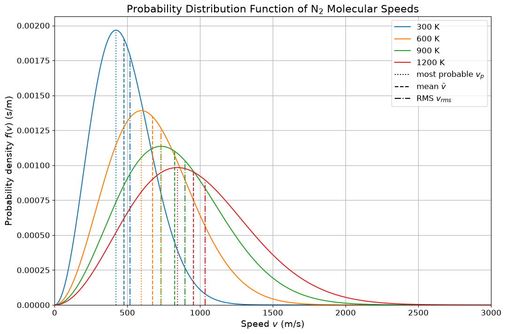

# From Newton to Navier-Stokes

Fluid dynamics spans multiple scales. At the microscopic level, Newton's laws (or molecular dynamics, MD) govern the behavior of individual particles. At the macroscopic level, fluids are described by the Navier-Stokes equations (NSE). Bridging these scales is essential for both physical insight and computational efficiency. The **Lattice-Boltzmann Method (LBM)** provides this bridge by adopting a mesoscopic approach that leverages a simplified kinetic model. LBM recovers the NSE while retaining key microscopic insights, making it an appealing alternative to traditional computational fluid dynamics (CFD).


## 1. Introduction: Why a Mesoscopic Approach?

Traditional CFD methods solve the continuum Navier-Stokes equations directly, but they may obscure the underlying physics present at the molecular level. A mesoscopic approach, such as LBM, operates between these extremes by:
- **Averaging Microscopic Behavior:** Instead of tracking each molecule, we average over small volumes where molecular fluctuations are smoothed out.
- **Retaining Key Kinetic Details:** Essential kinetic information is preserved, enabling the recovery of macroscopic behavior.
- **Enhancing Computational Efficiency:** LBM is inherently parallel and can handle complex boundaries with relative ease.

This approach not only offers computational advantages but also deepens our understanding of how macroscopic fluid phenomena emerge from microscopic interactions.

---

## 2. The Lattice-Boltzmann Approach

The Lattice-Boltzmann method is based on a discrete version of the Boltzmann kinetic equation. It does not solve the full Boltzmann equation directly; instead, it employs a simplified, discretized version that is designed to recover the Navier-Stokes equations in the macroscopic limit.

### 2.1. Transition Diagram: From Microscopic to Macroscopic

The following diagram outlines the cascade of models from fundamental molecular dynamics to continuum fluid dynamics:

```
+------------+        +-------------+          +---------------+               +-------+
| Newton/MD  +------->+  Boltzmann  +--------->+ Navier-Stokes | <-----------> +  CFD  +
+------------+        +-------------+          +---------------+               +-------+
      |                      |                         ^
      v                      v                         |
+------------+        +----------------+               |
| Lattice    +------->+ Lattice        +---------------+
| Gas        |        | Boltzmann      |
+------------+        +----------------+
```

- **Newton/MD:** The microscopic laws governing individual particles.
- **Boltzmann Equation:** A statistical description of particle distributions.
- **Lattice Boltzmann:** A mesoscopic model that discretizes the Boltzmann equation on a lattice.
- **Navier-Stokes & CFD:** The macroscopic continuum equations and their numerical solution.

This flow illustrates how the Lattice-Boltzmann method serves as the crucial intermediary, combining microscopic fidelity with macroscopic efficiency.

---

## 3. The Probability Distribution Function (PDF)

At the heart of the LBM lies the **probability distribution function** $ f(\xi, x, t) $. This function encapsulates the statistical information about particles at a mesoscopic scale.

### 3.1. Simplifying Microscopic Details

The objective is to remove unnecessary microscopic details while retaining the essential physics needed to describe macroscopic fluid behavior. This is achieved by averaging over a volume $ \ell_{\text{av}} $ that satisfies

$$
\ell_{\text{mfp}} \ll \ell_{\text{av}} \ll \ell,
$$

where:
- $ \ell_{\text{mfp}} $ is the mean free path (the typical distance a molecule travels between collisions),
- $ \ell $ is the macroscopic length scale.

The **distribution function** $ f(\xi, x, t) $:
- **Definition:** Describes the density of molecules with velocity $ \xi $ at position $ x $ and time $ t $.
- **Kinetic Link:** The molecular velocity is defined as $ \xi = \frac{dx}{dt} $.

In essence, $ f(\xi, x, t) \, d\xi \, dx $ represents the number of molecules in a small velocity range $ d\xi $ and spatial element $ dx $.

### 3.2. Visualizing Molecular Averaging

Consider the following schematic representation of molecules (dots) distributed within a small control volume. The averaging process smooths out microscopic fluctuations while capturing overall behavior:

```
+------------------------------------------------+
|   *    .         *     .      *               |
|   .  *    .          .   *         .          |
|  *     .       *         .     *              |
|        .         . *         .    *           |
|   *          .         *         .            |
|         *        .           *         .       |
+------------------------------------------------+
```

*This diagram shows the random positions of molecules. Averaging over such a control volume yields a continuum description that feeds into the LBM framework.*

---

## 4. Advantages of the Lattice-Boltzmann Method

The LBM offers several compelling benefits compared to conventional CFD approaches:

1. **Inherent Parallelism:**  
   LBM’s algorithm naturally partitions over a lattice, making it highly efficient on parallel computing architectures.

2. **Simplicity in Implementation:**  
   The underlying algorithm is straightforward, reducing coding complexity and facilitating rapid development.

3. **Flexibility with Complex Boundaries:**  
   Complex geometries and boundary conditions are easier to handle compared to traditional CFD methods.

4. **Physical Transparency:**  
   By working at the mesoscopic level, LBM retains a clear connection to the underlying kinetic theory, providing physical insights that can be obscured in fully macroscopic formulations.

---

## 5. Macroscopic Properties via Moments of $ f(\xi, x, t) $

The power of the LBM lies in its ability to recover macroscopic fluid properties by taking moments of the probability distribution function $ f(\xi, x, t) $.

### 5.1. Important Properties

1. **Normalization (Total Mass):**

   $$
   \int d^3\xi \int d^3x \, f(\xi, x, t) = M(t),
   $$

   where $ M(t) $ is the total mass.

2. **Fluid Density:**

   $$
   \int d^3\xi \, f(\xi, x, t) = \rho(x, t),
   $$

   which defines the density at point $ x $ and time $ t $.

3. **Momentum Density:**

   $$
   \int d^3\xi \, \xi\, f(\xi, x, t) = \rho(x, t)\, u(x, t),
   $$

   where $ u(x, t) $ is the macroscopic fluid velocity.

4. **Pressure and Stress Tensor:**
   Higher moments (involving $ \xi \otimes \xi $) provide information about the pressure and viscous stresses in the fluid. Although the exact expressions are more involved, they underpin the recovery of the Navier-Stokes equations from the kinetic model.

### 5.2. Comprehensive Role of $ f(\xi, x, t) $

The function $ f(\xi, x, t) $ holds all local information about the fluid:
- **Zeroth Moment:** Yields the density.
- **First Moment:** Gives the momentum.
- **Second Moment:** Relates to the pressure and stress tensor.

Thus, macroscopic properties are obtained as **moments** of the mesoscopic distribution, effectively bridging the scales.


*Figure: The probability distribution function $ f(\xi, x, t) $ encapsulates the complete mesoscopic description of the fluid, from which macroscopic properties emerge.*


## Purpose in CFD

This note traces the path from microscopic Newton's laws through the mesoscopic Boltzmann equation to the macroscopic Navier–Stokes equations. It explains why LBM operates at the mesoscopic level, how the probability distribution function $f(\xi, x, t)$ encodes all necessary physics, and how its moments recover density, velocity, and pressure. This conceptual bridge justifies using kinetic methods for CFD.

## Input / Output

| Aspect | Details |
|---|---|
| **Inputs** | Probability distribution function $f(\xi, x, t)$, averaging volume $\ell_{\text{av}}$, mean free path $\ell_{\text{mfp}}$ |
| **Outputs** | Zeroth moment → density $\rho$, first moment → momentum $\rho\mathbf{u}$, second moment → pressure/stress tensor |

## Related Scripts

- [Lattice Boltzmann Cylinder Flow Simulation](../../../scripts/simulations/lattice_boltzmann_cylinder_flow/): simulates 2D flow past a circular cylinder with the lattice Boltzmann method (D2Q9 lattice, BGK collision operator) and animates the velocity magnitude with Matplotlib.

## Exercises

**Exercise 1.** Air at $T = 293.15$ K and $p = 101325$ Pa behaves as an ideal gas with number density $n = p/(k_B T)$, where $k_B = 1.380649 \times 10^{-23}$ J/K. Compute $n$, the mean spacing between molecules $n^{-1/3}$, and the number of molecules in a cube of side 10 µm. Is this cube a reasonable averaging volume $\ell_{\text{av}}$?

<details>
<summary>Answer</summary>

- $n = 101325 / (1.380649 \times 10^{-23} \times 293.15) \approx 2.50 \times 10^{25}$ m⁻³.
- Mean spacing $n^{-1/3} \approx 3.4 \times 10^{-9}$ m = 3.4 nm.
- A cube of side $10^{-5}$ m has volume $10^{-15}$ m³ and holds about $2.5 \times 10^{10}$ molecules.

Relative statistical fluctuations scale like $N^{-1/2} \approx 6 \times 10^{-6}$, which is negligible. The cube is also much larger than the mean free path (tens of nanometres; see Exercise 3). For a flow scale of about 1 mm or more it satisfies $\ell_{\text{mfp}} \ll \ell_{\text{av}} \ll \ell$.

</details>

**Exercise 2.** A one-dimensional "two-beam" gas has $f(\xi) = \rho_1 \delta(\xi - \xi_1) + \rho_2 \delta(\xi - \xi_2)$ with $\rho_1 = 0.6$ kg/m³ at $\xi_1 = 300$ m/s and $\rho_2 = 0.4$ kg/m³ at $\xi_2 = -200$ m/s. Compute $\rho$, $u$ and the momentum flux of the relative motion $P_{xx} = \int (\xi - u)^2 f \, d\xi$.

<details>
<summary>Answer</summary>

- $\rho = 0.6 + 0.4 = 1.0$ kg/m³.
- $\rho u = 0.6 \times 300 + 0.4 \times (-200) = 100$ kg/(m² s), so $u = 100$ m/s.
- The relative velocities are $+200$ and $-300$ m/s, so $P_{xx} = 0.6 \times 200^2 + 0.4 \times 300^2 = 24000 + 36000 = 60000$ Pa.

This $f$ is far from a Maxwellian, but its moments still define a density, a velocity and a pressure-like stress.

</details>

**Exercise 3.** The hard-sphere mean free path is $\ell_{\text{mfp}} = k_B T / (\sqrt{2}\,\pi d^2 p)$. For nitrogen take $d = 0.37$ nm, with $T = 293.15$ K and $p = 101325$ Pa. Compute $\ell_{\text{mfp}}$ and the ratio $\ell_{\text{mfp}}/\ell$ for $\ell = 1$ µm and $\ell = 1$ mm. For which scale is there room for an averaging volume with $\ell_{\text{mfp}} \ll \ell_{\text{av}} \ll \ell$?

<details>
<summary>Answer</summary>

$\ell_{\text{mfp}} = 1.380649 \times 10^{-23} \times 293.15 / (\sqrt{2}\,\pi \, (0.37 \times 10^{-9})^2 \times 101325) \approx 6.6 \times 10^{-8}$ m (66 nm).

- $\ell = 1$ µm: ratio $\approx 0.066$. The scales are separated by only a factor of about 15, leaving no room for an averaging volume, and the flow is in the slip regime.
- $\ell = 1$ mm: ratio $\approx 6.6 \times 10^{-5}$. An averaging volume of about 10 µm is two orders of magnitude above $\ell_{\text{mfp}}$ and two orders below $\ell$, so the mesoscopic description is well founded.

</details>

**Exercise 4.** Show that the first moment of $f$ with respect to the relative velocity $v = \xi - u$ vanishes, $\int (\xi - u) f \, d^3\xi = 0$. Use this to split the second moment as $\int \xi \otimes \xi \, f \, d^3\xi = \rho \, u \otimes u + P$, where $P = \int v \otimes v \, f \, d^3\xi$. Which part becomes the convective term of the NSE, and which becomes pressure and viscous stress?

<details>
<summary>Answer</summary>

$\int (\xi - u) f \, d^3\xi = \rho u - u\rho = 0$, using the definitions of density and momentum density.

Expand $\xi \otimes \xi = (u + v) \otimes (u + v) = u \otimes u + u \otimes v + v \otimes u + v \otimes v$. Integrating against $f$, the two cross terms vanish by the first result, leaving

$$
\int \xi \otimes \xi \, f \, d^3\xi = \rho \, u \otimes u + P.
$$

In the momentum balance $\partial_t(\rho u) + \nabla \cdot \int \xi \otimes \xi \, f \, d^3\xi = \ldots$, the term $\rho \, u \otimes u$ gives the convective flux $\nabla \cdot (\rho u \otimes u)$. The tensor $P$ carries the molecular (thermal) momentum flux. Its isotropic part is the pressure, $p = \operatorname{tr}(P)/3$, and its deviatoric part is minus the viscous stress, which the Chapman–Enskog expansion relates to velocity gradients.

</details>

## References

- S. Chapman and T. G. Cowling, *The Mathematical Theory of Non-Uniform Gases*, 3rd ed., Cambridge University Press, 1970.
- U. Frisch, B. Hasslacher and Y. Pomeau, "Lattice-gas automata for the Navier-Stokes equation", *Physical Review Letters* 56(14), 1986.
- T. Krüger, H. Kusumaatmaja, A. Kuzmin, O. Shardt, G. Silva and E. M. Viggen, *The Lattice Boltzmann Method: Principles and Practice*, Springer, 2017.
- S. Succi, *The Lattice Boltzmann Equation for Fluid Dynamics and Beyond*, Oxford University Press, 2001.
