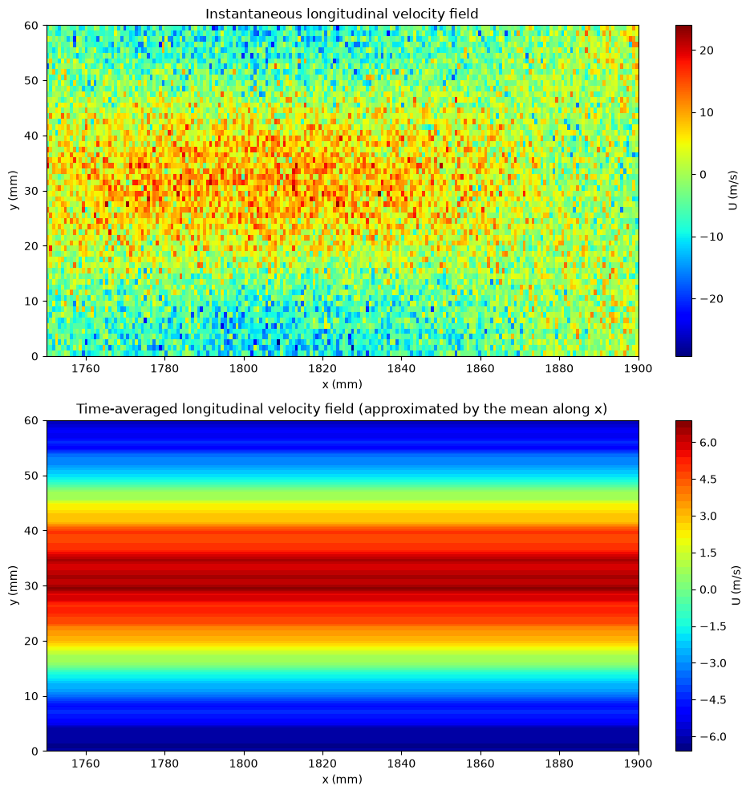
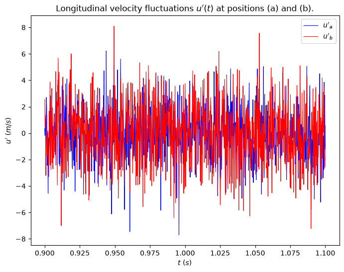
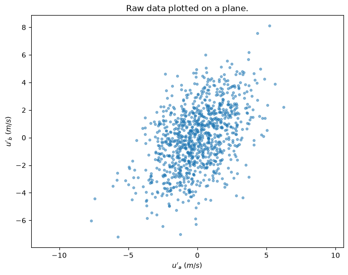
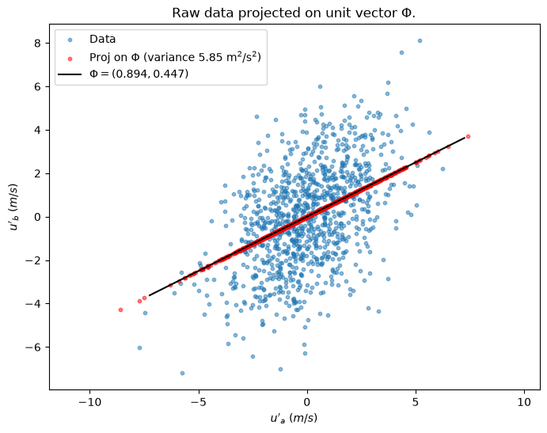
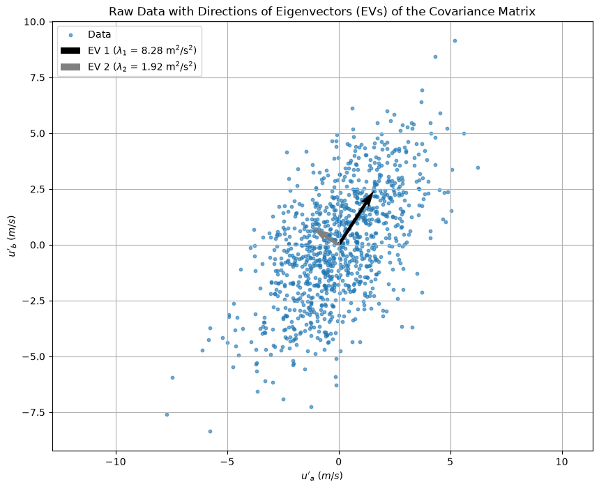
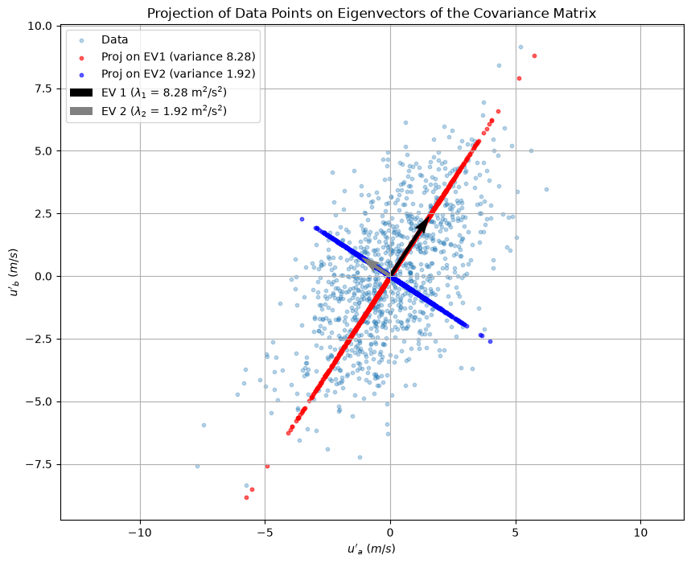

# Derivation of POD in 2D

### Origins and Purpose
- POD originated in turbulence studies, introduced by Lumley in 1967.
- Objective: Decompose turbulent fluid motion into deterministic functions (POD modes) to understand flow organization.
- Goal: Identify coherent structures within turbulent flows.

### Basic Concept
- Fluctuating velocity in flow: $\mathbf{u}'(\mathbf{x}, t)$ (velocity vector $\mathbf{U}$ minus its temporal mean).
- Position vector: $\mathbf{x} = (x, y, z)$.
- Velocity vector: $\mathbf{U} = (U, V, W)$.
- Time: $t$.

### Decomposition
- POD decomposes $\mathbf{u}'(\mathbf{x}, t)$ into spatial functions $\mathbf{\Phi}_k(\mathbf{x})$ and time coefficients $a_k(t)$:

$$ \mathbf{u}'(\mathbf{x}, t) = \sum_{k=1}^{\infty} a_k(t) \mathbf{\Phi}_k(\mathbf{x}). $$

### Key Properties
- **Optimality**: The sequence $\sum_{k=1}^n a_k(t) \mathbf{\Phi}_k(\mathbf{x})$ captures maximum kinetic energy.
- **Orthonormality**: Modes $\mathbf{\Phi}_k(\mathbf{x})$ are orthonormal:

$$ \int_{\mathbf{x}} \mathbf{\Phi}_{k_1}(\mathbf{x}) \mathbf{\Phi}_{k_2}(\mathbf{x}) d\mathbf{x} = \begin{cases} 
1 & \text{if } k_1 = k_2 \\
0 & \text{if } k_1 \neq k_2 
\end{cases}. $$

- **Time Coefficients**: Each $a_k(t)$ depends on $\mathbf{\Phi}_k(\mathbf{x})$:

$$ a_k(t) = \int_{\mathbf{x}} \mathbf{u}'(\mathbf{x}, t) \mathbf{\Phi}_k(\mathbf{x}) d\mathbf{x}. $$

### Relevance in Engineering
- Often introduced to students through Principal Component Analysis (PCA), suited to finite-dimensional data.
- POD is used in fluid mechanics and aerodynamics, targeting experimental and numerical finite-dimensional data.

## II. Example Flow: Turbulent Separation-Bubble (TSB)

### Flow Geometry
- Investigated using Particle Image Velocimetry (PIV).
- TSB forms due to adverse and favorable pressure gradients in a wind tunnel.
- PIV data: 200 mm $\times$ 80 mm rectangle, centered at $x =$ 1825 mm, $z =$ 0 mm.
- Data consists of 3580 vector fields, 129 $N_x$ $\times$ 45 $N_y$ velocity vectors ($U, V$).

### Data Analysis
- Focus on longitudinal velocity $U$.
- Example: Instantaneous contour plot of $U$ shows unsteady shear layer.
- Time-averaged velocity field: Average of PIV sequences.

## III. The 2-Dimensional Example

### Snapshot Matrix
- Analyze data at two positions within the separation bubble.
- Velocity data: Two arrays of $m = 3580$ longitudinal velocity values ($U_a(t_i)$ and $U_b(t_i)$).
- Concatenate into $m \times 2$ matrix $\mathbf{S}$ (matrix of snapshots).

### Steps to Implement POD
1. **Data Collection**: Gather velocity data from PIV measurements.
2. **Matrix Formation**: Form snapshot matrix $\mathbf{S}$.
3. **Covariance Matrix**: Compute the covariance matrix of $\mathbf{S}$.
4. **Eigenvalue Decomposition**: Perform eigenvalue decomposition on the covariance matrix.
5. **POD Modes**: Extract eigenvectors as POD modes.
6. **Time Coefficients**: Calculate time coefficients using the POD modes.

### Practical Considerations
- **Finite-dimensional Implementation**: Suitable for experimental and numerical data.
- **Visualization**: Contour plots to visualize velocity fields and modes.
- **Interpretation**: Analyze modes to understand flow structures.

$$ 
\mathbf{S} = 
\begin{pmatrix}
    U_a(t_1) & U_b(t_1) \\
    U_a(t_2) & U_b(t_2) \\
    \vdots & \vdots \\
    U_a(t_m) & U_b(t_m)
\end{pmatrix}. \quad (4) 
$$

### Removing Average Velocities
- To focus on flow dynamics, remove the average velocities $\overline{U}_a$ and $\overline{U}_b$ from their respective columns.
- This gives a new snapshot matrix $\mathbf{U}$ consisting of velocity fluctuations $u'_a(t) = U_a(t) - \overline{U}_a$ and $u'_b(t) = U_b(t) - \overline{U}_b$:

$$ 
\mathbf{U} = 
\begin{pmatrix}
    u_{11} & u_{12} \\
    u_{21} & u_{22} \\
    \vdots & \vdots \\
    u_{m1} & u_{m2}
\end{pmatrix} = 
\begin{pmatrix}
    u'_a(t_1) & u'_b(t_1) \\
    u'_a(t_2) & u'_b(t_2) \\
    \vdots & \vdots \\
    u'_a(t_m) & u'_b(t_m)
\end{pmatrix}. \quad (5) 
$$

### Visualizing Data
- The time traces of $u'_a$ and $u'_b$ show random turbulent signals, indicating some correlation due to proximity.
- On a 2D plot with $u'_a$ on the x-axis and $u'_b$ on the y-axis, the data points form an ellipse, showing correlation.

### Covariance Matrix
- To quantify the correlation, compute the covariance matrix $\mathbf{C}$:

$$
\mathbf{C} = \frac{1}{m-1} \mathbf{U}^T \mathbf{U} = \frac{1}{m-1} 
\begin{pmatrix}
    \sum_{i=1}^{m} u'_a(t_i)^2 & \sum_{i=1}^{m} u'_a(t_i)u'_b(t_i) \\
    \sum_{i=1}^{m} u'_b(t_i)u'_a(t_i) & \sum_{i=1}^{m} u'_b(t_i)^2
\end{pmatrix}. \quad (6)
$$

- Diagonal elements: variances of $u'_a$ and $u'_b$.
- Off-diagonal elements: covariances between $u'_a$ and $u'_b$.
- Symmetric covariance matrix indicates correlation if off-diagonal terms are non-zero.

### Example Covariance Matrix
- For the given data:

$$
\mathbf{C} = 
\begin{pmatrix}
    c_{11} & c_{12} \\
    c_{21} & c_{22}
\end{pmatrix} = 
\begin{pmatrix}
    4.92 & 2.82 \\
    2.82 & 5.01
\end{pmatrix}. \quad (7)
$$

### Implications of Covariance Matrix
- Non-zero off-diagonal terms confirm statistical correlation between $u'_a$ and $u'_b$.
- Correlated velocity fluctuations suggest coherent structures in the flow.

### Correlation and Kinetic Energy

- **Correlation Coefficient**: Measures the degree of correlation between $u'_a$ and $u'_b$.
  
$$
  \rho_{ab} = \frac{c_{12}}{\sqrt{c_{11}c_{22}}} = 0.57
  $$

  - Indicates that $u'_a$ and $u'_b$ are fairly well correlated.

- **Total Fluctuating Kinetic Energy (TKE)**: Represents the kinetic energy of the velocity fluctuations.
  
$$
  \text{TKE} = \frac{1}{2} \frac{1}{m-1} \left( \sum_{i=1}^{m} u'_a(t_i)^2 + \sum_{i=1}^{m} u'_b(t_i)^2 \right) = \frac{1}{2} (c_{11} + c_{22}) = 4.96 \, \text{m}^2/\text{s}^2
  $$

### Variance and Modes of Variation

- **Natural Basis Variance**:
  - Variance of $u'_a$: $4.92 \, \text{m}^2/\text{s}^2$
  - Variance of $u'_b$: $5.01 \, \text{m}^2/\text{s}^2$
  - Statistical connection expressed as off-diagonal terms of $\mathbf{C}$.

- **Projection onto a Unit Vector**:
  - Any axis in the plane can define a mode of variation.
  - Project data onto a unit vector $\mathbf{\phi} = (\phi_1, \phi_2)$.
  - Compute dot product of each data point with $\mathbf{\phi}$:

  
$$
  \mathbf{a} = \mathbf{U} \mathbf{\phi} = 
  \begin{pmatrix}
      u_{11} & u_{12} \\
      u_{21} & u_{22} \\
      \vdots & \vdots \\
      u_{m1} & u_{m2}
  \end{pmatrix}
  \begin{pmatrix}
      \phi_1 \\
      \phi_2
  \end{pmatrix} = 
  \begin{pmatrix}
      a_1 = u_{11}\phi_1 + u_{12}\phi_2 \\
      a_2 = u_{21}\phi_1 + u_{22}\phi_2 \\
      \vdots \\
      a_m = u_{m1}\phi_1 + u_{m2}\phi_2
  \end{pmatrix}. \quad (9)
  $$

  - Result is an $m$-dimensional array $\mathbf{a}$ with coordinates $a_i$ projected on $\mathbf{\phi}$.

- **Variance in Any Direction**:
  - Compute variance along the direction $\mathbf{\phi}$:

  
$$
  \text{var}_{\mathbf{\phi}}(\mathbf{a}) = \frac{1}{m-1} \sum_{i=1}^{m} a_i^2 = \frac{1}{m-1} \mathbf{a}^T \mathbf{a}. \quad (10)
  $$

  - Example for unit vector $\mathbf{\phi} = \left( \frac{2}{\sqrt{5}}, \frac{1}{\sqrt{5}} \right)$:
    - Variance: $7.19 \, \text{m}^2/\text{s}^2$
    - Larger than variances on horizontal ($4.92 \, \text{m}^2/\text{s}^2$) or vertical ($5.01 \, \text{m}^2/\text{s}^2$) axes.

### Principal Axes and Modes
- **Infinite Variations**: Any direction $\mathbf{\phi}$ leads to new variance value.
- **Principal Axes**: Major and minor axes of the ellipse in the 2D plot.
  - **Major Axis**: Direction of maximum variance.
  - **Minor Axis**: Orthogonal to the major axis, represents remaining variance.
  - These axes form an orthonormal basis, called the principal axes or proper orthogonal modes of the dataset.

### Computing Principal Axes

- **Eigenvectors of Covariance Matrix**:
  - Directions of major and minor axes are eigenvectors of the covariance matrix $\mathbf{C}$.
  - Intuitively: In the proper orthogonal basis, variance is maximized on each axis, making covariance between axes zero (diagonal covariance matrix).

- **Symmetric Covariance Matrix**:
  - $\mathbf{C}$ is symmetric, so its eigenvectors form an orthonormal basis.
  - Covariance matrix $\mathbf{C}$ can be diagonalized using its eigenvectors:
  
  
$$
  \mathbf{C} = \mathbf{\Phi} \mathbf{\Lambda} \mathbf{\Phi}^{-1} = \mathbf{\Phi} \mathbf{\Lambda} \mathbf{\Phi}^T 
  = \begin{pmatrix}
      \phi_{11} & \phi_{12} \\
      \phi_{21} & \phi_{22}
  \end{pmatrix}
  \begin{pmatrix}
      \lambda_1 & 0 \\
      0 & \lambda_2
  \end{pmatrix}
  \begin{pmatrix}
      \phi_{11} & \phi_{12} \\
      \phi_{21} & \phi_{22}
  \end{pmatrix}^T, \quad (11)
  $$

- **Eigenvector Computation**:
  - In MATLAB: `[PHI LAM] = eig(C)`
  - Order eigenvalues from largest to smallest.
  - First eigenvector corresponds to the largest eigenvalue, representing the major axis.
  - Second eigenvector corresponds to the smallest eigenvalue, representing the minor axis.
  - Eigenvalues relate to the variance along their respective eigenvectors (principal axes).

- **Projection onto Principal Axes**:
  - Project data onto each eigenvector to compute variance along principal axes:

  
$$
  \mathbf{A} = \mathbf{U} \mathbf{\Phi} = 
  \begin{pmatrix}
      u_{11} & u_{12} \\
      u_{21} & u_{22} \\
      \vdots & \vdots \\
      u_{m1} & u_{m2}
  \end{pmatrix}
  \begin{pmatrix}
      \phi_{11} & \phi_{12} \\
      \phi_{21} & \phi_{22}
  \end{pmatrix}. \quad (12)
  $$

- **Variance on Principal Axes**:
  - Major axis variance: $\lambda_1$
  - Minor axis variance: $\lambda_2$
  - Diagonal matrix $\mathbf{\Lambda}$ represents variances in the principal orthogonal basis:

  
$$
  \mathbf{C'} = \frac{1}{m-1} \mathbf{A}^T \mathbf{A} = \frac{1}{m-1} (\mathbf{U} \mathbf{\Phi})^T (\mathbf{U} \mathbf{\Phi}) = \mathbf{\Lambda}. \quad (13)
  $$

### Significance of Eigenvectors

- **Correlation and Eigenvectors**:
  - Eigenvectors indicate how $u'_a$ and $u'_b$ are correlated.
  - In the proper orthogonal basis, $u'_a$ and $u'_b$ are uncorrelated, and their correlation is implicit in the directions of the eigenvectors.
  - Projected variables ($a_{i1}$ and $a_{i2}$) are uncorrelated and represent independent modes of fluctuation.

- **Proper Orthogonal Modes**:
  - Modes correspond to independent coherent structures in the flow.
  - **Example Directions**:
    - $(\sqrt{2}/2, \sqrt{2}/2)$: $u'_a$ and $u'_b$ move in phase with the same amplitude (first mode).
    - $(1,0)$: $u'_a$ fluctuates independently of $u'_b$ (natural basis).
    - $(\sqrt{2}/2, -\sqrt{2}/2)$: $u'_a$ and $u'_b$ fluctuate in opposition (second mode).

### Eigenvalues and Kinetic Energy

- **Eigenvalues and Correlation**:
  - Eigenvalues rank the correlation with respect to the variance (or kinetic energy) of the velocity fluctuations.
  - For the given data:
    - $\lambda_1 = 7.78 \, \text{m}^2/\text{s}^2$
    - $\lambda_2 = 2.15 \, \text{m}^2/\text{s}^2$
  - Total Kinetic Energy (TKE) is:
    
$$
    \text{TKE} = \frac{1}{2} (\lambda_1 + \lambda_2) = 4.96 \, \text{m}^2/\text{s}^2
    $$

- **Proportion of TKE by Each Mode**:
  - Mode 1: $\lambda_1/(\lambda_1 + \lambda_2) \approx 0.78$ (78% of TKE)
  - Mode 2: $\lambda_2/(\lambda_1 + \lambda_2) \approx 0.22$ (22% of TKE)

### Interpretation of Modes

- **First Mode**:
  - Oriented at roughly 45°, indicating a strong correlation between $u'_a$ and $u'_b$.
  - Accounts for 78% of the TKE, indicating significant in-phase fluctuations.

- **Second Mode**:
  - Represents a smaller portion (22%) of TKE.
  - Indicates out-of-phase fluctuations between $u'_a$ and $u'_b$.

### Summary of Steps

1. **Matrix of Snapshots**:
   - Start with the original matrix $\mathbf{S}$ and remove its mean to obtain $\mathbf{U}$.
   - $\mathbf{U}$ represents the velocity fluctuations.

2. **Covariance Matrix**:
   - Compute the covariance matrix $\mathbf{C} = \frac{1}{m-1} \mathbf{U}^T \mathbf{U}$.

3. **Eigenvectors and Eigenvalues**:
   - Obtain the matrix of eigenvectors $\mathbf{\Phi}$ and eigenvalues $\mathbf{\Lambda}$.

4. **Projection onto Eigenvectors**:
   - Project $\mathbf{U}$ onto each eigenvector to obtain $\mathbf{A} = \mathbf{U} \mathbf{\Phi}$.

5. **Reconstruction**:
   - Use the orthogonal property of $\mathbf{\Phi}$ to write $\mathbf{U}$ in terms of $\mathbf{A}$:

   
$$
   \mathbf{A} = \mathbf{U} \mathbf{\Phi} \Rightarrow \mathbf{U} = \mathbf{A} \mathbf{\Phi}^{-1} = \mathbf{A} \mathbf{\Phi}^T
   $$

### Detailed Reconstruction

- **Reconstruction of $\mathbf{U}$**:

$$
\mathbf{U} = \begin{pmatrix}
    u_{11} & u_{12} \\
    u_{21} & u_{22} \\
    \vdots & \vdots \\
    u_{m1} & u_{m2}
\end{pmatrix} = 
\begin{pmatrix}
    a_{11} & a_{12} \\
    a_{21} & a_{22} \\
    \vdots & \vdots \\
    a_{m1} & a_{m2}
\end{pmatrix}
\begin{pmatrix}
    \phi_{11} & \phi_{21} \\
    \phi_{12} & \phi_{22}
\end{pmatrix}
$$

$$
= 
\begin{pmatrix}
    a_{11} \phi_{11} + a_{12} \phi_{12} & a_{11} \phi_{21} + a_{12} \phi_{22} \\
    a_{21} \phi_{11} + a_{22} \phi_{12} & a_{21} \phi_{21} + a_{22} \phi_{22} \\
    \vdots & \vdots \\
    a_{m1} \phi_{11} + a_{m2} \phi_{12} & a_{m1} \phi_{21} + a_{m2} \phi_{22}
\end{pmatrix}
$$

$$
= 
\begin{pmatrix}
    a_{11} \phi_{11} & a_{11} \phi_{21} \\
    a_{21} \phi_{11} & a_{21} \phi_{21} \\
    \vdots & \vdots \\
    a_{m1} \phi_{11} & a_{m1} \phi_{21}
\end{pmatrix}
+
\begin{pmatrix}
    a_{12} \phi_{12} & a_{12} \phi_{22} \\
    a_{22} \phi_{12} & a_{22} \phi_{22} \\
    \vdots & \vdots \\
    a_{m2} \phi_{12} & a_{m2} \phi_{22}
\end{pmatrix}
$$

$$
= 
\begin{pmatrix}
    a_{11} \\
    a_{21} \\
    \vdots \\
    a_{m1}
\end{pmatrix}
\begin{pmatrix}
    \phi_{11} & \phi_{21}
\end{pmatrix}
+
\begin{pmatrix}
    a_{12} \\
    a_{22} \\
    \vdots \\
    a_{m2}
\end{pmatrix}
\begin{pmatrix}
    \phi_{12} & \phi_{22}
\end{pmatrix}
$$

$$
= \mathbf{\tilde{U}}^1 + \mathbf{\tilde{U}}^2
$$

### Decomposition into Proper Orthogonal Modes

- **Definition of Components**:
  - For $k = 1, 2$:
  
$$
  \mathbf{\tilde{U}}^k = 
  \begin{pmatrix}
      \tilde{u}^k_{11} & \tilde{u}^k_{12} \\
      \tilde{u}^k_{21} & \tilde{u}^k_{22} \\
      \vdots & \vdots \\
      \tilde{u}^k_{m1} & \tilde{u}^k_{m2}
  \end{pmatrix}
  = 
  \begin{pmatrix}
      a_{1k} \\
      a_{2k} \\
      \vdots \\
      a_{mk}
  \end{pmatrix}
  \begin{pmatrix}
      \phi_{1k} & \phi_{2k}
  \end{pmatrix}. \quad (16)
  $$

- **Interpretation of Decomposition**:
  - Original matrix $\mathbf{U}$ can be expressed as the sum of:
    - $\mathbf{\tilde{U}}^1$: Data projected onto the major axis, expressed in the natural basis.
    - $\mathbf{\tilde{U}}^2$: Data projected onto the minor axis, expressed in the natural basis.
  - This means the original velocity fluctuations are decomposed into contributions from the first mode ($\mathbf{\tilde{U}}^1$) and the second mode ($\mathbf{\tilde{U}}^2$).

### Geometric Interpretation

- **Projection Illustration**:
  - Projections involved in the decomposition are illustrated in the geometric interpretation (refer to Fig. 9).

### Simplification through Dominant Mode

- **Dominance of First Mode**:
  - The first mode ($\mathbf{\tilde{U}}^1$) is largely dominant compared to the second mode ($\mathbf{\tilde{U}}^2$).
  - Simplify data analysis by focusing only on the first mode, neglecting the second mode.

- **Approximation**:
  - The first mode provides a good approximation of the total fluctuations.
  - $\mathbf{U}$ can be approximated by $\mathbf{\tilde{U}}^1$.
  - Approximately 78% of the TKE is explained by the first mode.

### Dimensionality Reduction

- **Concept**:
  - Dimensionality reduction is a key feature of POD.
  - In higher dimensions ($n$), this feature becomes extremely useful.
  - Simplifies analysis by reducing the number of modes considered while retaining most of the important information.

## Purpose in CFD

This note derives POD step by step in two dimensions using a Turbulent Separation Bubble (TSB) example. It shows how to compute the covariance matrix from snapshot data, solve the eigenvalue problem, identify principal axes (modes), and quantify the kinetic energy captured by each mode. The 2-D derivation builds intuition before generalizing to N dimensions.

## Input / Output

| Aspect | Details |
|---|---|
| **Inputs** | Fluctuating velocity snapshots $\mathbf{u}'(\mathbf{x}, t_k)$, number of snapshots $m$, spatial points |
| **Outputs** | Covariance matrix $C$, eigenvalues $\lambda_k$ (sorted), eigenvectors (POD modes) $\boldsymbol{\Phi}_k$, energy fractions, reconstructed velocity field |

## Related Scripts

- [Eigenvector Projection of Velocity Fluctuations](../../../scripts/plots/eigenvector_projection/): finds the principal directions of correlated 2D velocity fluctuations from the eigenvectors of their covariance matrix and projects the data onto them.
- [Longitudinal Velocity Fluctuations and Projections](../../../scripts/plots/longitudinal_velocity_fluctuations_and_projections/): plots synthetic two-point velocity fluctuations as time traces, as a scatter cloud, and projected onto a unit vector, which are the first steps of the two-point POD example.
- [POD Modes of a Two-Point Velocity Signal](../../../scripts/plots/pod_modes_2d/): applies Proper Orthogonal Decomposition to velocity signals measured at two points, a and b, and plots how much each of the two POD modes contributes to each signal.
- [Proper Orthogonal Decomposition (POD)](../../../scripts/algorithms/pod/): performs Proper Orthogonal Decomposition on a synthetic spatio-temporal field by taking the singular value decomposition of the mean-subtracted snapshot matrix.

## Exercises

**Exercise 1.** Using the covariance matrix $\mathbf{C}$ of Eq. (7), compute the variance of the data projected on $\mathbf{\phi} = (1, 1)/\sqrt{2}$ and on $\mathbf{\phi} = (1, -1)/\sqrt{2}$. First show that the variance of Eq. (10) equals $\mathbf{\phi}^T \mathbf{C} \mathbf{\phi}$.

Answer

From Eq. (10), $\text{var}_{\mathbf{\phi}} = \frac{1}{m-1}(\mathbf{U}\mathbf{\phi})^T(\mathbf{U}\mathbf{\phi}) = \mathbf{\phi}^T \left(\frac{1}{m-1}\mathbf{U}^T\mathbf{U}\right)\mathbf{\phi} = \mathbf{\phi}^T \mathbf{C} \mathbf{\phi}$.

- $(1,1)/\sqrt{2}$: $(4.92 + 2 \times 2.82 + 5.01)/2 = 7.785$ m²/s².
- $(1,-1)/\sqrt{2}$: $(4.92 - 2 \times 2.82 + 5.01)/2 = 2.145$ m²/s².

These are almost exactly $\lambda_1 = 7.78$ and $\lambda_2 = 2.15$. Because $c_{11} \approx c_{22}$, the principal axes lie very close to $45^\circ$. The two variances sum to the trace, $9.93$ m²/s².

**Exercise 2.** For a symmetric $2 \times 2$ matrix, $\lambda_{1,2} = \frac{c_{11} + c_{22}}{2} \pm \sqrt{\left(\frac{c_{11} - c_{22}}{2}\right)^2 + c_{12}^2}$, and the first eigenvector makes an angle $\theta$ with the $u'_a$ axis given by $\tan 2\theta = 2c_{12}/(c_{11} - c_{22})$. Evaluate $\lambda_1$, $\lambda_2$, $\theta$ and the energy fractions for Eq. (7).

Answer

The mean of the diagonal is $4.965$, and $\sqrt{0.045^2 + 2.82^2} = 2.8204$, so $\lambda_1 = 7.785$ and $\lambda_2 = 2.145$ m²/s².

Since $c_{11} - c_{22} = -0.09 < 0$, $2\theta$ lies in the second quadrant: $2\theta = \operatorname{atan2}(5.64, -0.09) = 90.91^\circ$, so $\theta = 45.46^\circ$. The first mode is $(\cos\theta, \sin\theta) = (0.701, 0.713)$ and the second is $(-0.713, 0.701)$, up to sign.

Energy fractions: $7.785/9.93 = 0.784$ (78.4%) and $0.216$ (21.6%), matching the note.

**Exercise 3.** Take $m = 4$ mean-subtracted snapshots at the two points: $u'_a = (1, 2, -1, -2)$ and $u'_b = (2, 1, -2, -1)$. Compute $\mathbf{C}$, its eigenvalues and eigenvectors, the projection $\mathbf{A} = \mathbf{U}\mathbf{\Phi}$, and $\mathbf{C}' = \frac{1}{m-1}\mathbf{A}^T\mathbf{A}$. Then form the one-mode approximation $\tilde{\mathbf{U}}^1$ and compute the squared Frobenius norm of $\mathbf{U} - \tilde{\mathbf{U}}^1$.

Answer

$\mathbf{U}^T\mathbf{U} = \begin{pmatrix} 10 & 8 \\ 8 & 10 \end{pmatrix}$, so $\mathbf{C} = \frac{1}{3}\begin{pmatrix} 10 & 8 \\ 8 & 10 \end{pmatrix}$. The eigenvalues are $\lambda_1 = 18/3 = 6$ and $\lambda_2 = 2/3$, with $\mathbf{\phi}_1 = (1,1)/\sqrt{2}$ and $\mathbf{\phi}_2 = (1,-1)/\sqrt{2}$.

The columns of $\mathbf{A}$ are $\mathbf{a}_1 = (u'_a + u'_b)/\sqrt{2} = (3, 3, -3, -3)/\sqrt{2}$ and $\mathbf{a}_2 = (u'_a - u'_b)/\sqrt{2} = (-1, 1, 1, -1)/\sqrt{2}$. Then $\mathbf{a}_1^T\mathbf{a}_1/3 = 18/3 = 6$, $\mathbf{a}_2^T\mathbf{a}_2/3 = 2/3$ and $\mathbf{a}_1^T\mathbf{a}_2 = 0$, so $\mathbf{C}' = \text{diag}(6, 2/3) = \mathbf{\Lambda}$.

Mode 1 holds $6/(20/3) = 90\%$ of the TKE, where $\text{TKE} = \frac{1}{2}(6 + 2/3) = 10/3$.

$\tilde{\mathbf{U}}^1 = \mathbf{a}_1 \mathbf{\phi}_1^T$ has rows $(1.5, 1.5), (1.5, 1.5), (-1.5, -1.5), (-1.5, -1.5)$. The residual has eight entries of magnitude $0.5$, so $\|\mathbf{U} - \tilde{\mathbf{U}}^1\|_F^2 = 8 \times 0.25 = 2 = (m-1)\lambda_2$.

**Exercise 4.** Prove that the unit vector $\mathbf{\phi}$ that maximizes $\text{var}_{\mathbf{\phi}} = \mathbf{\phi}^T\mathbf{C}\mathbf{\phi}$ is the eigenvector of $\mathbf{C}$ with the largest eigenvalue, and that the maximum variance equals $\lambda_1$.

Answer

Maximize $\mathbf{\phi}^T\mathbf{C}\mathbf{\phi}$ subject to $\mathbf{\phi}^T\mathbf{\phi} = 1$ with the Lagrangian $L = \mathbf{\phi}^T\mathbf{C}\mathbf{\phi} - \lambda(\mathbf{\phi}^T\mathbf{\phi} - 1)$. Since $\mathbf{C}$ is symmetric, $\nabla_{\mathbf{\phi}} L = 2\mathbf{C}\mathbf{\phi} - 2\lambda\mathbf{\phi} = 0$, so every stationary point is an eigenvector, $\mathbf{C}\mathbf{\phi} = \lambda\mathbf{\phi}$. At such a point the variance is $\mathbf{\phi}^T\mathbf{C}\mathbf{\phi} = \lambda\,\mathbf{\phi}^T\mathbf{\phi} = \lambda$, so the maximum is the largest eigenvalue $\lambda_1$. Alternatively, expand $\mathbf{\phi} = \sum_k \alpha_k \mathbf{\phi}_k$ in the orthonormal eigenbasis: $\mathbf{\phi}^T\mathbf{C}\mathbf{\phi} = \sum_k \lambda_k \alpha_k^2 \le \lambda_1 \sum_k \alpha_k^2 = \lambda_1$. Adding the constraint $\mathbf{\phi} \perp \mathbf{\phi}_1$ gives the second mode with variance $\lambda_2$.

## References

- J. Weiss, "A Tutorial on the Proper Orthogonal Decomposition", *AIAA Aviation 2019 Forum*, Dallas, Texas, 2019. These notes follow the notation and turbulent separation bubble example of this tutorial.
- G. Berkooz, P. Holmes and J. L. Lumley, "The proper orthogonal decomposition in the analysis of turbulent flows", *Annual Review of Fluid Mechanics* 25, 1993.
- P. Holmes, J. L. Lumley, G. Berkooz and C. W. Rowley, *Turbulence, Coherent Structures, Dynamical Systems and Symmetry*, 2nd ed., Cambridge University Press, 2012.
- I. T. Jolliffe, *Principal Component Analysis*, 2nd ed., Springer, 2002.
