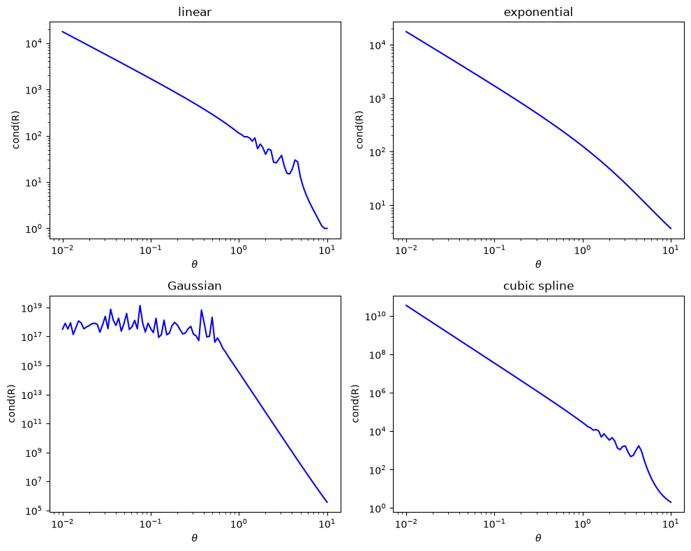

# Condition Number of the Correlation Matrix

This script plots how the condition number of a kriging correlation matrix changes with the correlation parameter $\theta$ for the linear, exponential, Gaussian and cubic spline correlation functions. A large condition number means the matrix is close to singular, so solving the kriging system $R\mathbf{w} = \mathbf{y}$ amplifies rounding errors and noise in the data.

## Overview

- Builds the $10 \times 10$ correlation matrix for 10 equally spaced points in $[0, 1]$.
- Uses four correlation functions: linear, exponential, Gaussian and cubic spline.
- Sweeps $\theta$ over 100 log-spaced values in $[10^{-2}, 10^{1}]$.
- Computes the 2-norm condition number $\kappa(R)$ with `numpy.linalg.cond` for every function and every $\theta$.
- Draws a $2 \times 2$ figure, one panel per function, with $\kappa$ against $\theta$ on log–log axes.

## Mathematical Background

### Correlation Matrix

For sample locations $x_1, \dots, x_n$ the correlation matrix is

$$
R_{ij} = R(x_i - x_j;\, \theta), \quad i, j = 1, \dots, n.
$$

It is symmetric with ones on the diagonal. In the convention used here, a small $\theta$ gives long-range correlation (all entries close to 1) and a large $\theta$ gives short-range correlation ($R$ close to the identity).

### Condition Number

$$
\kappa(R) = \frac{\sigma_{\max}(R)}{\sigma_{\min}(R)},
$$

where $\sigma_{\max}$ and $\sigma_{\min}$ are the largest and smallest singular values. For a symmetric positive semi-definite matrix these are its largest and smallest eigenvalues. In double precision, values of order $10^{16}$ or more mean the matrix is numerically singular.

### Correlation Functions

Linear (zero for $|h| \geq 1/\theta$):

$$
R(h;\,\theta) = \max\bigl(0,\; 1 - \theta|h|\bigr)
$$

Exponential:

$$
R(h;\,\theta) = e^{-\theta|h|}
$$

Gaussian:

$$
R(h;\,\theta) = e^{-\theta h^2}
$$

Cubic spline, written in the scaled lag $\xi = \theta|h|$ (zero for $|h| \geq 2/\theta$):

$$
R(h;\,\theta) = \begin{cases} 1 - \tfrac{3}{2}\xi^2 + \tfrac{3}{4}\xi^3, & \xi \leq 1, \\ \tfrac{1}{4}(2 - \xi)^3, & 1 < \xi \leq 2, \\ 0, & \xi > 2. \end{cases}
$$

## Implementation

- `linear`, `exponential`, `gaussian` and `cubic_spline` evaluate $R(h;\theta)$ element-wise on NumPy arrays. They are collected in the `CORRELATION_FUNCTIONS` dictionary.
- `lag_matrix(n_points)` returns the lag matrix $H_{ij} = x_i - x_j$ for `N_POINTS = 10` equally spaced points.
- `condition_numbers(lags, thetas)` evaluates each correlation function on $H$ for every $\theta$ and calls `numpy.linalg.cond`.
- `plot_condition_numbers(thetas, cond_numbers)` draws the four log–log panels.
- The sweep is set by `THETA_MIN`, `THETA_MAX` and `N_THETA`.

## Usage

```bash
python main.py                          # show the figure
python main.py --no-show --output .     # save the figure as a PNG in the current directory
```

## Output



The condition number of all four functions falls as $\theta$ grows, because the correlation matrix tends to the identity:

- **Linear**: about $2 \times 10^{4}$ at $\theta = 0.01$, falling to exactly 1 once $1/\theta$ is smaller than the point spacing $1/9$.
- **Exponential**: the smoothest decrease, from about $2 \times 10^{4}$ to about 4.
- **Gaussian**: numerically singular ($\kappa \approx 10^{17}$, with rounding noise) for $\theta \lesssim 0.5$. It is still about $4 \times 10^{5}$ at $\theta = 10$, making it the worst-conditioned of the four.
- **Cubic spline**: about $3 \times 10^{10}$ at $\theta = 0.01$, falling to about 2 at $\theta = 10$.

The small wiggles in the linear and cubic spline curves for $\theta > 1$ appear where the compact support $1/\theta$ or $2/\theta$ passes a multiple of the point spacing.

## Related Notes

- [Kriging](../../../notes/numerical/surrogates/kriging.md)
- [Radial Basis Functions](../../../notes/numerical/surrogates/radial_basis_functions.md)
