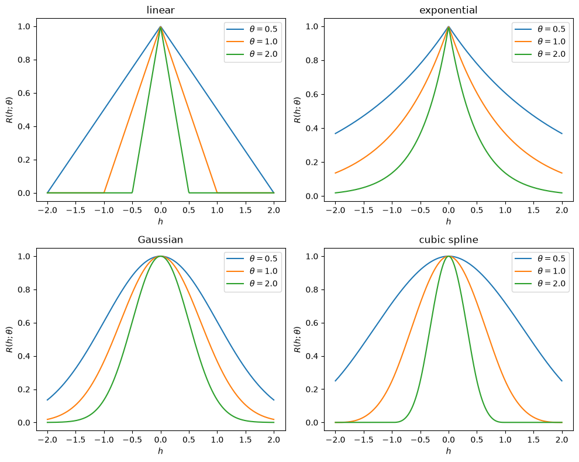

# Correlation Functions

This script plots four correlation functions used in kriging surrogate models (linear, exponential, Gaussian and cubic spline) for several values of the correlation parameter $\theta$. Laying the curves side by side shows how the choice of function sets the smoothness of the correlation at zero lag and whether it has compact support, and how $\theta$ sets its range.

## Overview

- Evaluates the four correlation functions on 400 lag values $h \in [-2, 2]$.
- Overlays one curve per $\theta \in \{0.5, 1, 2\}$ in each panel.
- Draws a $2 \times 2$ figure, one panel per function, with a legend giving $\theta$.

## Mathematical Background

A stationary correlation function $R(h;\,\theta)$ depends only on the lag $h = x - x'$ and a parameter $\theta > 0$. The four functions below have $R(0;\,\theta) = 1$ and decay as $|h|$ grows. In this convention a larger $\theta$ means a shorter correlation range.

### Linear

$$
R(h;\,\theta) = \max\bigl(0,\; 1 - \theta|h|\bigr)
$$

This is a tent function that is zero for $|h| \geq 1/\theta$. It has a kink at $h = 0$ and at the edge of its support.

### Exponential

$$
R(h;\,\theta) = e^{-\theta|h|}
$$

It has global support and correlation length $1/\theta$, and it is continuous but not differentiable at $h = 0$. It is the correlation function of the Ornstein–Uhlenbeck process.

### Gaussian

$$
R(h;\,\theta) = e^{-\theta h^2}
$$

It has global support and is infinitely differentiable. Its effective range scales as $1/\sqrt{\theta}$.

### Cubic Spline

In the scaled lag $\xi = \theta|h|$:

$$
R(h;\,\theta) = \begin{cases} 1 - \tfrac{3}{2}\xi^2 + \tfrac{3}{4}\xi^3, & \xi \leq 1, \\ \tfrac{1}{4}(2 - \xi)^3, & 1 < \xi \leq 2, \\ 0, & \xi > 2. \end{cases}
$$

This is the cubic B-spline scaled so that $R(0) = 1$. It is twice continuously differentiable and zero for $|h| \geq 2/\theta$.

## Implementation

- `linear`, `exponential`, `gaussian` and `cubic_spline` evaluate $R(h;\theta)$ element-wise. `cubic_spline` handles its three branches with nested `numpy.where` calls.
- `CORRELATION_FUNCTIONS` maps each panel title to its function.
- `plot_correlation_functions(h, thetas)` draws one panel per function and one curve per $\theta$.
- `H_MAX`, `N_LAGS` and `THETAS` set the lag range, the number of lag samples and the parameter values.

## Usage

```bash
python main.py                          # show the figure
python main.py --no-show --output .     # save the figure as a PNG in the current directory
```

## Output



- **Linear** (top left): tents that reach zero at $|h| = 1/\theta$ (at $\pm 2$, $\pm 1$ and $\pm 0.5$).
- **Exponential** (top right): sharp peaks at $h = 0$ with exponential tails that are still non-zero at $|h| = 2$.
- **Gaussian** (bottom left): smooth bell curves that narrow as $\theta$ grows.
- **Cubic spline** (bottom right): smooth curves that reach zero at $|h| = 2/\theta$. For $\theta = 0.5$ the support extends to $|h| = 4$, beyond the plotted range, so the curve is still 0.25 at $h = \pm 2$.

## Related Notes

- [Kriging](../../../notes/numerical/surrogates/kriging.md)
- [Hierarchical Kriging](../../../notes/numerical/surrogates/hierarchical_kriging.md)
- [Surrogate Modelling Introduction](../../../notes/numerical/surrogates/intro.md)
