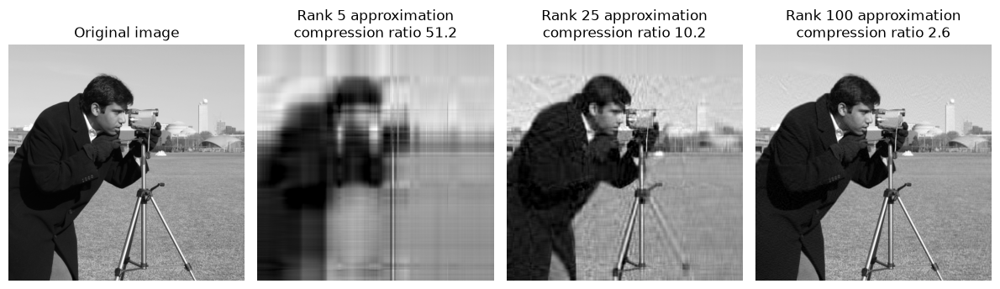
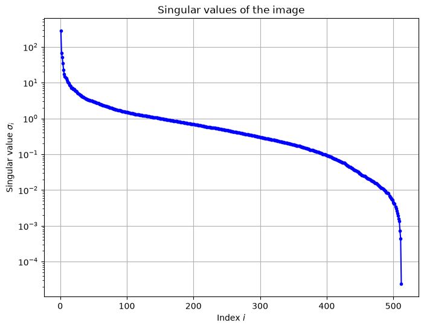
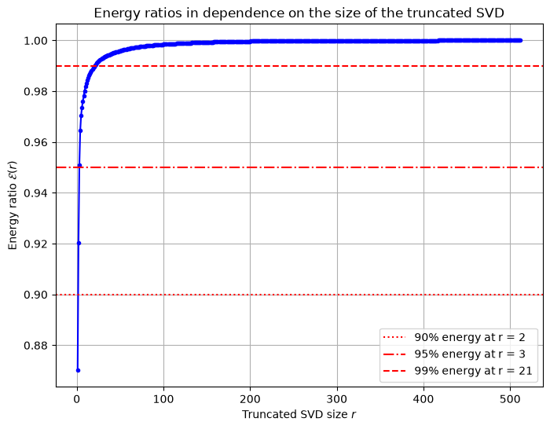

# Image Compression Using SVD

This script compresses a grayscale image by keeping only its $r$ largest singular values and the matching singular vectors, then compares the rank-$r$ reconstructions with the original. The same truncated SVD underlies Proper Orthogonal Decomposition, so the singular value spectrum and energy ratio plots have the same meaning as in a POD analysis of flow snapshots.

## Overview

- Loads a grayscale image: by default the $512 \times 512$ `camera` sample bundled with scikit-image, or any file passed with `--image`. Colour images are converted to grayscale.
- Computes the thin SVD with `numpy.linalg.svd(..., full_matrices=False)`.
- Shows the original image next to reconstructions of rank $r \in \{5, 25, 100\}$, each titled with its compression ratio.
- Plots the singular values $\sigma_i$ on a logarithmic axis.
- Plots the cumulative energy ratio $\mathcal{E}(r)$, marks the 90 %, 95 % and 99 % levels, and gives the rank needed to reach each one in the legend and on standard output.

## Mathematical Background

### Singular Value Decomposition

An $m \times n$ pixel matrix $A$ can be factored as

$$
A = U \Sigma V^T,
$$

with $p = \min(m, n)$, $U \in \mathbb{R}^{m \times p}$ and $V \in \mathbb{R}^{n \times p}$ having orthonormal columns, and $\Sigma = \mathrm{diag}(\sigma_1, \dots, \sigma_p)$ with $\sigma_1 \geq \sigma_2 \geq \cdots \geq \sigma_p \geq 0$.

### Rank-$r$ Approximation

$$
A_r = U_r \Sigma_r V_r^T = \sum_{i=1}^{r} \sigma_i \mathbf{u}_i \mathbf{v}_i^T
$$

By the Eckart–Young theorem, $A_r$ is the best rank-$r$ approximation of $A$ in both the Frobenius norm and the 2-norm. Its Frobenius error is

$$
\|A - A_r\|_F = \sqrt{\sum_{i=r+1}^{p} \sigma_i^2}.
$$

### Cumulative Energy Ratio

$$
\mathcal{E}(r) = \frac{\sum_{i=1}^{r} \sigma_i^2}{\sum_{i=1}^{p} \sigma_i^2}
$$

The image is not mean-subtracted, so $\sigma_1$ carries the mean brightness and $\mathcal{E}(1)$ is already large.

### Compression Ratio

Storing $A_r$ takes $r(m + n + 1)$ numbers instead of $mn$:

$$
\rho = \frac{mn}{r(m + n + 1)}.
$$

## Implementation

- `load_grayscale_image(path)` reads the image with `skimage.io.imread`, or uses `skimage.data.camera()` when no path is given. It converts RGB or RGBA input to grayscale and returns floats in $[0, 1]$.
- `reconstruct_image(U, S, Vt, rank)` forms $U_r \Sigma_r V_r^T$.
- `compression_ratio(m, n, rank)` evaluates $\rho$.
- `energy_ratios(S)` returns $\mathcal{E}(r)$ for every $r$, and `rank_for_energy(ratios, level)` returns the smallest $r$ with $\mathcal{E}(r) \geq$ `level`.
- `plot_reconstructions` clips each reconstruction to $[0, 1]$ and shows it with a fixed gray scale. `plot_singular_values` and `plot_energy_ratios` draw the other two figures.
- `RANKS` and `ENERGY_LEVELS` set the ranks shown and the energy levels marked.

## Usage

```bash
python main.py                                   # use the bundled camera image
python main.py --image path/to/picture.png       # use your own image
python main.py --no-show --output .              # save the three figures as PNGs
```

## Output



At rank 5 (compression ratio 51.2) only the rough light and dark regions remain. At rank 25 (10.2) the figure and tripod are recognisable. At rank 100 (2.6) the image is close to the original, apart from faint texture in the sky.



The singular values fall by about two orders of magnitude over the first 50 indices, then decay slowly, then drop sharply over the last few indices.



For the camera image, 90 % of the energy is reached at $r = 2$, 95 % at $r = 3$ and 99 % at $r = 21$. Visual quality needs many more modes than these energy levels suggest, because the fine detail carries little energy.

## Related Notes

- [SVD and POD](../../../notes/numerical/pod/pod_vs_svd.md)
- [POD Introduction](../../../notes/numerical/pod/pod_intro.md)
