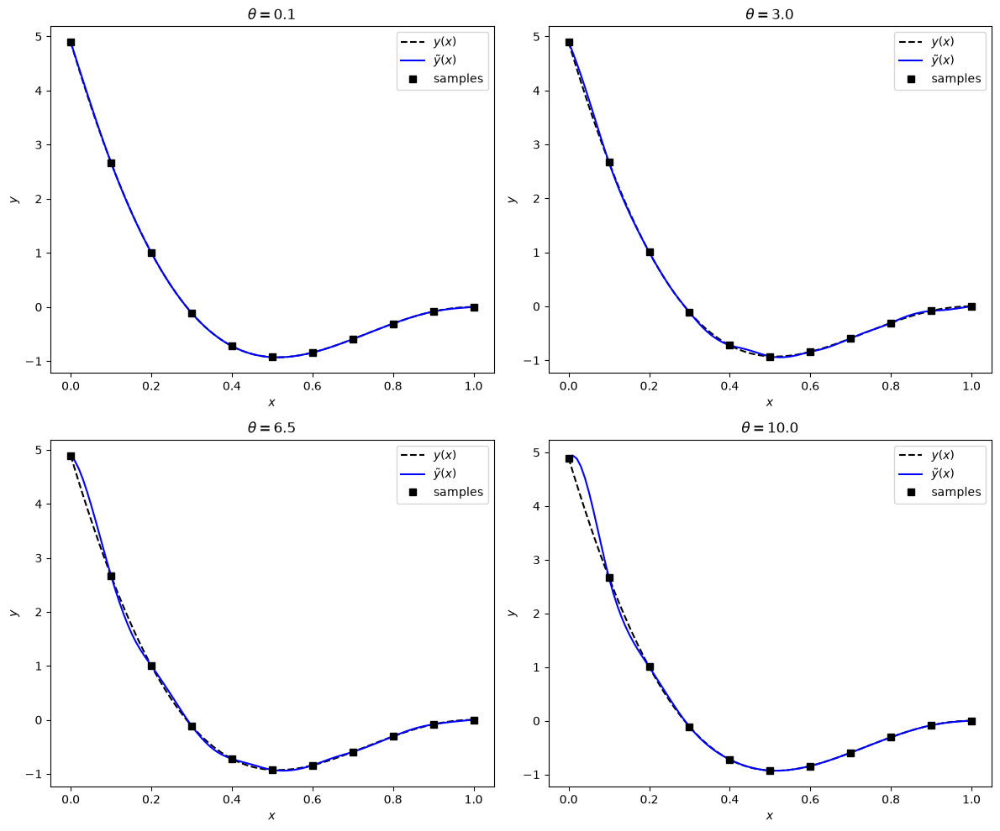

# Kriging Interpolation

This script interpolates 11 samples of $y(x) = (3x-3)^2 \sin(2x-10)$ with a kriging-type predictor built on the cubic spline correlation function, for four values of the correlation parameter $\theta$. Each panel compares the interpolant with the true function, showing how $\theta$ trades a broad, smooth fit against a local one.

## Overview

- Samples the test function at 11 equally spaced points in $[0, 1]$.
- For each $\theta \in \{0.1, 3, 6.5, 10\}$, assembles the cubic spline correlation matrix $R$ and solves $R\mathbf{w} = \mathbf{y}$ with `numpy.linalg.solve`.
- Evaluates the interpolant at 100 points in $[0, 1]$.
- Draws a $2 \times 2$ figure, one panel per $\theta$, with the true function, the interpolant and the samples.

## Mathematical Background

### Predictor

The interpolant is a weighted sum of correlation functions centred on the samples $x_1, \dots, x_n$:

$$
\tilde{y}(x) = \sum_{i=1}^{n} w_i\, R(x - x_i;\,\theta) = \mathbf{r}(x)^T R^{-1} \mathbf{y}.
$$

This is the kriging predictor with a zero mean (no regression trend $f(x)^T\beta$). It is the same as radial basis function interpolation that uses the correlation function as the basis.

### Weights

Requiring $\tilde{y}(x_j) = y_j$ at every sample gives

$$
R\,\mathbf{w} = \mathbf{y}, \qquad R_{ij} = R(x_i - x_j;\,\theta).
$$

### Cubic Spline Correlation

With $\xi = \theta|h|$:

$$
R(h;\,\theta) = \begin{cases} 1 - \tfrac{3}{2}\xi^2 + \tfrac{3}{4}\xi^3, & \xi \leq 1, \\ \tfrac{1}{4}(2 - \xi)^3, & 1 < \xi \leq 2, \\ 0, & \xi > 2. \end{cases}
$$

Each basis function is non-zero only within $|x - x_i| < 2/\theta$. With a sample spacing of 0.1, $\theta = 10$ gives a support radius of two spacings, while $\theta = 0.1$ makes every basis function almost constant over $[0, 1]$. In that limit $R$ is nearly singular (condition number about $5 \times 10^{7}$), yet the interpolant is very smooth.

## Implementation

- `test_function(x)` evaluates $y(x) = (3x-3)^2 \sin(2x-10)$.
- `cubic_spline(h, theta)` evaluates the correlation function element-wise.
- `fit_weights(x_data, y_data, theta)` builds $R$ and solves $R\mathbf{w} = \mathbf{y}$.
- `predict(x_new, x_data, weights, theta)` evaluates $\tilde{y}$ at new points.
- `plot_interpolants(x_data, y_data, x_fine, thetas)` draws the four panels.
- `N_SAMPLES`, `N_PREDICT` and `THETA_VALUES` set the sample count, the prediction grid and the $\theta$ values.

## Usage

```bash
python main.py                          # show the figure
python main.py --no-show --output .     # save the figure as a PNG in the current directory
```

## Output



Every interpolant passes through the 11 samples. For $\theta = 0.1$ the interpolant is indistinguishable from $y(x)$ at this scale. As $\theta$ grows each basis function becomes more local and the interpolant bends away from $y(x)$ between samples. The largest deviation is between $x = 0$ and $x = 0.1$, where the function is steepest; for $\theta = 10$ it overshoots near $x = 0$.

## Related Notes

- [Kriging](../../../notes/numerical/surrogates/kriging.md)
- [Surrogate Modelling Introduction](../../../notes/numerical/surrogates/intro.md)
- [Radial Basis Functions](../../../notes/numerical/surrogates/radial_basis_functions.md)
