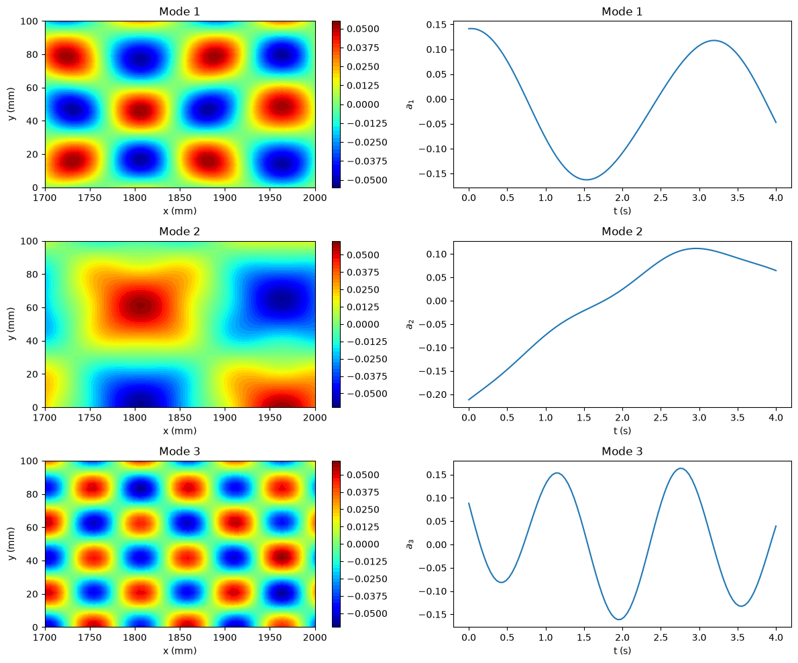

# Proper Orthogonal Decomposition (POD)

This script performs Proper Orthogonal Decomposition on a synthetic spatio-temporal field by taking the singular value decomposition of the mean-subtracted snapshot matrix. It plots the three most energetic spatial modes next to their temporal coefficients and prints the share of fluctuation energy in each.

## Overview

- Generates a field $u(x, y, t)$ on a $50 \times 30$ spatial grid with 100 time samples. The field is the sum of three separable structures with different wavenumbers, frequencies and amplitudes.
- Reshapes the data into a $1500 \times 100$ snapshot matrix and subtracts the temporal mean at every point.
- Computes the thin SVD with `numpy.linalg.svd(..., full_matrices=False)`.
- Prints the energy fraction $\sigma_i^2 / \sum_j \sigma_j^2$ of the first three modes.
- Plots the first three spatial modes as filled contours next to their temporal coefficients.

## Mathematical Background

### Synthetic Field

With $x$ and $y$ in mm and $t$ in s:

$$
u = \sin(0.02x)\cos(0.05y)\sin(0.5t) + 0.5\cos(0.04x)\sin(0.1y)\cos(2t) + 0.25\sin(0.06x)\cos(0.15y)\sin(4t)
$$

on $x \in [1700, 2000]$, $y \in [0, 100]$ and $t \in [0, 4]$.

### Mean Subtraction

Each column of the snapshot matrix $U \in \mathbb{R}^{N \times M}$ holds one snapshot, with $N$ spatial points and $M$ snapshots. The temporal mean of each row is removed:

$$
\tilde{U} = U - \bar{U}, \qquad \bar{U}_{k} = \frac{1}{M}\sum_{j=1}^{M} U_{kj}.
$$

### POD via the SVD

$$
\tilde{U} = \Phi \Sigma \Psi^T
$$

- The columns of $\Phi \in \mathbb{R}^{N \times M}$ are the orthonormal spatial (POD) modes.
- $\Sigma = \mathrm{diag}(\sigma_1, \dots, \sigma_M)$ holds the singular values, with $\sigma_1 \geq \sigma_2 \geq \cdots \geq 0$.
- The rows of $\Psi^T \in \mathbb{R}^{M \times M}$ are the unit-norm temporal coefficients.

Mode $i$ holds the fraction $\sigma_i^2 / \sum_j \sigma_j^2$ of the fluctuation energy.

## Implementation

- `generate_synthetic_data(n_samples, n_x, n_y)` returns the field and its $x$, $y$, $t$ axes.
- `create_snapshot_matrix(data)` reshapes the $(n_x, n_y, n_t)$ array to $(n_x n_y) \times n_t$.
- `preprocess_data(snapshot_matrix)` subtracts the temporal mean.
- The `POD` class runs the SVD in `run()`, storing `modes` ($\Phi$), `singular_values` and `time_coeffs` ($\Psi^T$). `energy_fractions()` returns the energy share of each mode.
- `plot_modes_and_time_coeffs(pod, x, y, t, num_modes)` draws the contour plots and time series on a `GridSpec` layout.
- `N_SAMPLES`, `N_X`, `N_Y` and `NUM_MODES` set the data size and the number of modes plotted.

## Usage

```bash
python main.py                          # show the figure
python main.py --no-show --output .     # save the figure as a PNG in the current directory
```

## Output



The script prints the energy fractions: mode 1 holds 49.14 %, mode 2 holds 39.16 % and mode 3 holds 11.70 %. The three modes recover the three structures in the data:

- **Mode 1** is the $\cos(0.04x)\sin(0.1y)$ structure with the $\cos(2t)$ time signal.
- **Mode 2** is the $\sin(0.02x)\cos(0.05y)$ structure. It has the largest amplitude, but its $\sin(0.5t)$ signal covers less than half a period, so it has less variance about its mean than mode 1.
- **Mode 3** is the $\sin(0.06x)\cos(0.15y)$ structure with the $\sin(4t)$ time signal.

The sign of each mode and its coefficient is arbitrary: flipping both leaves the product unchanged.

## Related Notes

- [POD Introduction](../../../notes/numerical/pod/pod_intro.md)
- [SVD and POD](../../../notes/numerical/pod/pod_vs_svd.md)
- [POD Derivation in N Dimensions](../../../notes/numerical/pod/derivation_in_n_dim.md)
- [Snapshot POD](../../../notes/numerical/pod/snapshot_pod.md)
