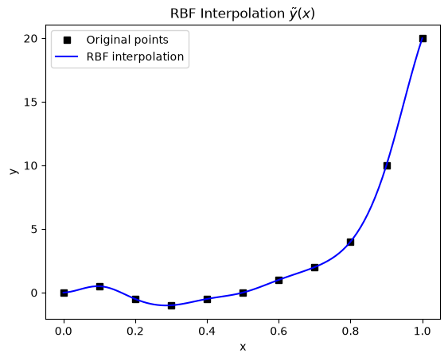

# Radial Basis Functions

This script fits a multiquadric radial basis function (RBF) interpolant through 11 data points on $[0, 1]$ using SciPy's `Rbf` class and plots it on a fine grid. RBF interpolation needs no mesh, which is why it is used for scattered-data interpolation, mesh deformation and surrogate modelling in CFD.

## Overview

- Uses 11 fixed data points at $x = 0, 0.1, \dots, 1$, digitised from a reference plot. They are not generated from a formula.
- Builds a multiquadric interpolant with `scipy.interpolate.Rbf` and SciPy's default shape parameter, and prints that parameter.
- Evaluates the interpolant at 100 points in $[0, 1]$.
- Plots the data points and the interpolant.

## Mathematical Background

### RBF Interpolant

For centres $x_1, \dots, x_n$ with values $y_1, \dots, y_n$:

$$
\tilde{y}(x) = \sum_{i=1}^{n} w_i\, \phi\bigl(|x - x_i|\bigr).
$$

### Multiquadric Basis in SciPy

SciPy's `Rbf` defines the multiquadric as

$$
\phi(r) = \sqrt{\left(\frac{r}{\varepsilon}\right)^2 + 1},
$$

so a larger $\varepsilon$ gives a flatter basis function. By default $\varepsilon$ is the average node spacing, estimated from the bounding box of the nodes. In one dimension that is $(x_{\max} - x_{\min})/n = 1/11 \approx 0.0909$ here.

### Weights

Requiring $\tilde{y}(x_j) = y_j$ gives the symmetric system

$$
\Phi\,\mathbf{w} = \mathbf{y}, \qquad \Phi_{ij} = \phi\bigl(|x_i - x_j|\bigr).
$$

`Rbf` solves this system directly, with no polynomial term and the default `smooth=0`. For distinct centres the multiquadric matrix is non-singular (Micchelli, 1986).

## Implementation

- `X_DATA` and `Y_DATA` hold the 11 data points, and `N_PREDICT` sets the number of evaluation points.
- `fit_rbf(x, y, function="multiquadric")` returns the `scipy.interpolate.Rbf` object, which assembles and solves $\Phi\mathbf{w} = \mathbf{y}$.
- `plot_interpolation(x, y, x_new, y_new)` plots the points and the interpolant.
- `main` prints `rbf.epsilon`, evaluates the interpolant and saves or shows the figure.

## Usage

```bash
python main.py                          # show the figure
python main.py --no-show --output .     # save the figure as a PNG in the current directory
```

## Output



The interpolant passes exactly through all 11 points. It follows the small oscillation between $x = 0$ and $x = 0.4$ and the steep rise from $y = 4$ to $y = 20$ over $x \in [0.8, 1]$ without large overshoots between the points.

## Related Notes

- [Radial Basis Functions](../../../notes/numerical/surrogates/radial_basis_functions.md)
- [Surrogate Modelling Introduction](../../../notes/numerical/surrogates/intro.md)
