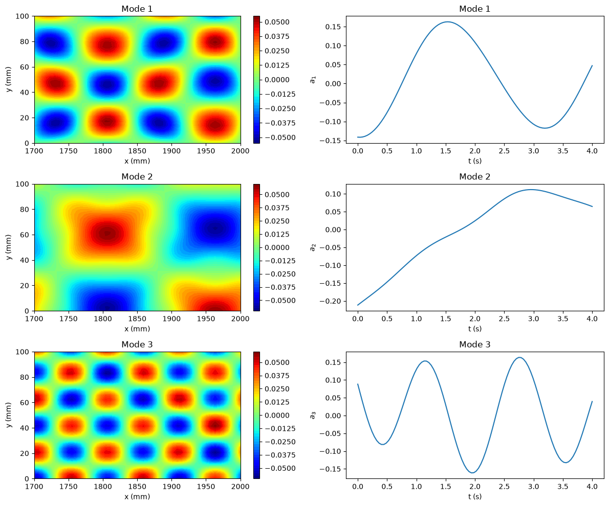

# Snapshot Proper Orthogonal Decomposition (Snapshot POD)

This script computes POD modes of a synthetic spatio-temporal field with the snapshot method, which solves an eigenvalue problem for the $M \times M$ temporal correlation matrix instead of the much larger $N \times N$ spatial one. It plots the three leading spatial modes next to their temporal eigenvectors and prints the share of fluctuation energy in each.

## Overview

- Generates the same synthetic field as the [POD script](../pod/README.md): three separable structures on a $50 \times 30$ grid with 100 time samples.
- Builds the $1500 \times 100$ snapshot matrix and subtracts the temporal mean at every point.
- Forms the $100 \times 100$ temporal correlation matrix $C_s$ and solves its symmetric eigenvalue problem with `numpy.linalg.eigh`.
- Recovers the spatial modes by projecting the data onto the eigenvectors and normalises them to unit length.
- Prints the energy fraction $\lambda_i / \sum_j \lambda_j$ of the first three modes.
- Plots the first three spatial modes next to their temporal eigenvectors.

## Mathematical Background

### Temporal Correlation Matrix

For the mean-subtracted snapshot matrix $\tilde{U} \in \mathbb{R}^{N \times M}$, with $N$ spatial points and $M$ snapshots:

$$
C_s = \frac{1}{M-1} \tilde{U}^T \tilde{U} \in \mathbb{R}^{M \times M}.
$$

### Eigenvalue Problem

$$
C_s \mathbf{a}_i = \lambda_i \mathbf{a}_i, \qquad \lambda_1 \geq \lambda_2 \geq \cdots \geq 0,
$$

where the $\mathbf{a}_i$ are unit-norm temporal eigenvectors and $\lambda_i$ is proportional to the energy of mode $i$.

### Spatial Modes

$$
\boldsymbol{\phi}_i = \frac{\tilde{U} \mathbf{a}_i}{\|\tilde{U} \mathbf{a}_i\|}
$$

### Link to the SVD

If $\tilde{U} = \Phi \Sigma \Psi^T$, then $\lambda_i = \sigma_i^2/(M-1)$, $\mathbf{a}_i = \boldsymbol{\psi}_i$ and $\boldsymbol{\phi}_i$ is the $i$-th column of $\Phi$, each up to sign. The snapshot method and the direct SVD therefore give the same modes and energy fractions. The snapshot method is cheaper when $M \ll N$.

## Implementation

- `generate_synthetic_data`, `create_snapshot_matrix` and `preprocess_data` build the mean-subtracted snapshot matrix, exactly as in the POD script.
- `SnapshotPOD.run()` forms $C_s$, calls `numpy.linalg.eigh` and sorts the eigenpairs by decreasing eigenvalue. It stores `eigenvalues`, `time_coeffs` (the eigenvectors as columns) and `spatial_modes` $= \tilde{U}\mathbf{a}_i$.
- `SnapshotPOD.normalize_modes()` scales each spatial mode to unit norm, leaving any exactly zero mode unchanged.
- `SnapshotPOD.energy_fractions()` returns $\lambda_i / \sum_j \lambda_j$, with tiny negative round-off eigenvalues clipped to zero.
- `plot_snapshot_modes_and_time_coeffs(pod, x, y, t, num_modes)` draws the contour plots and time series.
- `N_SAMPLES`, `N_X`, `N_Y` and `NUM_MODES` set the data size and the number of modes plotted.

## Usage

```bash
python main.py                          # show the figure
python main.py --no-show --output .     # save the figure as a PNG in the current directory
```

## Output



The printed energy fractions are 49.14 %, 39.16 % and 11.70 %, identical to the SVD-based POD script. The modes and temporal eigenvectors match that script's figure up to the sign of each mode, which is arbitrary in both methods. Mode 1 is the $\cos(2t)$ structure, mode 2 the slowly varying $\sin(0.5t)$ structure, and mode 3 the $\sin(4t)$ structure.

## Related Notes

- [Snapshot POD](../../../notes/numerical/pod/snapshot_pod.md)
- [SVD and POD](../../../notes/numerical/pod/pod_vs_svd.md)
- [POD Introduction](../../../notes/numerical/pod/pod_intro.md)
