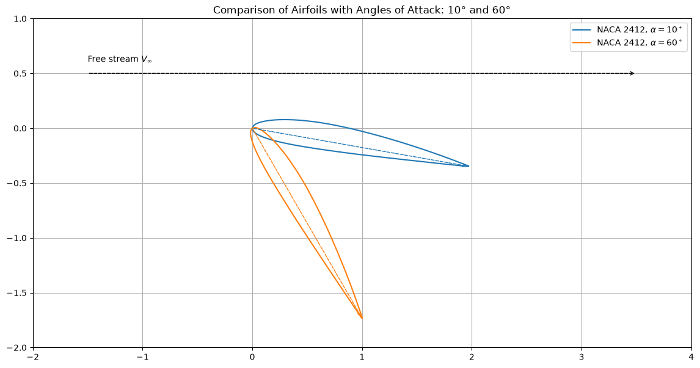

# Airfoil Angle of Attack

This script draws a NACA 2412 airfoil pitched nose-up about its leading edge to several angles of attack, $10^\circ$ and $60^\circ$ by default, relative to a free stream flowing left to right. The geometry comes from the NACA 4-digit camber line and thickness distribution, and dashed arrows mark each chord line and the free-stream direction.

## Overview

- Builds the NACA 4-digit geometry with $m = 0.02$, $p = 0.4$ and $t = 0.12$ (NACA 2412), chord $c = 2$ and 200 stations per surface.
- Offsets the upper and lower surfaces perpendicular to the camber line.
- Rotates the airfoil clockwise about the leading edge by each angle of attack, so the trailing edge drops below the leading edge.
- Draws each airfoil in its own colour, with a dashed chord-line arrow from leading edge to trailing edge.
- Draws a dashed free-stream arrow along $+x$.
- Accepts other angles with `--angles`.

## Mathematical Background

### Camber Line

$$
y_c = \begin{cases} \dfrac{m c}{p^2}\left(2p\dfrac{x}{c} - \left(\dfrac{x}{c}\right)^2\right), & x < pc, \\ \dfrac{m c}{(1-p)^2}\left((1-2p) + 2p\dfrac{x}{c} - \left(\dfrac{x}{c}\right)^2\right), & x \geq pc. \end{cases}
$$

### Thickness Distribution

$$
y_t = \frac{t}{0.2}\,c\left(0.2969\sqrt{\frac{x}{c}} - 0.1260\frac{x}{c} - 0.3516\left(\frac{x}{c}\right)^{2} + 0.2843\left(\frac{x}{c}\right)^{3} - 0.1015\left(\frac{x}{c}\right)^{4}\right)
$$

### Surfaces

With $\theta = \arctan(dy_c/dx)$:

$$
x_u = x - y_t\sin\theta, \quad y_u = y_c + y_t\cos\theta, \qquad x_l = x + y_t\sin\theta, \quad y_l = y_c - y_t\cos\theta.
$$

### Pitching by the Angle of Attack

The free stream flows in the $+x$ direction. A positive angle of attack $\alpha$ is therefore a clockwise rotation about the leading edge at the origin:

$$
\begin{pmatrix}x'\\ y'\end{pmatrix} = \begin{pmatrix}\cos\alpha & \sin\alpha\\ -\sin\alpha & \cos\alpha\end{pmatrix}\begin{pmatrix}x\\ y\end{pmatrix}
$$

This moves the trailing edge to $(c\cos\alpha,\, -c\sin\alpha)$.

### Context

The script draws geometry only and computes no forces. For reference, thin-airfoil theory gives $C_L = 2\pi(\alpha - \alpha_{L=0})$ for small angles. Real airfoils of this type stall at roughly $15^\circ$, so $10^\circ$ is normally attached flow and $60^\circ$ is far beyond stall.

## Implementation

- `naca4_airfoil(m, p, t, c, n)` returns the upper and lower surface coordinates.
- `pitch_airfoil(x, y, angle_of_attack)` applies the clockwise rotation above.
- `plot_multiple_airfoils(angles_of_attack)` draws the airfoils, chord arrows and free-stream arrow with equal axis scaling.
- `MAX_CAMBER`, `CAMBER_POSITION`, `THICKNESS`, `CHORD`, `N_POINTS` and `DEFAULT_ANGLES` hold the parameters.

## Usage

```bash
python main.py                            # 10 and 60 degrees
python main.py --angles 0 5 15            # any list of angles in degrees
python main.py --no-show --output .       # save the figure as a PNG in the current directory
```

## Output



The blue outline is the airfoil at $10^\circ$ and the orange outline at $60^\circ$. Both are pitched nose-up relative to the free-stream arrow above them, and the dashed arrows inside each outline are the chord lines.

## Related Notes

- [Airfoil Design](../../../notes/applied_mechanics/transportation/airplanes/airfoil_design.md)
- [How Airplanes Work](../../../notes/applied_mechanics/transportation/airplanes/how_airplanes_work.md)
