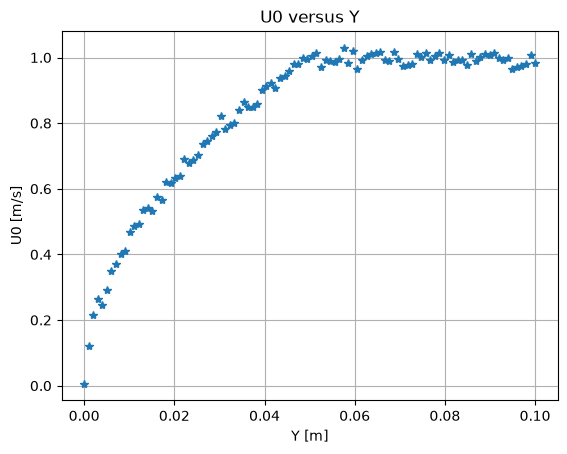
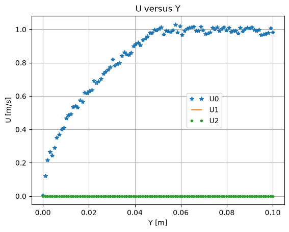

# Generating Synthetic Data for Boundary Layer Simulation

This script generates noisy synthetic velocity samples across a boundary layer from a simple square-root profile, saves them to a CSV file and plots them against the wall-normal distance. The data mimic a measured profile for testing post-processing tools. The profile is a simple shape, not a solution of the boundary-layer equations.

## Overview

- Samples 100 wall-normal positions $Y \in [0, 2\delta]$ with $\delta = 0.05$ m and $U_\infty = 1$ m/s.
- Computes $U_0 = U_\infty\sqrt{Y/\delta}$ inside the layer and $U_0 = U_\infty$ above it.
- Adds seeded Gaussian noise ($\sigma = 0.02$ m/s) to $U_0$ only. $U_1$ and $U_2$ are exactly zero.
- Writes `boundary_layer_data.csv` with columns `U0,U1,U2,X,Y,Z`, where `X` and `Z` are zero. The file goes to the `--output` directory, or to the current directory without that flag.
- Plots $U_0$ against $Y$, and all three components against $Y$.

## Mathematical Background

### Velocity Profile

$$
U_0(y) = U_\infty \sqrt{\min\left(\frac{y}{\delta},\, 1\right)} + \epsilon, \qquad \epsilon \sim \mathcal{N}(0, \sigma^2)
$$

where $U_\infty$ is the free-stream velocity and $\delta$ the boundary layer thickness. The profile meets the no-slip condition $U_0(0) = 0$ and reaches $U_\infty$ at $y = \delta$. Unlike the Blasius profile, it has an infinite velocity gradient at the wall.

### Lateral Components

$$
U_1 = U_2 = 0
$$

## Implementation

- `velocity_profile(y, u_inf, delta)` evaluates the clipped square-root profile.
- `generate_data(num_points, noise_std, seed)` returns $Y$, the noisy $U_0$, and $U_1$ and $U_2$. It uses `numpy.random.default_rng(SEED)`, so the noise is reproducible.
- `save_csv(path, y, u0, u1, u2)` writes the CSV with `numpy.savetxt`.
- `plot_u0(y, u0)` and `plot_all_components(y, u0, u1, u2)` create the two figures.
- `U_INF`, `DELTA`, `NUM_POINTS`, `NOISE_STD` and `SEED` hold the parameters.

## Usage

```bash
python main.py                          # write the CSV to the current directory and show the plots
python main.py --no-show --output .     # write the CSV and both PNGs to the current directory
```

## Output



The streamwise velocity rises from zero at the wall to about 1 m/s at $Y = 0.05$ m, then stays at the free-stream value with $\pm 0.02$ m/s scatter.



The second plot adds the zero lateral components $U_1$ (line) and $U_2$ (dots).

## Related Notes

- [Boundary Layers](../../../notes/fluid_mechanics/viscous_flow/boundary_layers.md)
