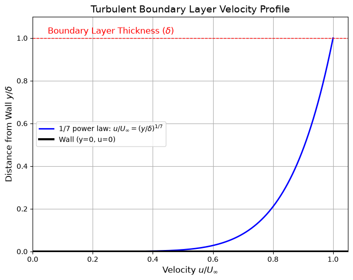

# Turbulent Boundary Layer Velocity Profile

This script plots the one-seventh power-law velocity profile of a turbulent boundary layer in normalised form, $u/U_\infty$ against $y/\delta$. The curve runs from zero velocity at the wall to the free-stream value at the boundary layer edge, which is marked by a dashed line.

## Overview

- Evaluates $u/U_\infty = (y/\delta)^{1/7}$ at 1000 points in $0 \leq y/\delta \leq 1$.
- Satisfies $u = 0$ at the wall and $u = U_\infty$ at $y = \delta$.
- Marks the boundary layer edge $y = \delta$ with a dashed red line and the wall with a thick black line.
- Plots $u/U_\infty$ on the horizontal axis and $y/\delta$ on the vertical axis, with the power-law formula in the legend.

## Mathematical Background

### One-Seventh Power Law

$$
\frac{u}{U_\infty} = \left(\frac{y}{\delta}\right)^{1/7}, \qquad 0 \leq y \leq \delta
$$

where $y$ is the distance from the wall, $\delta$ the boundary layer thickness and $U_\infty$ the free-stream velocity. The law is an empirical fit to the outer part of turbulent flat-plate boundary layers. It gives a fuller profile than a laminar layer.

### Boundary Values

$$
u(0) = 0, \qquad u(\delta) = U_\infty
$$

In this profile $u$ equals $U_\infty$ exactly at $y = \delta$. This differs from the usual $u = 0.99\,U_\infty$ definition of $\delta$.

### Limitation at the Wall

The gradient

$$
\frac{\partial u}{\partial y} = \frac{U_\infty}{7\delta}\left(\frac{y}{\delta}\right)^{-6/7}
$$

is infinite at $y = 0$, so the power law cannot give the wall shear stress $\tau_w = \mu\,(\partial u/\partial y)_{y=0}$. In practice $\tau_w$ comes from an empirical skin-friction correlation used together with the power law, for example $C_f \approx 0.0592\,\mathrm{Re}_x^{-1/5}$. The script does not compute this. The steep rise near the wall is why the script samples the profile at 1000 points.

## Implementation

- `power_law_profile(eta, power)` returns $u/U_\infty$ for $\eta = y/\delta$, with `POWER = 1/7`.
- `plot_profile(eta, u_ratio)` draws the profile, the edge and wall lines, the labels and the legend.
- `N_POINTS` sets the number of samples.

## Usage

```bash
python main.py                          # show the figure
python main.py --no-show --output .     # save the figure as a PNG in the current directory
```

## Output



The profile rises steeply from the wall: $u/U_\infty$ is already 0.5 at $y/\delta \approx 0.008$ and 0.8 at $y/\delta \approx 0.21$. It reaches 1 at the dashed boundary layer edge.

## Related Notes

- [Boundary Layers](../../../notes/fluid_mechanics/viscous_flow/boundary_layers.md)
- [Drag](../../../notes/fluid_mechanics/viscous_flow/drag.md)
