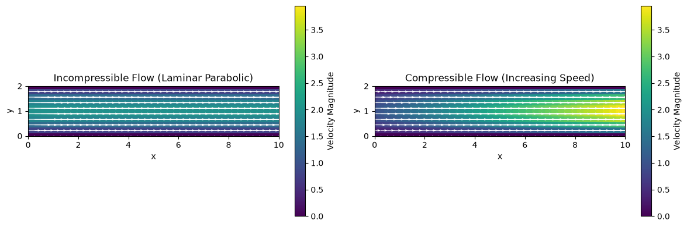

# Compressible vs. Incompressible Duct Flow

This script draws prescribed incompressible and compressible velocity fields in a 2D duct side by side, so the constant downstream profile of the first can be compared with the accelerating profile of the second. The incompressible panel shows a fully developed parabolic profile that is identical at every streamwise station. The compressible panel shows a schematic parabolic profile whose amplitude grows linearly from inlet to outlet, the behaviour expected when density falls along the duct. The fields are prescribed analytically, not computed from the flow equations.

## Overview

- Builds a 40 × 10 grid covering a longitudinal (side) section of the duct, $0 \le x \le 10$, $0 \le y \le 2$
- Prescribes a fully developed parabolic profile ($U_{\max} = 2$) for the incompressible case
- Prescribes a parabolic profile whose centreline speed rises linearly from 1 at the inlet to 4 at the outlet for the compressible case
- Colours both panels by velocity magnitude on a shared colour scale (0 to the largest speed in either field)
- Overlays a white velocity arrow at every grid node and outlines the duct walls

## Mathematical Background

### Incompressible Profile

With $y_{\text{mid}} = H/2$ the duct centreline, the incompressible field is

$$u_{\text{incomp}}(y) = U_{\max}\left[1 - \left(\frac{y - y_{\text{mid}}}{y_{\text{mid}}}\right)^2\right], \qquad v = 0$$

For incompressible flow $\nabla \cdot \mathbf{u} = \partial u/\partial x + \partial v/\partial y = 0$. With $v = 0$ this forces $\partial u/\partial x = 0$, so the profile cannot change along the duct.

### Compressible Profile

The compressible field keeps the same parabolic shape but scales it linearly in $x$:

$$u_{\text{comp}}(x, y) = \left(U_{\text{inlet}} + \frac{U_{\text{outlet}} - U_{\text{inlet}}}{L}\, x\right)\left[1 - \left(\frac{y - y_{\text{mid}}}{y_{\text{mid}}}\right)^2\right], \qquad v = 0$$

### Continuity for Compressible Flow

Steady compressible continuity reads

$$\nabla \cdot (\rho\, \mathbf{u}) = \frac{\partial (\rho u)}{\partial x} + \frac{\partial (\rho v)}{\partial y} = 0$$

With $v = 0$, the product $\rho u$ is constant along each streamline, so an accelerating flow must have falling density:

$$\frac{\rho(x)}{\rho(0)} = \frac{u(0, y)}{u(x, y)} = \frac{U_{\text{inlet}}}{U_{\text{inlet}} + (U_{\text{outlet}} - U_{\text{inlet}})\, x / L}$$

With the default values the implied density at the outlet is a quarter of the inlet density. The script does not compute or plot density. This ratio is exaggerated for visual effect: a real subsonic duct flow, such as Fanno flow with wall friction, accelerates much less before it chokes.

## Implementation

- `make_grid(nx, ny, x_max, y_max)` builds the mesh from the constants `NX = 40`, `NY = 10`, `X_MAX = 10`, `Y_MAX = 2`.
- `parabolic_shape(Y, y_max)` returns the normalised parabola, clipped at zero.
- `incompressible_field(X, Y, u_max)` and `compressible_field(X, Y, u_inlet, u_outlet, x_max)` return `(u, v)` using `U_MAX_INCOMP = 2`, `U_INLET = 1`, `U_OUTLET = 4`.
- `plot_panel(...)` draws the duct outline, a `pcolormesh` of speed with `vmin=0` and a shared `vmax`, a colour bar, and a `quiver` plot (`scale=15`).
- `make_figure()` assembles the two panels, and `main(argv=None)` handles the command-line flags.

## Usage

```bash
python main.py                          # open the figure window
python main.py --no-show --output out   # save compressible_vs_incompressible.png into out/
```

| Flag | Meaning |
|------|---------|
| `--no-show` | Do not open a plot window |
| `--output DIR` | Create `DIR` and save the figure as a PNG |

## Output

The left panel shows the incompressible flow as horizontal colour bands that do not change along the duct: fastest on the centreline and zero at the walls. The right panel, on the same colour scale, starts slower than the incompressible flow at the inlet and brightens steadily towards the outlet, where its centreline speed is twice the incompressible maximum.



## Related Notes

- [Pressure and Compressibility](../../../notes/fluid_mechanics/fluid_properties/pressure_and_compressibility.md)
- [Continuity Equation](../../../notes/fluid_mechanics/governing_equations/continuity.md)
- [Rayleigh and Fanno Flow](../../../notes/fluid_mechanics/compressible_flow/rayleigh_fanno.md)
- [Speed of Sound](../../../notes/fluid_mechanics/compressible_flow/speed_of_sound.md)
