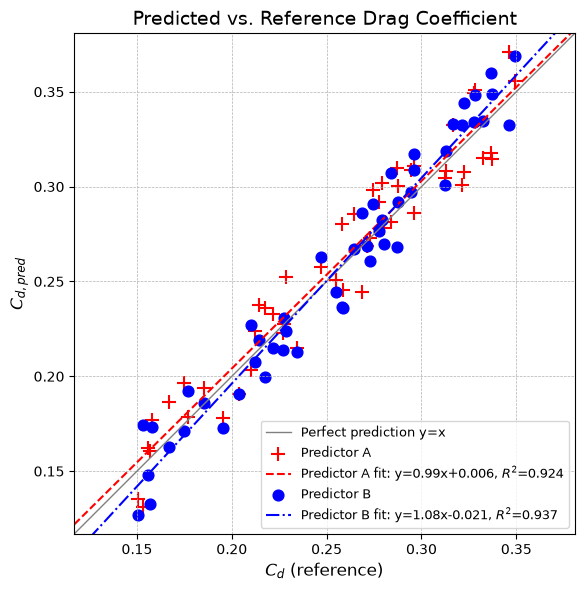

# Drag Coefficient Prediction

This script compares two synthetic drag-coefficient predictors with reference values in a predicted-vs-reference plot, adding a regression line and $R^2$ for each. It draws 50 reference values of $C_d$ and builds two prediction sets by adding independent random errors. It then plots both sets against the reference with their least-squares lines and the line of perfect prediction. The same kind of parity plot is used to judge machine-learning or reduced-order drag models against CFD or experiment.

## Overview

- Draws 50 reference values $C_d \sim \mathcal{U}(0.15, 0.35)$ from a seeded generator
- Forms two predictors, A (red `+`) and B (blue `o`), as $C_d$ plus independent uniform errors in $[-0.025, 0.025]$
- Fits a least-squares line to each predictor with `scipy.stats.linregress`
- Draws the identity line $C_{d,pred} = C_d$ as a reference
- Reports each fit's slope, intercept, and $R^2$ about the identity line in the legend

## Mathematical Background

### Drag Coefficient

The drag coefficient non-dimensionalises the drag force $F_D$ on a body:

$$C_d = \frac{F_D}{\frac{1}{2}\rho U^2 A}$$

where $\rho$ is the fluid density, $U$ the free-stream velocity, and $A$ the reference area.

### Synthetic Data

$$C_{d,i} = 0.15 + 0.2\, r_i, \qquad C_{d,pred,i} = C_{d,i} + 0.025\,(2 s_i - 1), \qquad r_i, s_i \sim \mathcal{U}(0, 1)$$

### Linear Regression

For each predictor the slope $m$ and intercept $b$ minimise the residual sum of squares:

$$\min_{m,\,b}\sum_{i=1}^{N}\left(C_{d,pred,i} - m\,C_{d,i} - b\right)^2$$

which gives $m = \dfrac{\sum_i (C_{d,i} - \bar{C}_d)(C_{d,pred,i} - \bar{C}_{d,pred})}{\sum_i (C_{d,i} - \bar{C}_d)^2}$ and $b = \bar{C}_{d,pred} - m\,\bar{C}_d$.

### Coefficient of Determination

A perfect model has slope 1 and intercept 0. The legend reports $R^2$ measured about that identity line, not about the fitted line:

$$R^2 = 1 - \frac{\sum_i (C_{d,pred,i} - C_{d,i})^2}{\sum_i (C_{d,i} - \bar{C}_d)^2}$$

With uniform errors of half-width 0.025 and reference values spread over a range of 0.2, the expected value is $R^2 \approx 1 - (0.05^2/12)/(0.2^2/12) = 0.9375$.

## Implementation

- `generate_data(n, seed)` returns the reference values and the two prediction arrays (constants `N_SAMPLES`, `CD_MIN`, `CD_RANGE`, `ERROR_HALF_WIDTH`).
- `r_squared(reference, predicted)` computes $R^2$ about $y = x$.
- `make_figure(cd, pred_red, pred_blue)` draws the identity line, the scatter points, and each `linregress` fit over the full axis range, with equal axes.
- `main(argv=None)` parses the flags, then shows or saves the figure.

## Usage

```bash
python main.py                          # open the figure window
python main.py --no-show --output out   # save drag_coefficient_prediction.png into out/
```

| Flag | Meaning |
|------|---------|
| `--no-show` | Do not open a plot window |
| `--output DIR` | Create `DIR` and save the figure as a PNG |

## Output

A square parity plot in which both point clouds sit in a narrow band around the grey identity line. With the default seed, predictor A fits $y = 0.99x + 0.006$ with $R^2 = 0.924$ and predictor B fits $y = 1.08x - 0.021$ with $R^2 = 0.937$. The small departures from slope 1 come only from sampling noise, because both predictors are unbiased by construction.



## Related Notes

- [Understanding Drag](../../../notes/fluid_mechanics/viscous_flow/drag.md)
- [Model Training](../../../notes/machine_learning/neural_networks/model_training.md)
- [Output Data in ML for Automotive Aerodynamics](../../../notes/machine_learning/automotive_aerodynamics/output_data.md)
