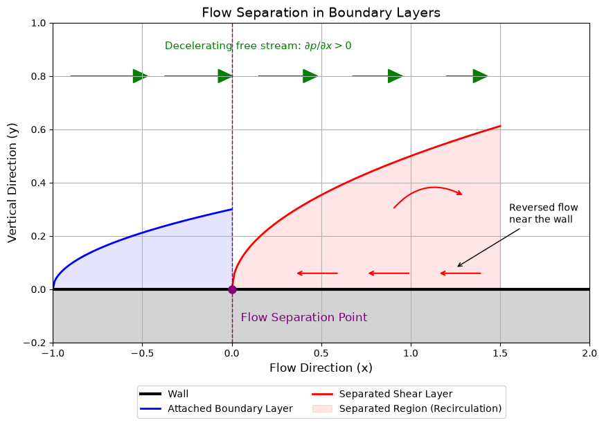

# Flow Separation in a Boundary Layer

This script draws a schematic of boundary-layer separation: an attached layer that thickens downstream, a separation point, and a recirculation region under the separated shear layer. The attached boundary layer grows as $\sqrt{x - x_0}$ from $x = -1$ to the separation point at $x = 0$. A separated shear layer then lifts off the wall and encloses a shaded recirculation region with reversed flow near the wall. The curves are illustrative shapes, not solutions of the boundary-layer equations.

## Overview

- Draws the attached boundary-layer edge $\delta(x) = 0.3\sqrt{x + 1}$ for $-1 \le x \le 0$ and shades the layer
- Marks the separation point at $x = 0$ with a dot, a dashed vertical line, and a label
- Draws the separated shear layer $y = 0.5\sqrt{x}$ for $0 \le x \le 1.5$ and shades the recirculation region between it and the wall
- Adds leftward (upstream) red arrows near the wall and a curved arrow to show the recirculating motion
- Draws free-stream arrows that shorten downstream to show the outer flow slowing in an adverse pressure gradient, $\partial p / \partial x > 0$
- Hatches the solid region below the wall

## Mathematical Background

### Laminar Boundary-Layer Growth

On a flat plate with zero pressure gradient the Blasius solution gives

$$\delta(x) \approx \frac{5\,x}{\sqrt{Re_x}} = 5\sqrt{\frac{\nu x}{U_\infty}}, \qquad Re_x = \frac{U_\infty x}{\nu}$$

so $\delta \propto \sqrt{x}$. The schematic uses the same square-root shape, measured from its leading edge at $x_0 = -1$.

### Adverse Pressure Gradient

In the boundary layer the wall-normal pressure variation is negligible, and the outer flow sets $-\frac{1}{\rho}\frac{dp}{dx} = U_e \frac{dU_e}{dx}$. A decelerating outer flow ($dU_e/dx < 0$) therefore means an adverse pressure gradient:

$$\frac{\partial p}{\partial x} > 0$$

This removes momentum from the slow fluid near the wall.

### Separation Criterion

Separation of a steady 2D boundary layer occurs where the wall shear stress vanishes:

$$\tau_w = \mu \left.\frac{\partial u}{\partial y}\right|_{y=0} = 0$$

### Recirculation

Downstream of separation the wall shear stress changes sign and the flow next to the wall runs upstream:

$$u(x, y) < 0 \quad \text{near the wall}$$

The recirculation region is bounded above by the dividing streamline, drawn here as the separated shear layer.

## Implementation

- `boundary_layer_edge(x)` returns `DELTA_COEFF * sqrt(x - X_START)` with `DELTA_COEFF = 0.3` and `X_START = -1`.
- `separated_shear_layer(x)` returns `SHEAR_COEFF * sqrt(x - X_SEP)` with `SHEAR_COEFF = 0.5`, `X_SEP = 0`, and `X_END = 1.5`.
- `make_figure()` draws the wall, both shaded regions, the reversed-flow and free-stream arrows, the separation marker, and the annotations. The legend sits below the axes.
- `main(argv=None)` handles the flags.

## Usage

```bash
python main.py                          # open the figure window
python main.py --no-show --output out   # save flow_separation_boundary_layer.png into out/
```

| Flag | Meaning |
|------|---------|
| `--no-show` | Do not open a plot window |
| `--output DIR` | Create `DIR` and save the figure as a PNG |

## Output

The wall runs along $y = 0$ above a hatched solid. On the left, the blue attached boundary layer thickens towards the purple separation point. From that point the red shear layer rises away from the wall over a pink recirculation region, which contains upstream-pointing arrows near the wall. Across the top, green free-stream arrows shorten from left to right.



## Related Notes

- [Boundary Layers](../../../notes/fluid_mechanics/viscous_flow/boundary_layers.md)
- [Understanding Drag](../../../notes/fluid_mechanics/viscous_flow/drag.md)
