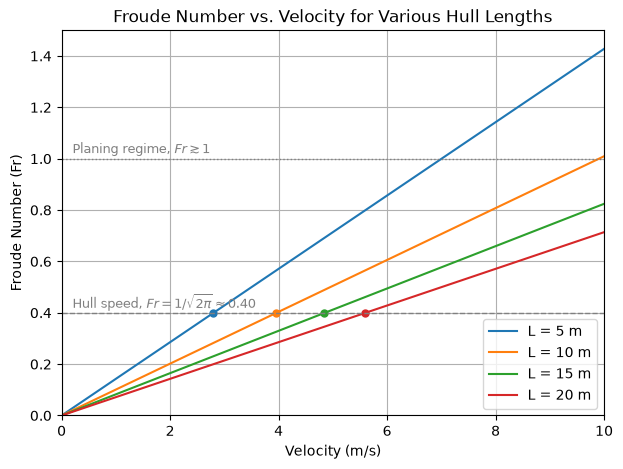

# Froude Number vs. Flow Velocity

This script plots the length-based Froude number $Fr = U/\sqrt{gL}$ against speed for hulls of 5, 10, 15, and 20 m, with reference lines at hull speed and at the approximate start of planing. The Froude number compares inertia with gravity and controls wave-making resistance in naval architecture. The plot shows that a longer hull reaches a given Froude number, and hence hull speed, at a higher absolute speed.

## Overview

- Computes $Fr$ for speeds from 0 to 10 m/s and hull lengths $L = 5, 10, 15, 20$ m with $g = 9.81\ \text{m/s}^2$
- Draws one line per hull length, each in its own colour, and marks the speed at which that hull reaches hull speed
- Draws a dashed reference line at hull speed, $Fr = 1/\sqrt{2\pi} \approx 0.40$
- Draws a dotted reference line at $Fr = 1$, a rough threshold for the planing regime
- Labels the axes with units and adds a grid and legend

## Mathematical Background

### Froude Number

$$Fr = \frac{U}{\sqrt{gL}}$$

where $U$ is the speed (m/s), $g$ the gravitational acceleration (m/s²), and $L$ the hull waterline length (m).

### Hull Speed

A ship moving at speed $U$ makes deep-water waves with phase speed $U$. Their wavelength follows from the dispersion relation:

$$\lambda = \frac{2\pi U^2}{g}$$

When the wavelength equals the hull length, the bow and stern waves reinforce each other and wave-making resistance rises steeply. Setting $\lambda = L$ gives

$$Fr_{\text{hull}} = \frac{1}{\sqrt{2\pi}} \approx 0.40$$

This is equivalent to the traditional rule of thumb $V_{\text{hull}} \approx 1.34\sqrt{L_{\text{ft}}}$ knots. The hull speeds for the plotted lengths are 2.8, 4.0, 4.8, and 5.6 m/s.

### Speed Regimes (Approximate)

- $Fr \lesssim 0.4$: displacement regime, with the hull supported by buoyancy
- $0.4 \lesssim Fr \lesssim 1$: semi-planing regime
- $Fr \gtrsim 1$: planing regime, with the hull supported largely by hydrodynamic lift

These length-based thresholds are indicative only. The subcritical/supercritical split at $Fr = 1$ belongs to the depth-based Froude number $U/\sqrt{gh}$ of open-channel flow, and the script does not plot that.

## Implementation

- `froude_number(velocity, g, length)` returns $U/\sqrt{gL}$ for scalars or arrays.
- `plot_froude_number_vs_velocity(lengths, g, v_max)` evaluates 200 speeds in $[0, v_{\max}]$ and plots one line per length, with a marker at $U = Fr_{\text{hull}}\sqrt{gL}$. It also draws the reference lines at `FR_HULL_SPEED` and `FR_PLANING`.
- Constants: `G = 9.81`, `HULL_LENGTHS = [5, 10, 15, 20]`, `V_MAX = 10`.
- `main(argv=None)` handles the flags.

## Usage

```bash
python main.py                          # open the figure window
python main.py --no-show --output out   # save froude_number.png into out/
```

| Flag | Meaning |
|------|---------|
| `--no-show` | Do not open a plot window |
| `--output DIR` | Create `DIR` and save the figure as a PNG |

## Output

Four straight lines through the origin, with slopes $1/\sqrt{gL}$ that decrease as the hull gets longer. The dots on the dashed $Fr \approx 0.40$ line show each hull's speed. Within the plotted range, only the 5 m hull passes $Fr = 1$ (at about 7 m/s), and the 10 m hull just reaches it at 9.9 m/s.



## Related Notes

- [Dimensionless Numbers](../../../notes/fluid_mechanics/dimensions.md)
- [Navier–Stokes Equations](../../../notes/fluid_mechanics/governing_equations/navier_stokes.md)
- [Wave Loading](../../../notes/applied_mechanics/fluid_loading/wave_loading.md)
