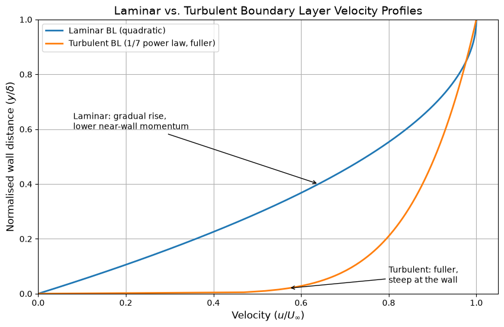

# Laminar vs. Turbulent Boundary Layer Profiles

This script plots normalised laminar and turbulent boundary-layer velocity profiles on the same axes to show how much fuller the turbulent profile is. The laminar profile is the quadratic (Pohlhausen-type) approximation $u/U_\infty = 2\eta - \eta^2$, and the turbulent profile is the empirical one-seventh power law $u/U_\infty = \eta^{1/7}$. Both are plotted against $\eta = y/\delta$. Because both are scaled by their own thickness $\delta$, the plot compares profile shape only, not the fact that a turbulent layer is thicker.

## Overview

- Evaluates both profiles at 200 points in $0 \le \eta \le 1$
- Plots velocity ratio $u/U_\infty$ on the horizontal axis against $\eta$ on the vertical axis
- Annotates the laminar curve (gradual rise, lower near-wall momentum) and the turbulent curve (fuller, steep at the wall)
- Adds a legend, grid, and axis labels

## Mathematical Background

### Laminar Profile (Quadratic Approximation)

$$\frac{u}{U_\infty} = 2\eta - \eta^2, \qquad \eta = \frac{y}{\delta}$$

This profile meets the no-slip condition $u(0) = 0$ and the edge conditions $u(\delta) = U_\infty$ and $\partial u / \partial y|_{\delta} = 0$. It is a simple approximation used in the momentum-integral (Pohlhausen) method, not the exact Blasius solution.

### Turbulent Profile (1/7 Power Law)

$$\frac{u}{U_\infty} = \eta^{1/7}$$

This is an empirical fit to the mean velocity of turbulent flat-plate boundary layers at moderate Reynolds numbers. Its velocity is much closer to $U_\infty$ over most of the layer.

### Wall Gradient and Wall Shear Stress

$$\tau_w = \mu \left.\frac{\partial u}{\partial y}\right|_{y=0} = \frac{\mu U_\infty}{\delta}\left.\frac{d(u/U_\infty)}{d\eta}\right|_{\eta=0}$$

For the quadratic profile the wall gradient is 2, so $\tau_w = 2\mu U_\infty/\delta$. For the power law, $d(\eta^{1/7})/d\eta = \tfrac{1}{7}\eta^{-6/7}$ grows without bound as $\eta \to 0$. The power law does not hold in the viscous sublayer and cannot be used to compute $\tau_w$. The steep near-wall rise does, however, reflect the much larger wall shear stress of turbulent layers.

## Implementation

- `laminar_profile(eta)` returns $2\eta - \eta^2$.
- `turbulent_profile(eta)` returns $\eta^{1/7}$.
- `make_figure(n_points)` builds `eta = np.linspace(0, 1, n_points)` (`N_POINTS = 200`), plots both profiles, and places the annotations on points of the curves.
- `main(argv=None)` handles the flags.

## Usage

```bash
python main.py                          # open the figure window
python main.py --no-show --output out   # save laminar_vs_turbulent_boundary_layer.png into out/
```

| Flag | Meaning |
|------|---------|
| `--no-show` | Do not open a plot window |
| `--output DIR` | Create `DIR` and save the figure as a PNG |

## Output

The laminar curve rises gradually from the wall. The turbulent curve jumps to about 60% of $U_\infty$ within the first 3% of the layer and then stays close to $U_\infty$, lying to the right of the laminar curve almost everywhere. The two curves meet at $\eta = 1$.



## Related Notes

- [Boundary Layers](../../../notes/fluid_mechanics/viscous_flow/boundary_layers.md)
- [Turbulence Modeling](../../../notes/numerical/cfd/turbulence_modeling.md)
- [Understanding Drag](../../../notes/fluid_mechanics/viscous_flow/drag.md)
