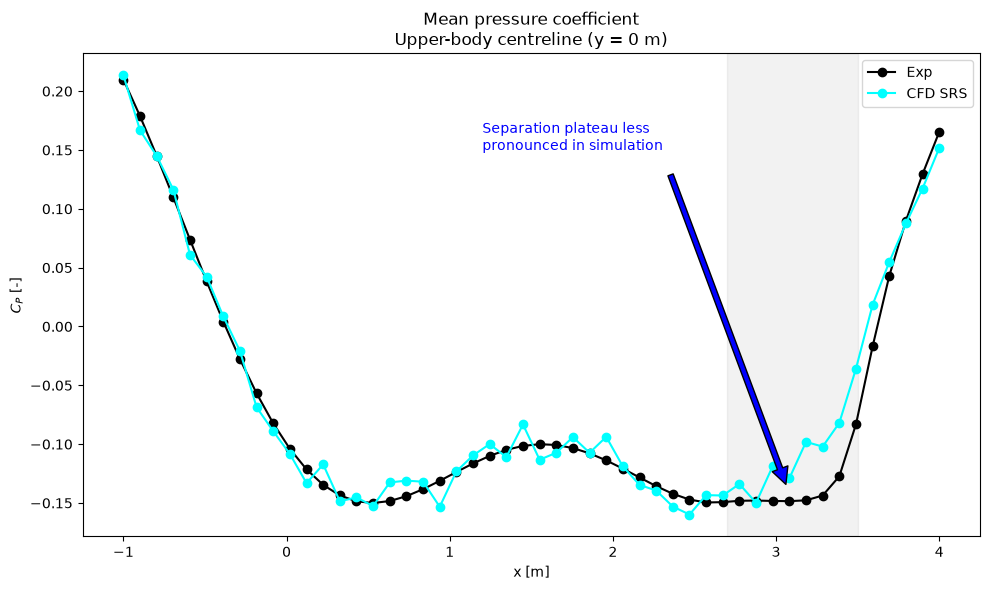

# Mean Pressure Coefficient Along Vehicle Centreline

This script plots a mock validation figure of mean pressure coefficient $C_P$ against streamwise position, comparing "experimental" data with a "CFD SRS" (scale-resolving simulation) curve that under-predicts a separation plateau. Both curves are synthetic. The experimental curve contains a flat separation plateau, and the CFD curve has a weaker plateau plus a little seeded noise. An arrow annotation points out the difference.

## Overview

- Evaluates 50 points over $-1 \le x \le 4$ m
- Builds the "Exp" curve from a smooth base distribution with a separation plateau between $x_{\text{sep}} = 2.7$ m and $x_{\text{reat}} = 3.5$ m
- Builds the "CFD SRS" curve with only 40% of the plateau and Gaussian noise with standard deviation 0.01 (seeded)
- Plots experiment in black and CFD in cyan, both with `"o-"` markers, and shades the plateau interval in grey
- Annotates the plateau with a blue arrow and the text "Separation plateau less pronounced in simulation"

## Mathematical Background

### Pressure Coefficient

$$C_P = \frac{p - p_\infty}{\frac{1}{2}\,\rho\,U_\infty^2}$$

where $p$ is the local static pressure, $p_\infty$ the free-stream static pressure, $\rho$ the density, and $U_\infty$ the free-stream velocity. Since $C_P$ is linear in $p$, $\partial C_P/\partial x > 0$ is the same as an adverse pressure gradient $\partial p/\partial x > 0$.

### Separation Plateau

Where the flow separates, the pressure on the surface under the separated region stays almost constant until the flow reattaches:

$$C_P \approx C_{P,\text{sep}}, \qquad x_{\text{sep}} \le x \le x_{\text{reat}}$$

A simulation that predicts too short or too weak a separation shows a rounder, less flat plateau.

### Mock Data

Base curve and smooth plateau indicator, with $\sigma(z) = 1/(1 + e^{-z})$ and edge width $s = 0.08$ m:

$$C_{P,0}(x) = -0.2\sin x - 0.1\cos 2x, \qquad w(x) = \sigma\!\left(\frac{x - x_{\text{sep}}}{s}\right)\sigma\!\left(\frac{x_{\text{reat}} - x}{s}\right)$$

Each curve blends the base towards the constant value $C_{P,0}(x_{\text{sep}})$ with plateau strength $k$:

$$C_P(x) = \bigl(1 - k\,w(x)\bigr)\,C_{P,0}(x) + k\,w(x)\,C_{P,0}(x_{\text{sep}}) + \epsilon(x)$$

The experiment uses $k = 1$ and $\epsilon = 0$. The CFD curve uses $k = 0.4$ and $\epsilon \sim \mathcal{N}(0, 0.01^2)$.

## Implementation

- `base_cp(x)` gives the smooth base distribution.
- `plateau_weight(x)` gives the smooth indicator $w(x)$, built from `X_SEP`, `X_REAT`, and `BLEND_WIDTH`.
- `mock_cp(x, plateau_strength, noise, rng)` builds one curve.
- `make_figure(seed)` creates both curves with `np.random.default_rng(SEED)` and draws the plot, shaded interval, and annotation (`CFD_PLATEAU_STRENGTH = 0.4`, `CFD_NOISE = 0.01`).
- `main(argv=None)` handles the flags.

## Usage

```bash
python main.py                          # open the figure window
python main.py --no-show --output out   # save mean_pressure_coefficient.png into out/
```

| Flag | Meaning |
|------|---------|
| `--no-show` | Do not open a plot window |
| `--output DIR` | Create `DIR` and save the figure as a PNG |

## Output

Both curves fall from $C_P \approx 0.2$ at $x = -1$ m to a suction region near $C_P \approx -0.15$ and recover to about 0.16 at $x = 4$ m. Inside the grey band the black experimental curve stays flat and then rises sharply. The cyan CFD curve starts to recover earlier and more gradually, which is the discrepancy the blue arrow points to.



## Related Notes

- [Boundary Layers](../../../notes/fluid_mechanics/viscous_flow/boundary_layers.md)
- [Turbulence Modeling](../../../notes/numerical/cfd/turbulence_modeling.md)
- [Turbulence Modeling Approaches](../../../notes/fluid_mechanics/turbulence/modeling.md)
- [Generating CFD Datasets](../../../notes/machine_learning/neural_networks/generating_cfd_datasets.md)
