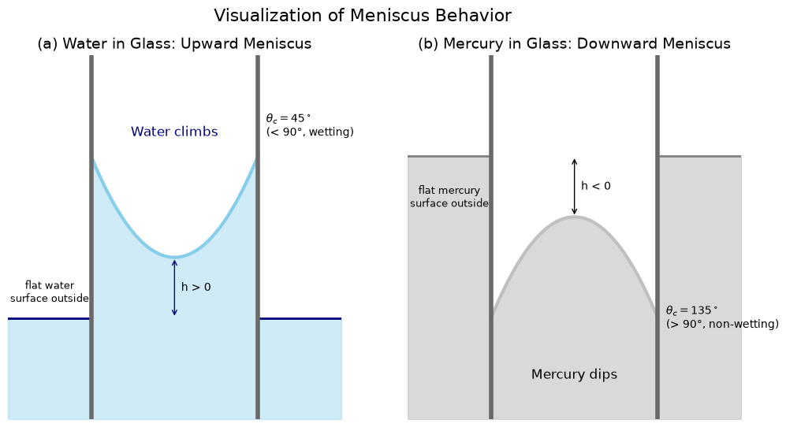

# Meniscus Behavior

This script sketches the meniscus of water and of mercury in a glass tube, showing how wetting determines whether the free surface curves up or down at the wall. Panel (a) shows water, which wets glass: its concave meniscus stands above the outside liquid level. Panel (b) shows mercury, which does not wet glass: its convex meniscus sits below the outside level. Each meniscus is drawn as the parabola $y = \pm 0.5x^2$ between tube walls at $x = \pm 1$. The contact angle implied by that shape is computed and annotated.

## Overview

- Draws two side-by-side panels, each with tube walls, the liquid inside the tube, and the flat liquid surface outside the tube.
- Uses $y = +0.5x^2$ (concave, water) and $y = -0.5x^2$ (convex, mercury) for the meniscus.
- Computes the contact angle where each parabola meets the wall (45° for water, 135° for mercury), prints it and annotates it.
- Marks the height difference $h$ between the meniscus apex and the outside level: $h > 0$ for water (capillary rise) and $h < 0$ for mercury (capillary depression).
- The figure is a schematic. Its lengths are arbitrary, and the drawn angles are not measured values: real water–glass angles are close to $0^\circ$, and mercury–glass angles are about $140^\circ$.

## Mathematical Background

### Meniscus shape and contact angle

Inside the tube the free surface is $y(x) = \pm c\,x^2$ with $c = 0.5$. The wall is vertical at $x = x_w = 1$, so the contact angle, measured through the liquid between the wall and the free surface, is

$$
\theta_c = 90^\circ - \arctan\left(\frac{dy}{dx}\bigg|_{x_w}\right) = 90^\circ - \arctan\left(\pm 2 c\, x_w\right)
$$

This gives $\theta_c = 45^\circ$ for the upward parabola and $\theta_c = 135^\circ$ for the downward one.

- $\theta_c < 90^\circ$: the liquid wets the wall, the meniscus is concave and the liquid rises.
- $\theta_c > 90^\circ$: the liquid does not wet the wall, the meniscus is convex and the liquid is depressed.

### Young's equation

The contact angle comes from the force balance at the contact line between solid (S), liquid (L) and gas (G):

$$
\sigma_{SG} = \sigma_{SL} + \sigma_{LG}\cos\theta_c
$$

### Capillary rise

The equilibrium height of liquid in a tube of radius $r$ (Jurin's law) is

$$
h = \frac{2\sigma\cos\theta_c}{\rho g r}
$$

where $\sigma$ is the liquid–gas surface tension, $\rho$ the liquid density and $g$ the gravitational acceleration. $h < 0$ when $\theta_c > 90^\circ$. The script only illustrates the sign of $h$; it does not evaluate this formula.

## Implementation

- Constants: `CURVATURE = 0.5`, `X_WALL = 1.0` (tube walls), `X_OUTSIDE = 2.0` (drawing half-width) and `OUTSIDE_LEVEL = 0.3` (drawn distance between the apex and the outside level).
- `meniscus_height(x, wetting)` returns $\pm$ `CURVATURE` $x^2$.
- `contact_angle_deg(wetting)` evaluates the contact-angle formula above.
- `draw_panel(ax, wetting, ...)` fills the liquid inside and outside the tube, draws the meniscus, outside surface and walls, and adds the $h$ arrow and the text labels.
- `plot_menisci()` builds the two-panel figure. `main(argv)` handles the flags.

## Usage

```bash
python main.py                      # open the plot window
python main.py --no-show --output . # save meniscus_behavior.png without opening a window
```

| Flag | Effect |
|------|--------|
| `--no-show` | Do not open a plot window |
| `--output DIR` | Create `DIR` and save `meniscus_behavior.png` in it |

## Output

On the left, water fills the tube up to a concave meniscus that stands above the flat water surface outside. On the right, mercury ends in a convex meniscus below the outside mercury surface. Each panel is labelled with its contact angle.



## Related Notes

- [Surface Tension](../../../notes/fluid_mechanics/fluid_properties/surface_tension.md): cohesion, adhesion, meniscus shapes and the capillary rise equation.
- [Fluid Properties](../../../notes/fluid_mechanics/fluid_properties/README.md): overview of surface tension alongside the other fluid properties.
