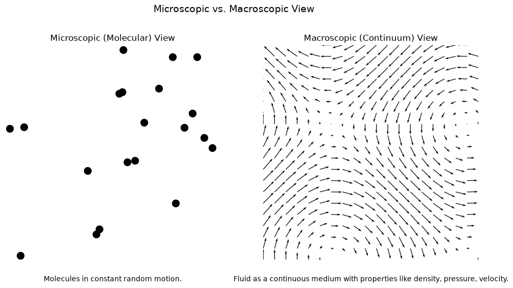

# Microscopic vs. Macroscopic View of a Fluid

This script draws two side-by-side panels that contrast the microscopic (molecular) and macroscopic (continuum) views of a fluid. The left panel shows discrete molecules as randomly placed dots. The right panel shows a smooth velocity field defined at every point. The distinction underlies the continuum hypothesis on which the Navier-Stokes equations rest.

## Overview

- Places 20 dots at seeded, uniformly random positions in a $10 \times 10$ box to stand for molecules. The dots are static; the caption says they are in random motion, but no motion is simulated.
- Evaluates the velocity field $\mathbf{u} = (\sin(y/2),\ \cos(x/2))$ on a uniform $20 \times 20$ grid over the same box and draws it as a quiver plot.
- Puts both panels in one figure with captions and a shared title.

## Mathematical Background

### Microscopic view

At the molecular level a fluid is a large number of discrete molecules in random thermal motion. Position and velocity belong to individual molecules. Density, velocity and pressure appear only as averages over many molecules.

### Continuum view

The continuum hypothesis treats density $\rho$, velocity $\mathbf{u}$ and pressure $p$ as smooth functions of position $\mathbf{x}$ and time $t$. It holds when the Knudsen number is small:

$$
Kn = \frac{\lambda}{L} \ll 1
$$

where $\lambda$ is the molecular mean free path and $L$ is the characteristic length of the flow. The script does not compute $Kn$; this is the background to the right-hand panel.

### Field in the right-hand panel

$$
u(x, y) = \sin\left(\frac{y}{2}\right), \qquad v(x, y) = \cos\left(\frac{x}{2}\right)
$$

$u$ does not depend on $x$ and $v$ does not depend on $y$. The field is therefore divergence-free, $\partial u/\partial x + \partial v/\partial y = 0$, which is the continuity equation for an incompressible flow.

## Implementation

- Constants: `BOX_SIZE = 10.0`, `N_MOLECULES = 20`, `GRID_POINTS = 20` and `SEED = 0`.
- `molecule_positions(n, box, seed)` returns random $x, y$ positions from a seeded `numpy.random.RandomState`.
- `continuum_field(n, box)` returns the meshgrid and the $(u, v)$ components.
- `plot_microscopic_view()` draws the scatter and quiver panels (quiver `scale=20`) and returns the figure.
- `main(argv)` handles the flags.

## Usage

```bash
python main.py                      # open the plot window
python main.py --no-show --output . # save microscopic_view.png without opening a window
```

| Flag | Effect |
|------|--------|
| `--no-show` | Do not open a plot window |
| `--output DIR` | Create `DIR` and save `microscopic_view.png` in it |

## Output

On the left are 20 scattered black dots labelled "Molecules in constant random motion." On the right are smoothly varying arrows labelled as the continuum description.



## Related Notes

- [Introduction to Fluid Mechanics](../../../notes/fluid_mechanics/intro.md): microscopic vs. macroscopic viewpoints and the continuum hypothesis.
- [The Boltzmann Equation](../../../notes/numerical/lattice_boltzmann/boltzmann_equation.md): the kinetic description and how continuum equations are recovered at small Knudsen number.
- [Continuity Equation](../../../notes/fluid_mechanics/governing_equations/continuity.md): the divergence-free condition satisfied by the plotted field.
