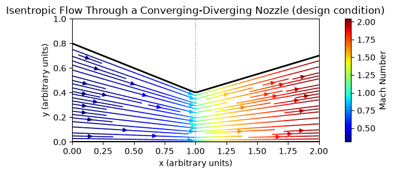

# Converging-Diverging Nozzle Flow

This script plots quasi-one-dimensional isentropic flow through a converging-diverging (de Laval) nozzle, with streamlines coloured by Mach number. The top wall converges linearly from $y = 0.8$ to $0.4$ over $0 \le x \le 1$, then diverges linearly to $0.7$ at $x = 2$. At the design condition the flow is subsonic in the converging part, sonic at the throat and supersonic in the diverging part. The local Mach number is found by inverting the isentropic area–Mach relation.

## Overview

- Defines the nozzle height $h(x)$ as a piecewise-linear wall above a flat bottom wall. The flow is two-dimensional with unit depth, so the area is $A = h$.
- Solves $A(x)/A^* = f(M)$ for the Mach number with $A^* = h_{\text{throat}} = 0.4$ and $\gamma = 1.4$. It takes the subsonic root for $x \le 1$ and the supersonic root for $x > 1$.
- Converts Mach number to a velocity $u/a_0$ and sets the vertical velocity so that streamlines follow the walls ($y/h$ constant).
- Prints $A/A^*$ and $M$ at the inlet, throat and exit: 0.31, 1.00 and 2.04.
- Draws the walls and streamlines coloured by Mach number, with a colourbar and a dotted line at the throat.

## Mathematical Background

### Wall geometry

$$
h(x) = \begin{cases} 0.8 - 0.4x, & 0 \le x \le 1 \\ 0.4 + 0.3(x-1), & 1 < x \le 2 \end{cases}
$$

### Isentropic area–Mach relation

For steady, adiabatic, frictionless flow of a perfect gas, mass conservation $\rho u A = \text{const}$ together with the isentropic relations gives

$$
\frac{A}{A^*} = \frac{1}{M}\left[\frac{2}{\gamma+1}\left(1 + \frac{\gamma-1}{2}M^2\right)\right]^{\frac{\gamma+1}{2(\gamma-1)}}
$$

For each $A/A^* > 1$ there is one subsonic and one supersonic root. In differential form,

$$
\frac{du}{u} = \frac{dA/A}{M^2 - 1}
$$

so a converging duct accelerates subsonic flow and a diverging duct accelerates supersonic flow. $M = 1$ can occur only at the throat.

### Velocity field

The speed of sound falls as the gas accelerates, $a/a_0 = \left(1 + \frac{\gamma-1}{2}M^2\right)^{-1/2}$, so the axial velocity scaled by the stagnation speed of sound is

$$
\frac{u}{a_0} = M \left(1 + \frac{\gamma-1}{2}M^2\right)^{-1/2}
$$

In the quasi-1-D model $u$ is uniform across each section. For the plot, streamlines are made to follow the walls, $y/h(x) = \text{const}$, which gives

$$
v = u\,\frac{y\,h'(x)}{h(x)}
$$

## Implementation

- Constants: `GAMMA = 1.4`, `H_INLET = 0.8`, `H_THROAT = 0.4`, `H_EXIT = 0.7`, `X_THROAT = 1.0` and a `NX × NY = 100 × 50` grid.
- `nozzle_top(x)` and `nozzle_slope(x)` return $h$ and $h'$.
- `area_ratio(mach, gamma)` evaluates $A/A^*$.
- `mach_from_area_ratio(ratio, supersonic, gamma)` inverts it element-wise by 60 bisection steps on the chosen branch ($10^{-6} < M < 1$ or $1 < M < 50$).
- `solve_nozzle(X, Y)` returns $u/a_0$, $v/a_0$ and $M$ on the grid, with NaN above the top wall.
- `plot_nozzle(x, y, u, v, mach)` draws the walls and a `streamplot` coloured by Mach number (`jet` colormap).

## Usage

```bash
python main.py                      # open the plot window
python main.py --no-show --output . # save nozzle_flow.png without opening a window
```

| Flag | Effect |
|------|--------|
| `--no-show` | Do not open a plot window |
| `--output DIR` | Create `DIR` and save `nozzle_flow.png` in it |

## Output

Streamlines converge towards the throat and spread out after it, following the walls. They are blue at the inlet ($M \approx 0.31$), cyan–green near the throat ($M = 1$), and red at the exit ($M \approx 2.04$). The figure shows only the design (shock-free) solution. Off-design back pressures, which produce shocks in or after the diverging section, are not modelled.



## Related Notes

- [Isentropic Flow](../../../notes/fluid_mechanics/compressible_flow/isentropic_flow.md): stagnation properties and the area–Mach relation.
- [Speed of Sound](../../../notes/fluid_mechanics/compressible_flow/speed_of_sound.md): Mach number and how the speed of sound depends on temperature.
- [Compressible Flow Theory](../../../notes/fluid_mechanics/compressible_flow/README.md): area–velocity relations and converging-diverging nozzles.
- [Continuity Equation](../../../notes/fluid_mechanics/governing_equations/continuity.md): mass conservation in a duct.
