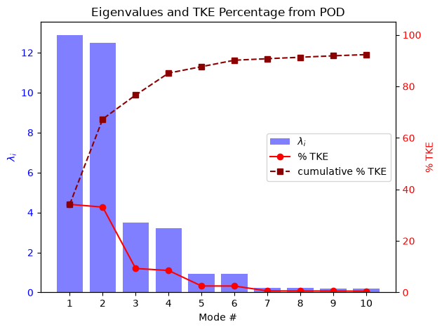

# POD Analysis for Flow Fields

This script performs Proper Orthogonal Decomposition (POD) on a synthetic 100 × 50 snapshot matrix with the singular value decomposition (SVD) and plots the eigenvalue spectrum with the share of turbulent kinetic energy (TKE) in each mode. The snapshots are built from three travelling waves of decreasing amplitude plus random noise. Each travelling wave appears as a pair of modes with equal energy, as vortex shedding does in real flows. The plot shows how many modes are needed to capture most of the fluctuation energy.

## Overview

- Builds a snapshot matrix with $M = 100$ time instants (rows) and $N = 50$ spatial points (columns): a uniform mean, three travelling waves and seeded Gaussian noise.
- Subtracts the temporal mean at every spatial point to obtain the velocity fluctuations.
- Applies `numpy.linalg.svd` and converts singular values to eigenvalues $\lambda_i = \sigma_i^2/(M-1)$.
- Computes the percentage of TKE per mode and its cumulative sum, and prints both for the first ten modes.
- Plots the first ten eigenvalues as bars (left axis), with per-mode and cumulative %TKE as lines (right axis).

## Mathematical Background

### Synthetic snapshots

$$
u(x_j, t_i) = 1 + \sum_{k=1}^{3} a_k \sin(k x_j - \omega_k t_i) + \epsilon_{ij}
$$

with $(a_k, \omega_k) = (1, 2),\ (0.5, 5),\ (0.25, 9)$, $x_j, t_i \in [0, 2\pi)$ and $\epsilon_{ij} \sim \mathcal{N}(0, 0.3^2)$. Each wave $\sin(kx - \omega t) = \sin kx\cos\omega t - \cos kx\sin\omega t$ contributes two spatial modes of equal energy.

### Snapshot matrix and SVD

With the temporal mean removed, the fluctuation matrix $\mathbf{U}' \in \mathbb{R}^{M \times N}$ is factorised as

$$
\mathbf{U}' = \mathbf{W}\,\boldsymbol{\Sigma}\,\boldsymbol{\Phi}^T
$$

The rows of $\boldsymbol{\Phi}^T$ are the spatial POD modes. The columns of $\mathbf{A} = \mathbf{W}\boldsymbol{\Sigma} = \mathbf{U}'\boldsymbol{\Phi}$ are the temporal coefficients. $\boldsymbol{\Sigma} = \mathrm{diag}(\sigma_1, \sigma_2, \ldots)$ holds the singular values.

### Eigenvalues

The eigenvalues of the spatial covariance matrix $\mathbf{C} = \mathbf{U}'^T\mathbf{U}'/(M-1)$ are

$$
\lambda_i = \frac{\sigma_i^2}{M - 1}, \qquad M = 100 \text{ snapshots}
$$

### Percentage of turbulent kinetic energy

$$
\%\text{TKE}_i = 100\,\frac{\lambda_i}{\sum_j \lambda_j}, \qquad \text{cumulative}_n = \sum_{i=1}^{n} \%\text{TKE}_i
$$

## Implementation

- Constants: `N_SAMPLES = 100`, `N_POINTS = 50`, `WAVES` (amplitude, wavenumber, angular frequency), `MEAN_VELOCITY = 1.0`, `NOISE_STD = 0.3`, `SEED = 42` and `N_PLOT = 10`.
- `generate_snapshots(n_samples, n_points, noise_std, seed)` builds the matrix.
- `pod(data)` subtracts the mean, runs the SVD and returns the eigenvalues, spatial modes and temporal coefficients.
- `plot_spectrum(eigenvalues, n_plot)` draws the bar chart and the twin-axis %TKE lines.
- `main(argv)` handles the flags and prints the energy table.

## Usage

```bash
python main.py                      # open the plot window
python main.py --no-show --output . # save pod_analysis_for_flow_fields.png without opening a window
```

| Flag | Effect |
|------|--------|
| `--no-show` | Do not open a plot window |
| `--output DIR` | Create `DIR` and save `pod_analysis_for_flow_fields.png` in it |

## Output

The eigenvalues come in pairs, one pair per travelling wave. Modes 1–2 hold about 34% and 33% of the TKE, modes 3–4 about 9% each, and modes 5–6 about 2.5% each. From mode 7 on, the modes hold only noise (about 0.5% each). The cumulative curve passes 85% after four modes and 90% after six.



## Related Notes

- [Proper Orthogonal Decomposition in CFD](../../../notes/numerical/pod/pod_intro.md): motivation and formulation of POD.
- [Derivation of POD for N Dimensions](../../../notes/numerical/pod/derivation_in_n_dim.md): snapshot matrix, eigenvalues and TKE contribution.
- [The SVD and POD](../../../notes/numerical/pod/pod_vs_svd.md): why the SVD of the snapshot matrix gives the POD modes and eigenvalues.
- [The Snapshot POD](../../../notes/numerical/pod/snapshot_pod.md): the method of snapshots.
