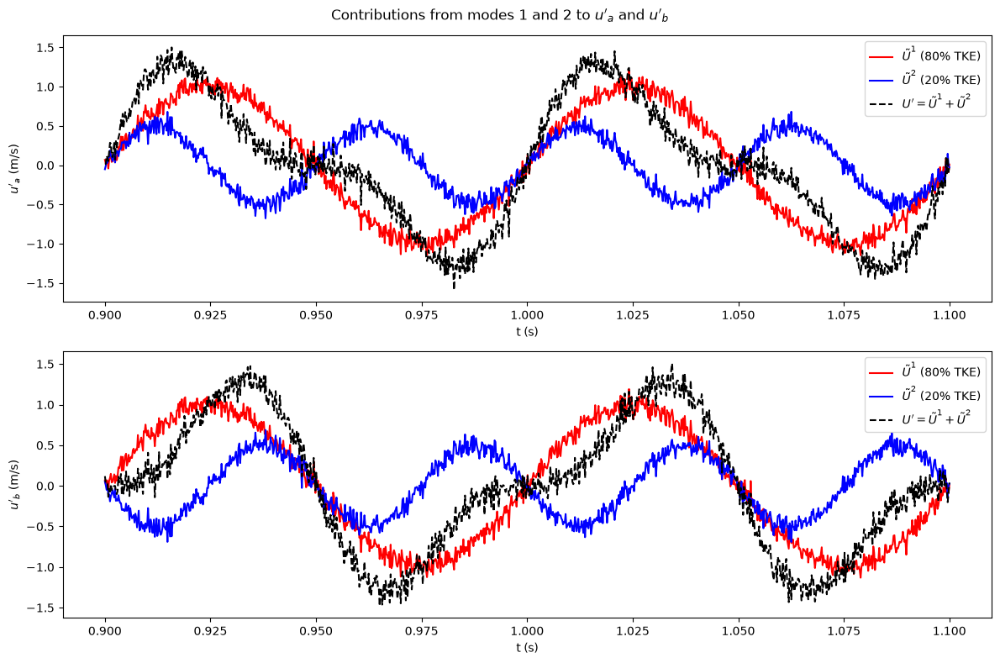

# POD Modes of a Two-Point Velocity Signal

This script applies Proper Orthogonal Decomposition to velocity signals measured at two points, a and b, and plots how much each of the two POD modes contributes to each signal. It follows the two-dimensional POD example in the notes, in which an $m \times 2$ snapshot matrix is decomposed into two rank-one contributions $\tilde{\mathbf{U}}^1$ and $\tilde{\mathbf{U}}^2$. Here the synthetic signals share an in-phase 10 Hz component and carry an anti-phase 20 Hz harmonic. POD therefore separates them cleanly into a dominant mode with about 80% of the TKE and a secondary mode with about 20%.

## Overview

- Generates $m = 1000$ samples over $0.9 \le t \le 1.1$ s of $u_a(t)$ and $u_b(t)$ with seeded measurement noise.
- Stacks them into an $m \times 2$ snapshot matrix and subtracts the mean of each column.
- Computes the SVD. The rows of $\boldsymbol{\Phi}^T$ are the modes, and $\mathbf{A} = \mathbf{W}\boldsymbol{\Sigma}$ holds the time coefficients.
- Forms the contributions $\tilde{\mathbf{U}}^k = \mathbf{a}_k \boldsymbol{\phi}_k^T$ of modes 1 and 2, and prints each mode vector with its share of the TKE.
- Plots mode 1, mode 2 and their sum for $u'_a$ (top panel) and $u'_b$ (bottom panel).

## Mathematical Background

### Synthetic signals

$$
u_a = \sin(2\pi f t) + 0.5\sin(4\pi f t) + \epsilon_a, \qquad
u_b = \sin(2\pi f t) - 0.5\sin(4\pi f t) + \epsilon_b
$$

with $f = 10$ Hz and $\epsilon \sim \mathcal{N}(0, 0.1^2)$. The covariance matrix is approximately $\begin{pmatrix} 0.625 & 0.375 \\ 0.375 & 0.625 \end{pmatrix}$. Its eigenvalues are $1.0$ and $0.25$, with eigenvectors $(1, 1)/\sqrt{2}$ and $(1, -1)/\sqrt{2}$, which gives the 80%/20% energy split.

### Snapshot matrix and SVD

$$
\mathbf{U}' = \begin{pmatrix} u'_a(t_1) & u'_b(t_1) \\ \vdots & \vdots \\ u'_a(t_m) & u'_b(t_m) \end{pmatrix} = \mathbf{W}\,\boldsymbol{\Sigma}\,\boldsymbol{\Phi}^T
$$

$\boldsymbol{\Phi} \in \mathbb{R}^{2 \times 2}$ holds the POD modes (principal axes) as columns. $\mathbf{A} = \mathbf{W}\boldsymbol{\Sigma} = \mathbf{U}'\boldsymbol{\Phi} \in \mathbb{R}^{m \times 2}$ holds the time coefficients.

### Mode contributions and reconstruction

$$
\tilde{\mathbf{U}}^k = \mathbf{a}_k\, \boldsymbol{\phi}_k^T, \qquad \mathbf{U}' = \tilde{\mathbf{U}}^1 + \tilde{\mathbf{U}}^2
$$

Column 1 of $\tilde{\mathbf{U}}^k$ is the contribution of mode $k$ to $u'_a$, and column 2 is its contribution to $u'_b$. The fraction of TKE in mode $k$ is $\sigma_k^2 / \sum_j \sigma_j^2$. With only two points, the two modes together reconstruct the data exactly.

## Implementation

- Constants: `T_START = 0.9`, `T_END = 1.1` s, `N_SAMPLES = 1000`, `FREQUENCY = 10.0` Hz, `AMP_FUNDAMENTAL = 1.0`, `AMP_HARMONIC = 0.5`, `NOISE_STD = 0.1` and `SEED = 0`.
- `generate_signals(n_samples, noise_std, seed)` returns $t$ and the $m \times 2$ matrix.
- `pod_contributions(snapshots)` removes the mean, runs `numpy.linalg.svd` and returns the list of $\tilde{\mathbf{U}}^k$, the modes and the energy fractions.
- `plot_contributions(t, contributions, energy_fraction)` draws the two stacked panels.
- `main(argv)` handles the flags.

## Usage

```bash
python main.py                      # open the plot window
python main.py --no-show --output . # save pod_modes_2d.png without opening a window
```

| Flag | Effect |
|------|--------|
| `--no-show` | Do not open a plot window |
| `--output DIR` | Create `DIR` and save `pod_modes_2d.png` in it |

## Output

At both points, mode 1 (red) is the shared 10 Hz oscillation, and it carries about 80% of the TKE. Mode 2 (blue) is the 20 Hz harmonic, which appears with opposite sign at a and b. The dashed black curve is their sum, equal to the measured fluctuation $u'$.



## Related Notes

- [Derivation of POD in 2D](../../../notes/numerical/pod/derivation_in_2d.md): the two-point example, covariance matrix, principal axes and the decomposition into $\tilde{\mathbf{U}}^1 + \tilde{\mathbf{U}}^2$.
- [The SVD and POD](../../../notes/numerical/pod/pod_vs_svd.md): computing POD with the SVD.
- [Derivation of POD for N Dimensions](../../../notes/numerical/pod/derivation_in_n_dim.md): the same decomposition for many spatial points.
