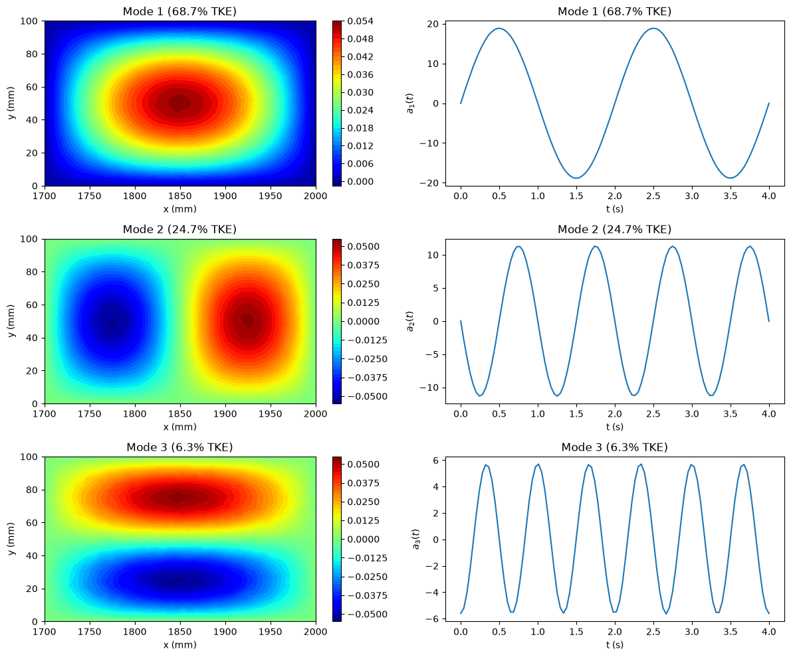

# POD Spatial Modes and Temporal Coefficients

This script extracts the first three POD spatial modes and their temporal coefficients from a synthetic two-dimensional, time-dependent field and plots them. The field is defined on a 50 × 30 spatial grid (x from 1700 to 2000 mm, y from 0 to 100 mm) at 100 time instants over 4 s. It is built from three separable structures of decreasing amplitude plus noise, so POD recovers each structure as one mode. The modes are shown as contour maps next to their time series.

## Overview

- Builds $u(x, y, t)$ as a sum of three standing-wave structures, each with its own spatial shape and oscillation frequency, plus seeded Gaussian noise.
- Reshapes the field into an $(N_x N_y) \times N_t = 1500 \times 100$ snapshot matrix and subtracts the temporal mean at each point.
- Runs the SVD. The columns of $\boldsymbol{\Phi}$ are the spatial modes, and $a_i(t) = \sigma_i \psi_i(t)$ are the temporal coefficients.
- Prints the share of TKE in modes 1–4. With the default settings this is about 69%, 25%, 6% and 0.004% (noise).
- Plots the first three modes as filled contours (left column) and $a_1, a_2, a_3$ against time (right column), with the TKE share in each title.

## Mathematical Background

### Synthetic field

With $\xi = (x - 1700)/300$ and $\eta = y/100$, both in $[0, 1]$:

$$
u = \sin(\pi\xi)\sin(\pi\eta)\sin(\pi t) + 0.6\sin(2\pi\xi)\sin(\pi\eta)\sin(2\pi t) + 0.3\sin(\pi\xi)\sin(2\pi\eta)\cos(3\pi t) + \epsilon
$$

with $\epsilon \sim \mathcal{N}(0, 0.02^2)$. The three spatial shapes are orthogonal on the grid and the amplitudes differ, so the SVD returns them as separate modes ordered by energy.

### Snapshot matrix and SVD

$$
\mathbf{U}' \in \mathbb{R}^{N_x N_y \times N_t}, \qquad N_x = 50,\ N_y = 30,\ N_t = 100
$$

$$
\mathbf{U}' = \boldsymbol{\Phi}\,\boldsymbol{\Sigma}\,\boldsymbol{\Psi}^T
$$

Each column $\boldsymbol{\phi}_i \in \mathbb{R}^{N_x N_y}$ of $\boldsymbol{\Phi}$ is a unit-norm spatial mode, reshaped to $(N_x, N_y)$ for plotting. The columns of $\boldsymbol{\Psi}$ are unit-norm temporal modes.

### Temporal coefficients and energy

$$
a_i(t_k) = \sigma_i\,\psi_i(t_k) = \boldsymbol{\phi}_i^T\,\mathbf{u}'(t_k), \qquad \%\text{TKE}_i = 100\,\frac{\sigma_i^2}{\sum_j \sigma_j^2}
$$

$a_i(t)$ is the projection of each snapshot onto mode $i$. The field is recovered as $\mathbf{u}'(t) = \sum_i a_i(t)\,\boldsymbol{\phi}_i$.

## Implementation

- Constants: `N_X, N_Y, N_T = 50, 30, 100`, `X_RANGE = (1700, 2000)` mm, `Y_RANGE = (0, 100)` mm, `T_END = 4.0` s, `STRUCTURES` (amplitude, x and y wavenumbers, time function), `NOISE_STD = 0.02`, `SEED = 42` and `N_MODES = 3`.
- `generate_field(noise_std, seed)` returns `x`, `y`, `t` and the field with shape `(N_X, N_Y, N_T)`.
- `pod(field, n_modes)` reshapes, removes the mean, runs `numpy.linalg.svd`, and returns the reshaped modes, the scaled temporal coefficients and the energy fractions.
- `plot_modes(x, y, t, modes, time_coeffs, energy_fraction)` lays out the 3 × 2 grid with `GridSpec`, using `contourf` with the `jet` colormap and 50 levels.
- `main(argv)` handles the flags.

## Usage

```bash
python main.py                      # open the plot window
python main.py --no-show --output . # save pod_modes_and_temporal_coefficients.png without opening a window
```

| Flag | Effect |
|------|--------|
| `--no-show` | Do not open a plot window |
| `--output DIR` | Create `DIR` and save `pod_modes_and_temporal_coefficients.png` in it |

## Output

- Mode 1 (about 69% TKE) is a single bump centred in the domain, oscillating with a 2 s period.
- Mode 2 (about 25%) has two cells of opposite sign side by side in $x$, with a 1 s period.
- Mode 3 (about 6%) has two cells stacked in $y$, oscillating three times as fast as mode 1.

The sign of each mode and its coefficient is arbitrary: flipping both leaves the product unchanged.



## Related Notes

- [Derivation of POD for N Dimensions](../../../notes/numerical/pod/derivation_in_n_dim.md): snapshot matrix, contour plots of modes, and time coefficients $\mathbf{A} = \mathbf{U}\boldsymbol{\Phi}$.
- [Proper Orthogonal Decomposition in CFD](../../../notes/numerical/pod/pod_intro.md): formulation and interpretation of POD modes.
- [The Snapshot POD](../../../notes/numerical/pod/snapshot_pod.md): the method of snapshots for the case with many more spatial points than snapshots, as here.
- [The SVD and POD](../../../notes/numerical/pod/pod_vs_svd.md): the relationship between the SVD factors and POD modes.
