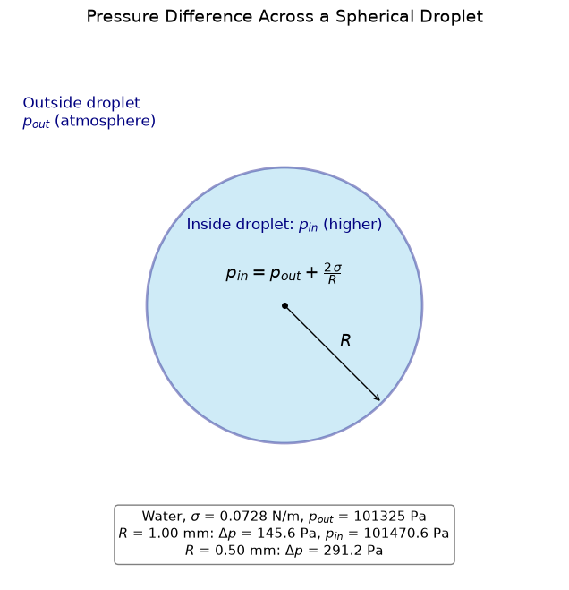

# Pressure Difference Across a Spherical Droplet

This script draws an annotated schematic of the Young-Laplace pressure jump across the surface of a spherical droplet. The inside and outside of the droplet are labelled with $p_{in}$ and $p_{out}$, the radius $R$ is marked, and the relation $p_{in} = p_{out} + 2\sigma/R$ is written on the droplet. A text box evaluates the jump for a water droplet of radius 1 mm and of half that radius, showing that halving the radius doubles the pressure difference.

## Overview

- Draws a filled circle with a navy outline to represent the droplet cross-section (drawn at unit size; it is a schematic).
- Labels the inside region with $p_{in}$ (higher) and the outside region with $p_{out}$ (atmosphere).
- Draws a radius arrow from the centre to the interface, labelled $R$.
- Writes the Young-Laplace relation $p_{in} = p_{out} + 2\sigma/R$ on the droplet.
- Evaluates $\Delta p$ and $p_{in}$ for water ($\sigma = 0.0728$ N/m, $p_{out} = 101325$ Pa) at $R = 1$ mm, and $\Delta p$ at $R = 0.5$ mm.

## Mathematical Background

### Young-Laplace Equation for a Sphere

A spherical interface has two equal principal radii of curvature, so the Young-Laplace equation reduces to

$$
\Delta p = p_{in} - p_{out} = \frac{2\sigma}{R}
$$

where $\sigma$ is the surface tension of the liquid (N/m) and $R$ is the droplet radius (m).

### Values Used

For water at about $20^\circ\text{C}$, $\sigma \approx 0.0728$ N/m. With $R = 1$ mm:

$$
\Delta p = \frac{2 \times 0.0728}{1.0 \times 10^{-3}} = 145.6 \text{ Pa}
$$

### Pressure-Radius Relationship

$$
\Delta p \propto \frac{1}{R}
$$

Halving the radius doubles the pressure difference ($291.2$ Pa at $R = 0.5$ mm), which is why very small droplets and bubbles sustain large internal overpressures.

## Implementation

- Constants: `SURFACE_TENSION` (N/m), `DROPLET_RADIUS` (m) and `ATMOSPHERIC_PRESSURE` (Pa).
- `laplace_pressure_jump(sigma, radius)` returns $2\sigma/R$.
- `draw_droplet(sigma, radius, p_out)` builds the figure: a `plt.Circle` patch for the droplet, an arrow from the centre for $R$, text labels for the two regions and the formula, and a text box with the numerical example computed from `laplace_pressure_jump`.
- `main(argv=None)` parses the command-line flags, saves the figure if requested, and shows it.

## Usage

```bash
python main.py                      # open the figure in a window
python main.py --no-show --output . # save pressure_difference_across_spherical_droplet.png without opening a window
```

| Flag | Description |
|------|-------------|
| `--no-show` | Do not open a plot window |
| `--output DIR` | Create `DIR` and save the figure there as a PNG |

## Output

A schematic of a droplet with labelled inside and outside pressures, the radius, the Young-Laplace relation and a worked example for water.



## Related Notes

- [Surface Tension](../../../notes/fluid_mechanics/fluid_properties/surface_tension.md)
- [Pressure and Compressibility](../../../notes/fluid_mechanics/fluid_properties/pressure_and_compressibility.md)
