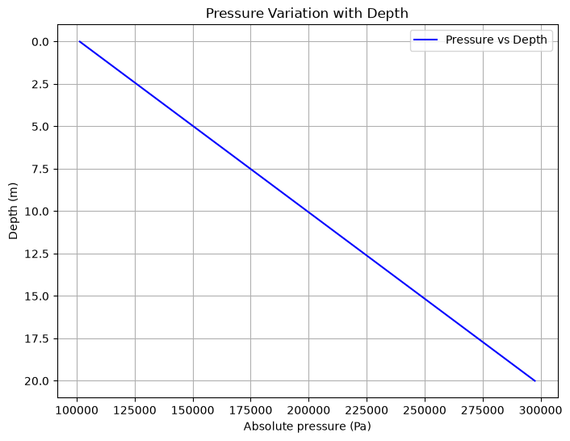

# Pressure Variation with Depth

This script plots how hydrostatic pressure increases linearly with depth below the free surface of a fluid at rest. It evaluates $P(h) = P_0 + \rho g h$ from the surface down to a chosen maximum depth, which is the basic relationship of fluid statics and hydraulics.

## Overview

- Computes the absolute hydrostatic pressure from the surface ($h = 0$) down to `max_depth`, starting from atmospheric pressure $P_0 = 101325$ Pa.
- Plots pressure on the x-axis against depth on the y-axis, with the y-axis inverted so depth increases downwards.
- Takes fluid density, gravitational acceleration and maximum depth as function arguments (defaults: water, $g = 9.81$ m/s$^2$, 20 m).

## Mathematical Background

For a fluid at rest in a uniform gravitational field, the pressure at depth $h$ below the free surface is

$$
P(h) = P_0 + \rho g h
$$

where $P_0$ is the pressure at the free surface (Pa), $\rho$ the fluid density (kg/m$^3$), $g$ the gravitational acceleration (m/s$^2$) and $h$ the depth (m).

### Derivation

Vertical force balance on a small fluid element gives

$$
\frac{dP}{dh} = \rho g
$$

and integrating from the surface, where $P = P_0$, gives the linear profile above. For water ($\rho = 1000$ kg/m$^3$) and $g = 9.81$ m/s$^2$ the pressure rises by $9810$ Pa per metre, so at 20 m it is $101325 + 196200 = 297525$ Pa, about 2.9 atm.

## Implementation

- `ATMOSPHERIC_PRESSURE`: surface pressure $P_0$ in Pa.
- `hydrostatic_pressure(depth, fluid_density, g, surface_pressure)`: evaluates $P_0 + \rho g h$.
- `plot_pressure_variation_with_depth(fluid_density=1000, g=9.81, max_depth=20)`: builds 100 evenly spaced depths from 0 to `max_depth`, computes the pressure, and plots it with an inverted y-axis, grid and legend. Returns the figure.
- `main(argv=None)`: parses the flags, saves the figure if requested, and shows it.

| Parameter | Default | Description |
|-----------|---------|-------------|
| `fluid_density` | 1000 | Fluid density in kg/m$^3$ |
| `g` | 9.81 | Gravitational acceleration in m/s$^2$ |
| `max_depth` | 20 | Maximum depth plotted, in m |

## Usage

```bash
python main.py                      # open the figure in a window
python main.py --no-show --output . # save pressure_variation_with_depth.png without opening a window
```

| Flag | Description |
|------|-------------|
| `--no-show` | Do not open a plot window |
| `--output DIR` | Create `DIR` and save the figure there as a PNG |

## Output

A straight line of absolute pressure (Pa) against depth (m), with depth increasing downwards, running from 101325 Pa at the surface to about 297500 Pa at 20 m.



## Related Notes

- [Hydrostatics](../../../notes/fluid_mechanics/fluid_statics/hydrostatics.md)
- [Pressure and Compressibility](../../../notes/fluid_mechanics/fluid_properties/pressure_and_compressibility.md)
- [Pressure Forces](../../../notes/applied_mechanics/fluid_loading/pressure_forces.md)
