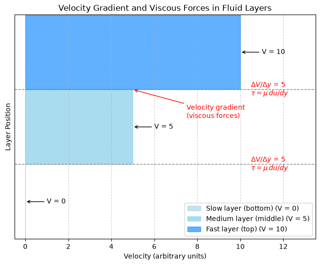

# Velocity Layers and Viscosity

This script draws a schematic of three stacked fluid layers moving at different speeds to illustrate Newton's law of viscosity, $\tau = \mu\, du/dy$. Each layer is a horizontal bar whose length equals its velocity, so the bars form a stepped velocity profile, and the velocity gradient between neighbouring layers is labelled at each interface.

## Overview

- Draws three layers, slow (bottom), medium (middle) and fast (top), with velocities 0, 5 and 10 in arbitrary units, as bars of matching length in three shades of blue.
- Labels each bar with its velocity ("V = ...") using an arrow to the end of the bar.
- Draws the two layer interfaces as dashed lines and labels each with its velocity gradient $\Delta V/\Delta y = 5$ (from layer centre to layer centre) and the relation $\tau = \mu\, du/dy$.
- Points to the upper interface with a red "Velocity gradient (viscous forces)" label.
- Adds a legend listing each layer and its velocity.

## Mathematical Background

### Newton's Law of Viscosity

$$
\tau = \mu\frac{du}{dy}
$$

where $\tau$ is the shear stress (Pa), $\mu$ the dynamic viscosity (Pa·s) and $du/dy$ the velocity gradient normal to the flow direction.

### Discrete Layers

For layers of thickness $\Delta y$ with velocities $V_j$, the gradient between neighbouring layers is approximated by

$$
\frac{du}{dy} \approx \frac{V_{j+1} - V_j}{\Delta y}
$$

With $V = 0, 5, 10$ and $\Delta y = 1$ both interfaces have gradient 5, so the shear stress is the same at both, as in Couette flow.

### Couette Flow

Between a fixed plate and a plate moving at $U_w$ a distance $h$ above it, the velocity profile is linear,

$$
u(y) = U_w \frac{y}{h}
$$

and the shear stress $\tau = \mu U_w/h$ is uniform. The three layers are a coarse, stepped version of this profile.

### Momentum Transport

The faster layer drags the slower layer forward and the slower layer holds the faster one back: viscosity transfers momentum from fast to slow fluid.

## Implementation

- Constants: `LAYERS` (names), `VELOCITIES`, `LAYER_BOUNDARIES` and `COLORS`.
- `interface_gradients(velocities, boundaries)` returns $\Delta V/\Delta y$ between the centres of adjacent layers.
- `draw_layers(layers, velocities, boundaries)` draws the bars with `fill_betweenx`, the velocity labels, the interface lines and gradient labels, and the red annotation, and returns the figure.
- `main(argv=None)` parses the flags, saves the figure if requested, and shows it.

## Usage

```bash
python main.py                      # open the figure in a window
python main.py --no-show --output . # save velocity_layers_viscosity.png without opening a window
```

| Flag | Description |
|------|-------------|
| `--no-show` | Do not open a plot window |
| `--output DIR` | Create `DIR` and save the figure there as a PNG |

## Output

Three bars stacked vertically: none for the stationary bottom layer (V = 0), a medium bar for V = 5 and a long bar for V = 10, with dashed interface lines labelled with the velocity gradient and the viscosity law.



## Related Notes

- [Viscosity](../../../notes/fluid_mechanics/fluid_properties/viscosity.md)
- [Navier-Stokes Equations](../../../notes/fluid_mechanics/governing_equations/navier_stokes.md)
- [Boundary Layers](../../../notes/fluid_mechanics/viscous_flow/boundary_layers.md)
