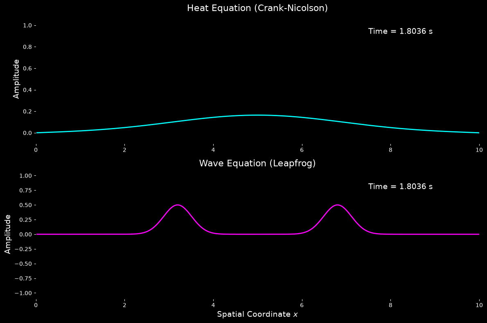

# 1D Heat and Wave Equation Simulations

This script solves the 1D heat equation with the implicit Crank–Nicolson scheme and the 1D wave equation with the explicit leapfrog scheme, animating both from the same initial Gaussian pulse. Running them side by side contrasts diffusion, where the pulse spreads and decays, with wave propagation, where it splits into two travelling pulses that reflect from the fixed ends.

## Overview

- Uses one uniform grid of `NX = 500` points on $0 \le x \le L$ with $L = 10$, and the same initial pulse $u(x,0) = e^{-5(x - L/2)^2}$ for both equations.
- Advances the heat equation (diffusivity `D = 1`) with Crank–Nicolson, using a sparse LU factorisation computed once.
- Advances the wave equation (speed `C = 1`) with the explicit leapfrog scheme, with a second-order start for a pulse at rest.
- Holds $u = 0$ at both ends (homogeneous Dirichlet conditions) for both equations.
- Sets one time step for both equations from the wave CFL limit (Courant number `COURANT = 0.9`). It prints the Courant number and $r = D\Delta t/\Delta x^2$, and warns if the Courant number exceeds 1.
- Animates both solutions in a two-panel dark-themed figure with the current time shown on each panel.

## Mathematical Background

### Heat Equation

$$\frac{\partial u}{\partial t} = D \frac{\partial^2 u}{\partial x^2}$$

Crank–Nicolson averages the central second difference $\delta^2 u_i = u_{i+1} - 2u_i + u_{i-1}$ between time levels $n$ and $n+1$:

$$u_i^{n+1} - \frac{r}{2}\,\delta^2 u_i^{n+1} = u_i^n + \frac{r}{2}\,\delta^2 u_i^n, \qquad r = \frac{D\,\Delta t}{\Delta x^2}$$

The scheme is second-order accurate in time and space and unconditionally stable, so $r$ can be much larger than the explicit limit $r \le 1/2$. With the default grid $r \approx 45$.

### Wave Equation

$$\frac{\partial^2 u}{\partial t^2} = c^2 \frac{\partial^2 u}{\partial x^2}$$

The leapfrog scheme uses central differences in both time and space:

$$u_i^{n+1} = 2u_i^n - u_i^{n-1} + C^2\,\delta^2 u_i^n, \qquad C = \frac{c\,\Delta t}{\Delta x}$$

It is stable for $C \le 1$ (CFL condition). For a pulse at rest ($\partial u/\partial t = 0$), the first step uses $u_i^{-1} = u_i^0 + \tfrac{1}{2}C^2\,\delta^2 u_i^0$. The exact solution is $u = \tfrac{1}{2}[f(x - ct) + f(x + ct)]$ until the halves reach the boundaries, where they reflect with inverted sign.

## Implementation

- `make_grid` builds the grid and picks $\Delta t \le$ `COURANT` $\cdot \Delta x / c$ so that an integer number of steps reaches `T = 500`.
- `crank_nicolson_operators` assembles the sparse matrices $A = I - \tfrac{r}{2}\delta^2$ and $B = I + \tfrac{r}{2}\delta^2$ with identity boundary rows, and factorises $A$ with `scipy.sparse.linalg.splu`.
- `heat_step` solves $A u^{n+1} = B u^n$ and `wave_step` applies the leapfrog update. Both work in place.
- `initial_state` creates the Gaussian pulse and the second-order starting level for the wave.
- `setup_figure` draws the two panels. `main` either animates with `FuncAnimation` (one step per frame) or, with `--no-show`, runs the steps directly and draws the final state.

## Usage

```bash
python main.py                                        # animate up to t = 500 (27,723 frames)
python main.py --steps 500                            # animate the first 500 steps only
python main.py --no-show --output . --steps 100       # save the state at t = 1.8 as a PNG
```

- `--steps N` runs exactly `N` time steps (one per animation frame). Each step is $\Delta t = 0.018$.
- `--no-show` skips the window.
- `--output DIR` saves `heat_and_wave_1d.png` in `DIR`.

## Output



The figure shows the state after 100 steps ($t \approx 1.8$). The top panel shows the heat solution, which has spread into a wide, low Gaussian: its peak has fallen from 1 to about $1/\sqrt{1 + 20Dt} \approx 0.16$. The bottom panel shows the wave solution, where the initial pulse has split into two half-amplitude pulses moving apart at speed $c = 1$. Later in the animation the heat profile decays towards zero, while the wave pulses reflect with inverted sign at $x = 0$ and $x = L$ and pass through each other.

## Related Notes

- [Finite difference method](../../../notes/numerical/fdm/intro.md)
- [Finite difference discretization](../../../notes/numerical/fdm/discretization.md)
- [Numerical stability: explicit and implicit schemes](../../../notes/numerical/cfd/numerical_stability.md)
