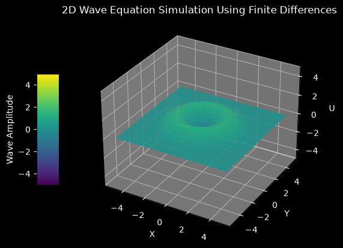

# 2D Wave Equation Simulation

This script solves the 2D scalar wave equation on a square domain with an explicit leapfrog finite difference scheme and animates the result as a 3D surface. The initial Gaussian bump is released from rest, spreads outward as a circular ring, and reflects from the fixed edges of the domain.

## Overview

- Uses a uniform $100 \times 100$ grid (`NX`, `NY`) on $[-L, L]^2$ with `L = 5`.
- Starts from a Gaussian pulse of amplitude `SCALE_FACTOR = 5` centred at the origin, with zero initial velocity.
- Advances the solution with the explicit leapfrog (central-in-time, central-in-space) scheme.
- Holds $u = 0$ on all four edges (Dirichlet boundary conditions), so the ring reflects with inverted sign.
- Takes the time step as half the 2D CFL limit.
- Animates the wave amplitude as a 3D `plot_surface` with the viridis colormap, a fixed colour scale from $-5$ to $5$, and a dark background.

## Mathematical Background

The 2D wave equation for a scalar field $u(x, y, t)$ with wave speed $c$ is:

$$\frac{\partial^2 u}{\partial t^2} = c^2 \left( \frac{\partial^2 u}{\partial x^2} + \frac{\partial^2 u}{\partial y^2} \right)$$

### Finite Difference Discretization

With central differences in space and time, the explicit update is:

$$u_{i,j}^{n+1} = 2u_{i,j}^n - u_{i,j}^{n-1} + (c\,\Delta t)^2 \left( \frac{u_{i+1,j}^n - 2u_{i,j}^n + u_{i-1,j}^n}{\Delta x^2} + \frac{u_{i,j+1}^n - 2u_{i,j}^n + u_{i,j-1}^n}{\Delta y^2} \right)$$

where $i$ indexes $x$ and $j$ indexes $y$. The scheme is second-order accurate in space and time.

### Stability (CFL Condition)

The scheme is stable when $c\,\Delta t\,\sqrt{1/\Delta x^2 + 1/\Delta y^2} \le 1$. For $\Delta x = \Delta y$ this becomes

$$\Delta t \le \frac{\min(\Delta x, \Delta y)}{c\sqrt{2}}$$

The code uses half of this limit, `dt = 0.5 * min(dx, dy) / (c * sqrt(2))`, which gives $\Delta t \approx 0.0357$ for $\Delta x = 0.101$.

### Initial Condition

$$u(x, y, 0) = A \exp\left(-\frac{x^2 + y^2}{2}\right), \qquad \frac{\partial u}{\partial t}(x, y, 0) = 0$$

with $A = 5$. The zero initial velocity is imposed by setting $u^{-1} = u^0$, which is first-order accurate for the first step.

## Implementation

- `make_grid` builds the grid with `np.meshgrid`, so array axis 0 is $y$ and axis 1 is $x$, and computes `dt` from the CFL condition.
- `initial_condition` returns the two starting levels $u^{-1} = u^0$.
- `leapfrog_step` applies the update above to interior points and sets the boundary to zero.
- `main` builds the figure. It either animates with `FuncAnimation`, advancing one step and redrawing the surface each frame, or, with `--no-show`, runs all the steps and draws the final surface once. A shared `Normalize(-5, 5)` keeps the surface colours consistent with the colour bar.

## Usage

```bash
python main.py                                     # animate up to t = 40 (1120 frames)
python main.py --steps 300                         # animate the first 300 steps
python main.py --no-show --output . --steps 45     # save the surface at t = 1.6 as a PNG
```

- `--steps N` runs exactly `N` time steps (one per frame).
- `--no-show` skips the window.
- `--output DIR` saves `wave_2d.png` in `DIR`.

## Output



The surface is shown after 45 steps ($t \approx 1.6$). The initial bump has become an outward-moving circular crest with a trough at the centre. Later in the animation the ring reaches the boundary at $|x| = 5$ or $|y| = 5$, reflects with inverted sign, and the reflected waves interfere to form a changing pattern of crests and troughs.

## Related Notes

- [Finite difference method (including the CFL condition and 2D extensions)](../../../notes/numerical/fdm/intro.md)
- [Finite difference discretization](../../../notes/numerical/fdm/discretization.md)
- [Numerical stability: explicit and implicit schemes for the wave equation](../../../notes/numerical/cfd/numerical_stability.md)
