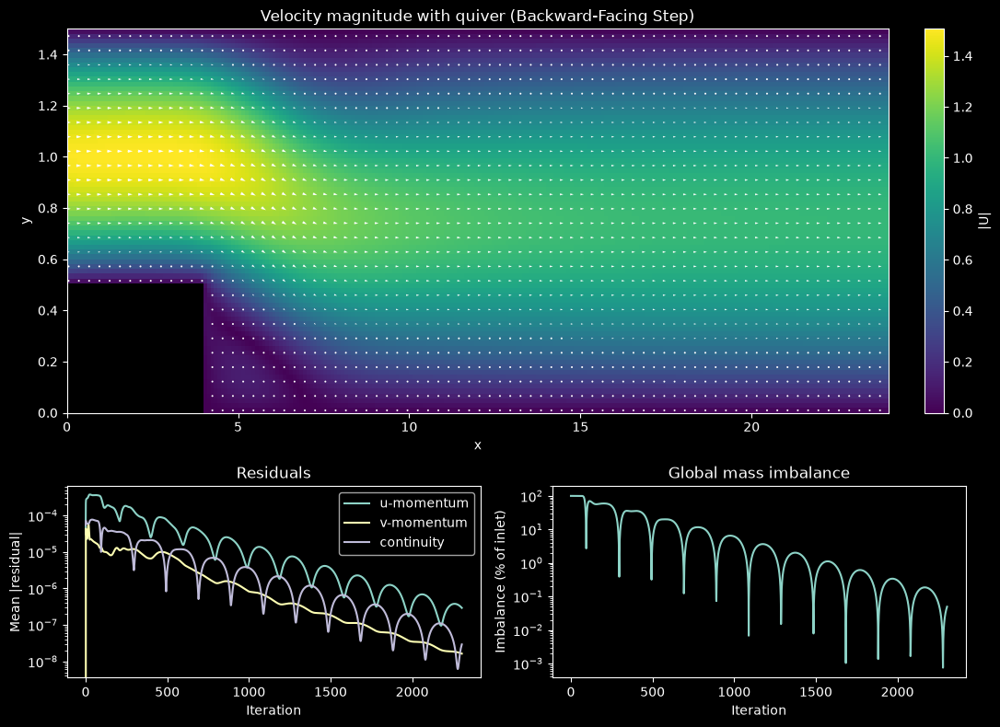

# Backward-Facing Step Flow (SIMPLE Algorithm)

This script solves steady 2D laminar incompressible flow over a backward-facing step with the finite volume method and the SIMPLE pressure–velocity coupling algorithm. The flow separates at the step corner, forms a recirculation zone behind the step, and reattaches downstream; the script prints the reattachment length and plots the velocity field and convergence history. The backward-facing step is a classic test case for separated flow, but this script does not compare its results with reference data.

## Overview

- Uses a 24 × 1.5 channel with a step of height `h = 0.5` and length `step_length = 4` at the lower left, so the inlet channel has height `H = 1` (expansion ratio 1.5).
- Solves on a staggered (MAC) grid of `nx × ny = 240 × 80` pressure cells, with first-order upwind convection and central-difference diffusion.
- Couples pressure and velocity with SIMPLE: momentum under-relaxation `alpha_u = 0.7`, pressure under-relaxation `alpha_p = 0.3`.
- Relaxes each linear system with Gauss–Seidel/SOR sweeps compiled with Numba: 2 momentum sweeps, and 40 pressure-correction sweeps with `omega_p = 1.7`.
- Applies a parabolic inlet profile with mean velocity 1, zero-gradient outflow with $p' = 0$ in the last cell column, and no-slip walls on the channel walls and the step.
- Tracks momentum and continuity residuals and the global mass imbalance, and stops when the solution meets the convergence criterion described below.
- Prints the bottom-wall reattachment length $x_r/h$, and shows the velocity magnitude with arrows, the residual history and the mass imbalance in one figure (updated live unless `--no-show` is given).

## Mathematical Background

### Governing Equations

Steady incompressible Navier–Stokes equations with density $\rho$ and viscosity $\mu$:

$$\frac{\partial u}{\partial x} + \frac{\partial v}{\partial y} = 0$$

$$\rho \left( u \frac{\partial u}{\partial x} + v \frac{\partial u}{\partial y} \right) = -\frac{\partial p}{\partial x} + \mu \left( \frac{\partial^2 u}{\partial x^2} + \frac{\partial^2 u}{\partial y^2} \right)$$

$$\rho \left( u \frac{\partial v}{\partial x} + v \frac{\partial v}{\partial y} \right) = -\frac{\partial p}{\partial y} + \mu \left( \frac{\partial^2 v}{\partial x^2} + \frac{\partial^2 v}{\partial y^2} \right)$$

The Reynolds number is based on the inlet channel height and mean inlet velocity, so the code sets $\mu = \rho U_{avg} H / Re$ with $Re = 200$:

$$Re = \frac{\rho U_{avg} H}{\mu}$$

### Finite Volume Discretisation

Integrating the $u$-momentum equation over the control volume around a $u$ face gives

$$a_P u_P = a_E u_E + a_W u_W + a_N u_N + a_S u_S + (p_w - p_e)\,\Delta y$$

where $p_w$ and $p_e$ are the pressures in the cells on either side of the face. With face mass fluxes $F$ (interpolated linearly from neighbouring velocities) and diffusion conductances $D_e = \mu\,\Delta y/\Delta x$ and $D_n = \mu\,\Delta x/\Delta y$, the first-order upwind coefficients are

$$a_E = D_e + \max(-F_e, 0), \quad a_W = D_w + \max(F_w, 0), \quad a_N = D_n + \max(-F_n, 0), \quad a_S = D_s + \max(F_s, 0)$$

$$a_P = a_E + a_W + a_N + a_S + (F_e - F_w + F_n - F_s)$$

Where a no-slip wall lies half a cell from a velocity node, its conductance is doubled and the neighbour link removed. The $v$ equation is assembled the same way. Under-relaxation replaces $a_P$ by $a_P/\alpha_u$ and adds $\frac{1-\alpha_u}{\alpha_u} a_P u_P^{\text{old}}$ to the source term.

### SIMPLE Pressure Correction

1. Solve the momentum equations with the current pressure to get $u^*$ and $v^*$.
2. The velocity correction is $u'_e = d_e (p'_P - p'_E)$ with $d_e = \Delta y / a_e$. Substituting into continuity gives the pressure-correction equation

$$a_P p'_P = \sum_{nb} a_{nb} p'_{nb} + b, \qquad a_E = \rho\,d_e\,\Delta y, \quad a_N = \rho\,d_n\,\Delta x, \qquad b = -\rho\left[(u^*_e - u^*_w)\Delta y + (v^*_n - v^*_s)\Delta x\right]$$

   with $p' = 0$ in the outlet column and no correction through solid or inlet faces.
3. Correct the velocities, $u = u^* + d_e(p'_P - p'_E)$, and the pressure, $p = p + \alpha_p p'$.

### Convergence Criterion

The momentum residual is the mean of $|b + \sum a_{nb}\phi_{nb} - a_P\phi_P|$, and the continuity residual is the mean $|b|$ of the pressure-correction equation. Iteration stops when all three residuals have fallen to $10^{-3}$ of their largest value in the first 10 iterations and the global mass imbalance $|\dot m_{in} - \dot m_{out}|/\dot m_{in}$ is at most 0.5%.

## Implementation

- `Params` holds the geometry, Reynolds number, relaxation factors and sweep counts. `build_geometry_masks` marks fluid pressure cells and $u$ and $v$ faces.
- `build_momentum_u` and `build_momentum_v` assemble the momentum coefficients, including the wall, inlet and outlet treatment. `gs_sor_scalar` performs the SOR sweeps, and `momentum_residual` computes the residual monitor.
- `apply_velocity_bcs` sets the inlet profile (`inlet_parabolic_profile`), the zero-gradient outlet $u$, wall and solid velocities, and a ±5 safety clamp.
- `build_pressure_correction` returns the $p'$ coefficients and the $d$ factors, and `correct_uvp` applies the corrections.
- `global_mass_imbalance` compares inlet and outlet flux. `reattachment_length` finds where $u$ in the first cell row changes sign from negative to positive behind the step.
- `setup_plot` and `update_plot` draw the three panels. Arrows are hidden inside the step, and the colour limit and arrow scale are smoothed between live updates.

## Usage

```bash
python main.py                                  # 240×80 grid, up to 3000 iterations, live plot
python main.py --demo                           # 120×40 grid, 400 iterations, plot every 5
python main.py --nx 160 --ny 60 --max-iters 2000 --plot-interval 50
python main.py --no-show --output . --steps 3000   # headless, save the final figure
```

- `--steps N` runs at most `N` SIMPLE iterations (overriding `--max-iters`), stopping earlier if the convergence criterion is met.
- `--no-show` skips the live window and draws the figure once at the end.
- `--output DIR` saves `backward_facing_step.png` in `DIR`.
- `--throttle-ms` sleeps every 5 iterations to reduce CPU load.

On the default grid the solver converges after 2305 iterations (about 25 s including Numba compilation) with $x_r/h \approx 6.2$. The `--demo` run stops at 400 iterations before meeting the criterion (mass imbalance about 2.5%), giving $x_r/h \approx 5.5$ on its coarser grid.

## Output



- **Top panel**: velocity magnitude with arrows. The parabolic inlet jet (peak 1.5) leaves the step corner, spreads over the full channel height, and relaxes towards a wider parabolic profile of peak 1. The dark region behind the step is the recirculation zone, where the near-wall velocity reverses; it ends about 6 step heights downstream of the step. The step itself is masked black.
- **Bottom left**: mean residuals of the $u$ and $v$ momentum equations and of continuity, on a log scale.
- **Bottom right**: global mass imbalance as a percentage of the inlet flux. Its decaying oscillation reflects how slowly pressure corrections propagate along the long channel.

First-order upwind convection adds numerical diffusion, which tends to shorten the recirculation zone. Refine the grid before comparing the reattachment length with experimental or benchmark data.

## Related Notes

- [Finite volume discretization](../../../notes/numerical/fvm/discretization.md)
- [Navier–Stokes equations](../../../notes/fluid_mechanics/governing_equations/navier_stokes.md)
- [Iterative convergence and residuals](../../../notes/numerical/cfd/iterative_convergence.md)
- [Boundary layers and separation](../../../notes/fluid_mechanics/viscous_flow/boundary_layers.md)
