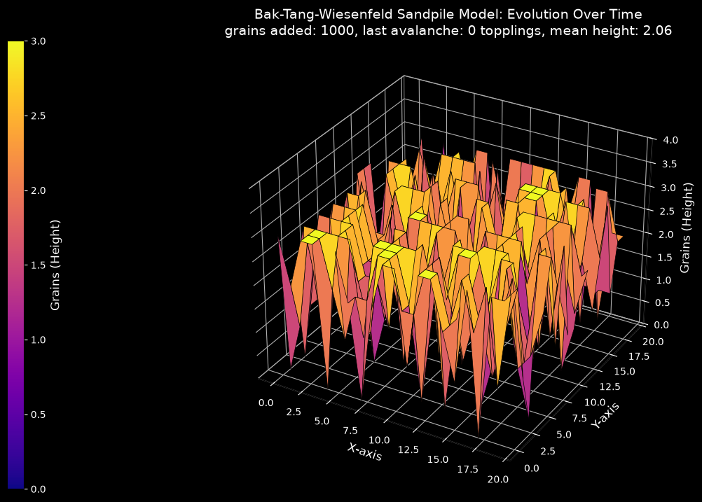

# Bak–Tang–Wiesenfeld Sandpile Model (3D)

This script simulates the two-dimensional Bak–Tang–Wiesenfeld (BTW) sandpile on a 20×20 lattice and animates its height field as a 3D surface. One grain is dropped on a random site per frame. A site holding 4 or more grains topples and passes one grain to each of its four neighbours, and grains that fall off the edge are lost. The "3D" in the name refers to the surface plot; the lattice itself is two-dimensional.

## Overview

- Uses a `GRID_SIZE = 20` square lattice with critical height `CRITICAL_HEIGHT = 4` and open (dissipative) boundaries.
- Adds one grain per frame to a site chosen uniformly at random by a seeded generator (`SEED = 0`). The default run adds `NUM_GRAINS = 1000` grains.
- After each grain, topples unstable sites until all heights are below 4, and counts the topplings (the avalanche size).
- Draws the height field as a 3D `plot_surface` with the plasma colormap on a dark background. The title shows the number of grains added, the size of the last avalanche, and the mean height.
- Prints the number of avalanches and the largest avalanche size when the run ends.

## Mathematical Background

### Toppling Rule

A site $(i, j)$ with height $z_{ij} \ge z_c = 4$ is unstable and topples:

$$z_{ij} \to z_{ij} - 4, \qquad z_{i\pm1,j} \to z_{i\pm1,j} + 1, \qquad z_{i,j\pm1} \to z_{i,j\pm1} + 1$$

Inside the lattice a toppling conserves grains. At an edge or corner site, the grains sent to missing neighbours leave the system. The final stable configuration after an avalanche does not depend on the order in which sites topple (the model is *abelian*).

### Open Boundaries and Self-Organised Criticality

Slow driving (one grain at a time) and boundary dissipation push the pile to a statistically stationary state. For this lattice the mean height in that state is about 2.1. No parameter has to be tuned to get there, which is why the model is the standard example of self-organised criticality (SOC).

In that state, large lattices give a power-law distribution of avalanche sizes $s$ (number of topplings per added grain):

$$P(s) \sim s^{-\tau}$$

Numerical studies of the 2D BTW model report $\tau$ of about 1.2 to 1.3. The script does not measure this distribution: a 20×20 lattice with 1000 grains is far too small for a meaningful fit.

## Implementation

- `topple(grid)` repeatedly scans the lattice, topples every site at or above `CRITICAL_HEIGHT`, and returns the number of topplings.
- `add_grain(grid, rng)` increments one random site and calls `topple`.
- `setup_figure(grid)` creates the 3D axes and colour bar, and returns a `draw` function that replaces the surface and updates the title.
- `main` either animates with `FuncAnimation` (one grain per frame) or, with `--no-show`, adds all the grains and draws the final state once.

## Usage

```bash
python main.py                                        # animate 1000 grains
python main.py --steps 3000                           # animate 3000 grains
python main.py --no-show --output . --steps 1000      # save the state after 1000 grains
```

- `--steps N` adds exactly `N` grains (one per frame).
- `--no-show` skips the window.
- `--output DIR` saves `sandpile_3d.png` in `DIR`.

## Output



The surface shows the lattice after 1000 grains. All heights are between 0 and 3, with a mean of about 2.06, close to the stationary value. By this point most added grains cause no toppling, but some trigger avalanches of up to a few hundred topplings that rearrange large parts of the pile.

## Related Notes

The sandpile model is a cellular automaton from statistical physics rather than a fluid or PDE topic, and no note in this repository covers it.
