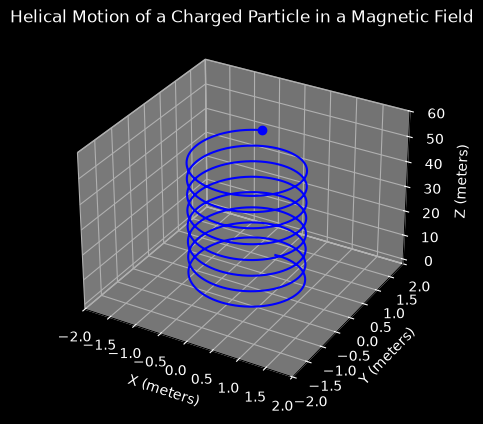

# Charged Particle Dynamics in a Magnetic Field

This script integrates the motion of a charged particle in a uniform magnetic field with the classical fourth-order Runge–Kutta (RK4) method and animates the resulting helical trajectory in 3D. It also prints the numerical Larmor radius next to the analytical value, and reports the drift in particle speed, which should stay at zero because the magnetic force does no work.

## Overview

- Models the Lorentz force $q\,\mathbf{v} \times \mathbf{B}$ on a particle with `Q = 1`, `M = 1` in a uniform field `B = (0, 0, 1)`.
- Integrates the six first-order ODEs for position and velocity with a hand-written RK4 step (`DT = 0.01`).
- Starts from `R0 = (0, 1, 0)` and `V0 = (1, 0, 1)`, which gives a helix of radius 1 around the $z$-axis.
- Prints the final time, cyclotron period, analytical and numerical Larmor radius, and maximum relative speed drift.
- Animates the trajectory as a growing blue line with a marker at the particle's current position. Each of the 200 default frames advances 25 RK4 steps, so the animation covers $t = 0$ to $50$.

## Mathematical Background

A particle with charge $q$ and mass $m$ moving with velocity $\mathbf{v}$ through a magnetic field $\mathbf{B}$ feels the Lorentz force

$$\mathbf{F} = q\,(\mathbf{v} \times \mathbf{B})$$

The force is always perpendicular to $\mathbf{v}$, so it does no work and the speed $|\mathbf{v}|$ stays constant.

### Equations of Motion

$$\dot{\mathbf{r}} = \mathbf{v}, \qquad \dot{\mathbf{v}} = \frac{q}{m}\,(\mathbf{v} \times \mathbf{B})$$

### Helical Motion

For $\mathbf{B} = B\hat{\mathbf{z}}$:

- The velocity component perpendicular to $\mathbf{B}$ rotates at the cyclotron frequency $\omega_c = |q|B/m$ on a circle of Larmor radius $r_L = m v_\perp/(|q|B)$.
- The component parallel to $\mathbf{B}$ is constant, so the particle drifts along $z$ at $v_z$.

With the default values, $\omega_c = 1$ (period $2\pi \approx 6.28$), $r_L = 1$ and $v_z = 1$. The guiding centre lies on the $z$-axis, so over $t = 50$ the particle completes about 8 turns and rises to $z = 50$.

### Runge–Kutta 4

For $\dot{\mathbf{y}} = \mathbf{f}(t, \mathbf{y})$ with $\mathbf{y} = (\mathbf{r}, \mathbf{v})$:

$$\mathbf{k}_1 = \mathbf{f}(t_n, \mathbf{y}_n), \quad \mathbf{k}_2 = \mathbf{f}\left(t_n + \tfrac{\Delta t}{2}, \mathbf{y}_n + \tfrac{\Delta t}{2}\mathbf{k}_1\right), \quad \mathbf{k}_3 = \mathbf{f}\left(t_n + \tfrac{\Delta t}{2}, \mathbf{y}_n + \tfrac{\Delta t}{2}\mathbf{k}_2\right), \quad \mathbf{k}_4 = \mathbf{f}(t_n + \Delta t, \mathbf{y}_n + \Delta t\,\mathbf{k}_3)$$

$$\mathbf{y}_{n+1} = \mathbf{y}_n + \frac{\Delta t}{6}\left(\mathbf{k}_1 + 2\mathbf{k}_2 + 2\mathbf{k}_3 + \mathbf{k}_4\right)$$

RK4 is fourth-order accurate but not energy-conserving. For this rotation its per-step amplitude factor is $1 - (\omega_c\Delta t)^6/144$, so with $\omega_c \Delta t = 0.01$ the speed drift over 5000 steps is of order $10^{-11}$, as the script's printout confirms.

## Implementation

- `lorentz_force(t, y)` returns $(\mathbf{v}, (q/m)\,\mathbf{v} \times \mathbf{B})$.
- `rk4_step(func, t, y, dt)` performs one RK4 step.
- `integrate(num_steps)` runs `num_steps` RK4 steps from the initial state and stores $t$, $\mathbf{r}$ and $\mathbf{v}$.
- `report` prints the diagnostics above.
- `main` integrates `--steps × STEPS_PER_FRAME` steps up front. It then either animates the stored trajectory with `FuncAnimation` or, with `--no-show`, draws the final frame directly.

## Usage

```bash
python main.py                                  # 200 frames, t = 0 to 50
python main.py --steps 50                       # 50 frames, t = 0 to 12.5
python main.py --no-show --output .             # save the full helix as a PNG
```

- `--steps N` shows `N` frames. Each frame is 25 RK4 steps of 0.01 s, so `N` also sets the integration length.
- `--no-show` skips the window.
- `--output DIR` saves `charged_particle_helix.png` in `DIR`.

## Output



The figure shows the full trajectory after 200 frames ($t = 50$): a helix of radius 1 around the $z$-axis with a pitch of $2\pi v_z/\omega_c \approx 6.28$, ending at $z = 50$ (marker). The console output reports a Larmor radius of 1.000000 and a speed drift of about $2 \times 10^{-11}$.

## Related Notes

- [Kinetics of particles (Newton's second law and equations of motion)](../../../notes/applied_mechanics/dynamics/kinetics_particles.md)
- [Kinematics of particles](../../../notes/applied_mechanics/dynamics/kinematics_particles.md)
