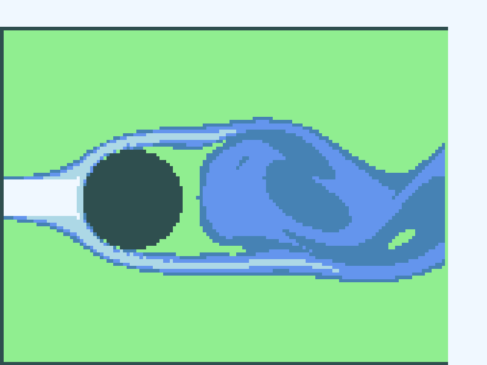

# Eulerian Cylinder Flow

This script simulates 2D incompressible, inviscid flow past a circular cylinder on a fixed Eulerian grid and renders a dye tracer in real time with Pygame. It uses the staggered-grid projection and semi-Lagrangian advection scheme of Matthias Müller's "Ten Minute Physics" fluid demo. A uniform inflow enters from the left, and a dye streak released at mid-height is carried around the cylinder into the wake.

## Overview

- Uses a staggered (MAC) grid with velocities on cell faces, and pressure and dye at cell centres. With `RESOLUTION = 100` cells across the 1 m domain height, the grid is 135 × 102 cells including boundary cells.
- Builds a wind tunnel: a left inlet column at `INLET_VELOCITY = 2` m/s, solid top and bottom walls, an open right boundary, and a cylinder of radius `OBSTACLE_RADIUS = 0.15` m centred at (0.4, 0.5) m.
- Removes the velocity divergence each frame with `NUM_ITERATIONS = 20` Gauss–Seidel sweeps with over-relaxation (`OVER_RELAXATION = 1.9`).
- Advects velocity and dye with the semi-Lagrangian (backtracking) method and bilinear interpolation.
- Includes no viscosity term: the flow is inviscid apart from the numerical diffusion of the interpolation. Gravity is supported but set to zero.
- Compiles the grid loops with Numba and draws the dye with a four-colour banded map. The window stays interactive: press `P` to pause or resume, and `M` to advance one frame while paused.

## Mathematical Background

The flow is modelled by the incompressible Euler equations with a passive dye concentration $m$:

$$\nabla \cdot \mathbf{u} = 0, \qquad \frac{\partial \mathbf{u}}{\partial t} + (\mathbf{u} \cdot \nabla)\mathbf{u} = -\frac{1}{\rho}\nabla p + \mathbf{g}, \qquad \frac{\partial m}{\partial t} + \mathbf{u} \cdot \nabla m = 0$$

Each frame of length $\Delta t = 1/60$ s splits these into three stages.

### 1. Body Forces

$v \leftarrow v + g\,\Delta t$ on faces between two fluid cells ($g = 0$ by default).

### 2. Projection

For every fluid cell with face velocities $u_{i,j}, u_{i+1,j}, v_{i,j}, v_{i,j+1}$ and grid spacing $h$, the discrete divergence is

$$d = u_{i+1,j} - u_{i,j} + v_{i,j+1} - v_{i,j}$$

Let $s_k \in \{0, 1\}$ mark each neighbour as solid or fluid, with $s = s_{i-1,j} + s_{i+1,j} + s_{i,j-1} + s_{i,j+1}$. The cell's outflow is removed by moving its fluid-side faces:

$$u_{i,j} \mathrel{+}= \omega\,s_{i-1,j}\,\frac{d}{s}, \quad u_{i+1,j} \mathrel{-}= \omega\,s_{i+1,j}\,\frac{d}{s}, \quad v_{i,j} \mathrel{+}= \omega\,s_{i,j-1}\,\frac{d}{s}, \quad v_{i,j+1} \mathrel{-}= \omega\,s_{i,j+1}\,\frac{d}{s}$$

Sweeping this over all cells is a Gauss–Seidel iteration, with over-relaxation factor $\omega$, for the pressure Poisson equation $\nabla^2 p = (\rho/\Delta t)\,\nabla \cdot \mathbf{u}^*$ followed by the update $\mathbf{u} = \mathbf{u}^* - (\Delta t/\rho)\nabla p$. The pressure is accumulated as $p \mathrel{+}= (\rho h/\Delta t)\,\omega\,(-d/s)$. After a fixed number of sweeps the divergence is reduced but not exactly zero.

### 3. Semi-Lagrangian Advection

Each velocity sample and dye value is traced back along the velocity field for one time step and interpolated bilinearly at the departure point:

$$q^{n+1}(\mathbf{x}) = q^n(\mathbf{x} - \Delta t\,\mathbf{u}(\mathbf{x}))$$

This is stable for any $\Delta t$, but the interpolation smooths the fields. That smoothing acts as numerical viscosity, which lets a wake form behind the cylinder.

## Implementation

- `FluidSimulator` stores flat `float32` arrays indexed `i * grid_height + j`: `u`, `v`, `pressure`, `solid` (1 = fluid, 0 = solid) and `density_field` (the dye, 1 = clear fluid, 0 = dye).
- `FluidSimulator.simulate` calls the Numba kernels `integrate`, `solve_incompressibility`, `extrapolate` (copies tangential velocities into boundary cells), `advect_velocity` and `advect_dye`. The last two use `sample_field` for bilinear interpolation.
- `setup_scene(1)` builds the wind tunnel and the inlet dye streak. `setup_scene(0)` builds a closed tank, which `main` does not use. `FluidSimulator.set_obstacle` marks the cylinder cells as solid.
- `draw` maps the dye to four colour bands and blits the scaled image; `main` runs the Pygame loop.

## Usage

```bash
python main.py                                   # interactive window, runs until closed
python main.py --steps 600                       # stop after 600 frames (10 s of flow)
python main.py --no-show --output . --steps 300  # headless: save a screenshot after 5 s
```

- `--steps N` simulates exactly `N` frames and stops. Without it the window runs until closed; with `--no-show` the default is 300 frames.
- `--no-show` uses SDL's dummy video driver, so no window opens.
- `--output DIR` saves `eulerian_cylinder_flow.png`, a screenshot of the last frame.

The first frames take a few seconds while Numba compiles the kernels.

## Output



The screenshot shows the flow after 300 frames (5 s). The dark disc is the cylinder, and the dark lines at the left, top and bottom are the solid boundary cells. Clear fluid is light green. The dye streak from the inlet (pale near the inlet, blue further downstream) splits around the cylinder, and the separated shear layers roll up into a wake of vortices. Numerical asymmetries make that wake break symmetry and begin shedding. A video of the earlier interactive version is on YouTube:

[](https://youtube.com/shorts/GYtn9u0awsE?si=qlHDFdepFfnIFg8W)

## Related Notes

- [Eulerian and Lagrangian flow descriptions](../../../notes/fluid_mechanics/flow_kinematics/eulerian_lagrangian_flows.md)
- [Navier–Stokes equations (including the Euler equations)](../../../notes/fluid_mechanics/governing_equations/navier_stokes.md)
- [Continuity equation](../../../notes/fluid_mechanics/governing_equations/continuity.md)
- [Drag](../../../notes/fluid_mechanics/viscous_flow/drag.md)
