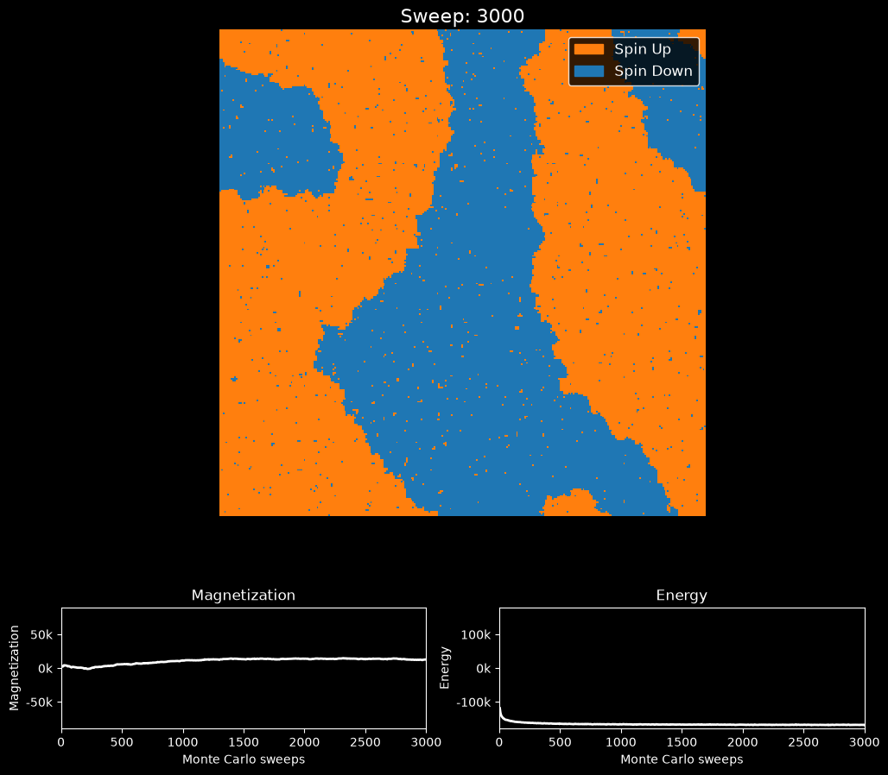

# Ising Model Simulation

This script simulates the two-dimensional Ising model with the Metropolis Monte Carlo algorithm and animates the spin lattice together with its magnetization and energy. With the default inverse temperature $\beta = 0.6$, which is below the critical temperature, a random start coarsens into large ordered domains of up and down spins.

## Overview

- Uses a 300×300 lattice (`N_ROWS`, `N_COLS`) of spins $s_i = \pm 1$ with periodic boundaries, $J = 1$ and $k_B = 1$.
- Starts from a random configuration drawn with a seeded generator (`SEED = 0`), then runs `WARMUP_STEPS = 1` sweep before the animation.
- Performs `TOTAL_STEPS = 3000` Metropolis sweeps at `BETA = 0.6`. Each sweep makes $N = 90{,}000$ single-spin-flip attempts at random sites.
- Numba-compiles (`@njit`) the Metropolis sweep and the energy and magnetization sums.
- Records $M$ and $E$ and redraws the lattice every `UPDATE_INTERVAL = 5` sweeps, plus the final sweep.
- Optionally writes the animation to `SAVE_PATH` (GIF via Pillow, or MP4 via ffmpeg) when `SAVE_ANIMATION = True`.

## Mathematical Background

### Hamiltonian

$$H = -J \sum_{\langle i,j \rangle} s_i s_j$$

The sum runs over nearest-neighbour pairs, each counted once. The code uses $J = 1$ (ferromagnetic) and counts each bond once by summing only the right and lower neighbours of every site. Energies therefore lie between $-2N$ (all spins aligned) and $+2N$.

### Magnetization

$$M = \sum_i s_i, \qquad -N \le M \le N$$

$|M| \approx N$ in a fully ordered state. $M \approx 0$ in the disordered (paramagnetic) phase, and also in an ordered state split into equal up and down domains.

### Metropolis Criterion

Flipping spin $s_i$ changes the energy by

$$\Delta E = 2 J s_i \sum_{j \in \text{nn}(i)} s_j$$

The flip is accepted with probability

$$A = \begin{cases} 1 & \Delta E \le 0 \\ e^{-\beta\Delta E} & \Delta E > 0 \end{cases}, \qquad \beta = \frac{1}{k_B T}$$

### Phase Transition

In the thermodynamic limit, the 2D Ising model on a square lattice has its critical point at $\beta_c = \tfrac{1}{2}\ln(1 + \sqrt{2}) \approx 0.4407$ ($T_c \approx 2.269$). For $\beta > \beta_c$ (low temperature) the equilibrium state is ordered with spontaneous magnetization; for $\beta < \beta_c$ it is disordered. At $\beta = 0.6$ the single-flip dynamics coarsen domains slowly, so after 3000 sweeps a 300×300 lattice usually still contains several large domains separated by domain walls.

## Implementation

- `initialize_lattice(n_rows, n_cols, rng)` returns a random `int8` lattice of $\pm 1$.
- `seed_numba(seed)` seeds Numba's random generator, which is separate from NumPy's.
- `metropolis_step_numba(lattice, beta)` performs one sweep in place.
- `calculate_energy_numba` and `calculate_magnetization_numba` compute $E$ and $M$.
- `run_simulation_numba(lattice, beta, steps, update_interval)` is a generator that yields `(sweep, lattice copy, M, E)` at each recorded sweep.
- `setup_figure` builds the lattice panel (orange for $+1$, blue for $-1$) and the magnetization and energy panels.
- `animate_simulation` feeds the generator to `FuncAnimation`. With `--no-show` it consumes the generator directly and returns the figure showing the final state.

## Usage

```bash
python main.py                                   # animate 3000 sweeps
python main.py --steps 500                       # animate 500 sweeps
python main.py --no-show --output .              # run 3000 sweeps and save the final frame
```

- `--steps N` runs exactly `N` Monte Carlo sweeps.
- `--no-show` skips the window.
- `--output DIR` saves `ising_model.png` in `DIR`.

Lattice size, `BETA`, `UPDATE_INTERVAL` and the animation options are constants at the top of `main.py`. Try `BETA = 0.44` to watch critical fluctuations, or `BETA = 0.3` for a disordered lattice.

## Output

The frame below is from a short video of an earlier version of the script:

[](https://youtube.com/shorts/aIUKwLx_Kj8?feature=share)

The figure below shows the final frame of the default run (3000 sweeps):



- **Lattice**: spin-up ($+1$) sites are orange and spin-down ($-1$) sites blue. Large domains have formed, with isolated flipped spins from thermal fluctuations inside them.
- **Magnetization**: $M$ stays well below $\pm N$ because up and down domains coexist.
- **Energy**: $E$ drops quickly from near 0 (random start) during the first few hundred sweeps as domains form, then decreases slowly as domain walls shorten.

## Related Notes

The Ising model is a statistical-mechanics topic, and no note in this repository covers Monte Carlo methods for it.
