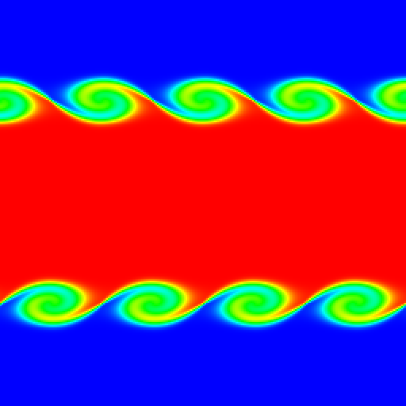

# Kelvin-Helmholtz Instability Simulation

This script simulates the Kelvin-Helmholtz instability, the rolling-up of a shear layer between fluid streams moving in opposite directions, in a periodic 2D incompressible flow drawn in real time with Pygame. A passive temperature field marks the two streams, so the growing vortices appear as curling bands of colour.

## Overview

- **Initial flow**: a double shear layer on a periodic 256 × 256 grid (grid units, $\Delta x = \Delta y = 1$). A central band moves at $+U_0$ and the surrounding fluid at $-U_0$, with smooth $\tanh$ profiles of thickness $\delta = 4$ cells.
- **Perturbation**: a cross-stream velocity $v \propto \sin(2\pi k x/N)$ with $k = 4$ wavelengths, localised at both layers, plus seeded random noise.
- **Solver**: semi-Lagrangian advection, a spectral (FFT) pressure projection and explicit viscous diffusion, all periodic in both directions.
- **Passive scalar**: temperature is 1 in the central band and 0 outside; it is advected by the flow and diffuses.
- **Display**: temperature is mapped to hue from blue (coldest) to red (hottest), normalised every frame, in a 512 × 512 Pygame window with 2 solver steps per frame.

## Mathematical Background

### Incompressible Navier-Stokes Equations

$$\frac{\partial\mathbf{u}}{\partial t} + (\mathbf{u}\cdot\nabla)\mathbf{u} = -\nabla p + \nu\nabla^2\mathbf{u}, \qquad \nabla\cdot\mathbf{u} = 0$$

### Temperature (Passive Scalar)

$$\frac{\partial T}{\partial t} + (\mathbf{u}\cdot\nabla)T = D\,\nabla^2 T$$

Temperature does not feed back on the velocity, so it only marks where fluid from each stream goes.

### Initial Condition

With $B(y) = \tfrac12\left[\tanh\left(\frac{y - N/4}{\delta}\right) - \tanh\left(\frac{y - 3N/4}{\delta}\right)\right]$, which is 1 inside the central band and 0 outside:

$$u = U_0\,(2B - 1), \qquad v = A\,U_0 \sin\left(\frac{2\pi k x}{N}\right)\left[e^{-\left(\frac{y - N/4}{2\delta}\right)^2} + e^{-\left(\frac{y - 3N/4}{2\delta}\right)^2}\right], \qquad T = B$$

with $U_0 = 1$, $A = 0.05$ and $k = 4$. The initial velocity is projected so that it is divergence-free.

### Linear Instability

A vortex sheet between equal-density streams with velocity jump $\Delta U$ is unstable at every wavenumber, with growth rate $\sigma = k\,\Delta U/2$. A shear layer of finite thickness $u = U_0\tanh(y/\delta)$ is only unstable for long waves. Its fastest-growing mode has $k\delta \approx 0.44$ and $\sigma \approx 0.19\,U_0/\delta$ (Michalke, 1964). The seeded wavelength of 64 cells gives $k\delta = 0.39$, close to this optimum.

### Numerical Scheme

Each call to `update_fields` performs:

1. **Advection** (semi-Lagrangian): $\mathbf{u}^*(\mathbf{x}) = \mathbf{u}^n(\mathbf{x} - \mathbf{u}^n\Delta t)$, with bilinear interpolation and periodic wrap-around.
2. **Projection** (spectral): with $\hat{\mathbf{u}}$ the Fourier transform and $\mathbf{k}$ the wave vector,

   $$\hat{\mathbf{u}}^{**} = \hat{\mathbf{u}}^* - \mathbf{k}\,\frac{\mathbf{k}\cdot\hat{\mathbf{u}}^*}{|\mathbf{k}|^2}$$

   This is equivalent to solving $\nabla^2 p = \nabla\cdot\mathbf{u}^*$ and subtracting $\nabla p$.
3. **Diffusion** (explicit Euler, 5-point periodic Laplacian): $\mathbf{u}^{n+1} = \mathbf{u}^{**} + \nu\,\Delta t\,\nabla_h^2\mathbf{u}^{**}$. This operator is diagonal in Fourier space, so it keeps the field divergence-free.
4. **Temperature**: advected with $\mathbf{u}^{n+1}$, then diffused explicitly with coefficient $D$.

Semi-Lagrangian advection is stable for any time step. The script uses a Courant number $U_0\Delta t/\Delta x = 0.5$ for accuracy. Explicit diffusion needs $\nu\,\Delta t/\Delta x^2 \le 1/4$; here it is 0.005.

## Implementation

- `initialize_fields` builds the double shear layer, the perturbation and the temperature bands, and projects the initial velocity.
- `advect`, `project` and `diffuse` implement the three stages above. `update_fields` combines them into one time step.
- `temperature_to_rgb` converts temperature to an RGB array with hue running from 240° to 0°. `draw` scales the array onto the window.
- Parameters are module constants: `GRID_SIZE`, `SHEAR_VELOCITY`, `LAYER_THICKNESS`, `PERTURBATION_AMPLITUDE`, `PERTURBATION_WAVES`, `TIME_STEP`, `VISCOSITY`, `DIFFUSION_RATE` and `STEPS_PER_FRAME`.

## Usage

```bash
python main.py                                    # run until the window is closed
python main.py --steps 300                        # stop after 300 frames
python main.py --no-show --output . --steps 150   # headless, save a screenshot at t = 150
```

`--steps N` sets the number of frames. Each frame is 2 solver steps of $\Delta t = 0.5$.

## Output



The screenshot shows the temperature field after 150 frames ($t = 150$):

- **Roll-up**: both shear layers have rolled up into four Kelvin-Helmholtz vortices each, the seeded wavelength, and the spirals entrain hot (red) and cold (blue) fluid.
- **Mixed fluid**: the green and cyan colours inside the rolls mark fluid at intermediate temperature.
- **Later times**: in longer runs the rolls smear out and neighbouring vortices merge (pairing). The bilinear semi-Lagrangian advection is strongly diffusive, so the vortices decay faster than the physical viscosity alone would allow.

## Related Notes

- [Navier-Stokes equations](../../../notes/fluid_mechanics/governing_equations/navier_stokes.md)
- [Turbulence](../../../notes/fluid_mechanics/turbulence/README.md)
- [Eulerian and Lagrangian descriptions of flow](../../../notes/fluid_mechanics/flow_kinematics/eulerian_lagrangian_flows.md)
- [Numerical stability](../../../notes/numerical/cfd/numerical_stability.md)
