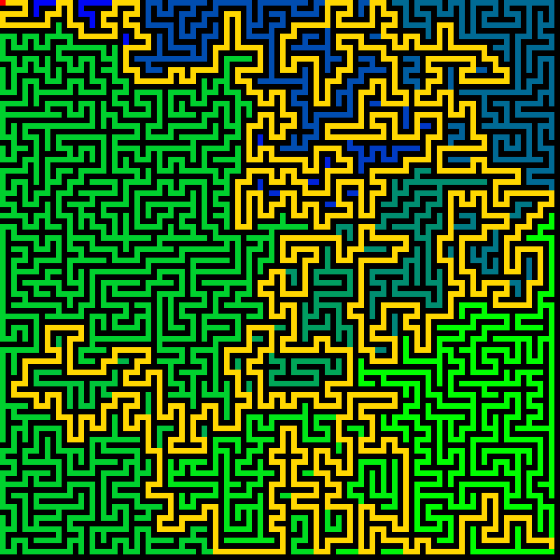

# Laplace Equation Maze Solver

This script solves a randomly generated maze by computing a potential that satisfies Laplace's equation in the maze passages and then following the potential uphill from the entrance to the exit. The solve and the path are animated with Pygame. Watch it in action: [](https://youtu.be/kyYcME2sBws)

## Overview

- **Maze generation**: a seeded depth-first (recursive backtracker) algorithm carves a perfect maze on a 100 × 100 grid, with exactly one route between any two open cells. The entrance is the top-left cell $(0, 0)$ and the exit is $(98, 98)$.
- **Laplace's equation**: solved on the open cells with $\phi = 0$ at the entrance, $\phi = 1$ at the exit and insulating walls (no flux through them).
- **Conjugate gradients**: 25 iterations are drawn per frame until the relative residual falls below $10^{-10}$. The default maze needs 4646 iterations.
- **Path extraction**: once the potential has converged, the path steps from the entrance to the open 4-neighbour with the largest $\phi$, backtracking out of dead ends if one is ever entered.
- **Display**: walls are black and open cells are coloured from blue ($\phi = 0$) to green ($\phi = 1$). The gold path is revealed one cell per frame, with the entrance in red and the exit in green.

## Mathematical Background

### Discrete Laplace Equation

Each open cell $c$ that is not the entrance or exit satisfies the graph Laplace equation over its open neighbours $\mathcal{N}(c)$:

$$\sum_{n\in\mathcal{N}(c)} \left(\phi_c - \phi_n\right) = 0$$

This is the 5-point finite-difference form of $\nabla^2\phi = 0$. Neighbours that are walls are left out of the sum, which imposes the zero-flux condition $\partial\phi/\partial n = 0$. The Dirichlet values $\phi_{\text{entrance}} = 0$ and $\phi_{\text{exit}} = 1$ move to the right-hand side, giving a symmetric positive-definite system $A\boldsymbol{\phi} = \mathbf{b}$.

### Why the Gradient Finds the Route

Think of the maze as an electrical network with a unit voltage applied between the entrance and the exit. In a perfect maze the only conducting route is the unique path between them. The potential therefore rises linearly along that path, by $1/(L-1)$ per cell for a path of $L$ cells. Every dead-end branch carries no current and keeps the constant potential of the junction where it leaves the path. Stepping to the neighbour with the largest potential therefore never enters a dead end. For the default maze the path has 1649 cells and $\phi$ rises by exactly $1/1648$ at each step.

### Conjugate Gradient Method

Starting from $\mathbf{r}_0 = \mathbf{b} - A\boldsymbol{\phi}_0$ and $\mathbf{d}_0 = \mathbf{r}_0$, each iteration computes

$$\alpha_k = \frac{\mathbf{r}_k^\top\mathbf{r}_k}{\mathbf{d}_k^\top A\mathbf{d}_k}, \quad \boldsymbol{\phi}_{k+1} = \boldsymbol{\phi}_k + \alpha_k\mathbf{d}_k, \quad \mathbf{r}_{k+1} = \mathbf{r}_k - \alpha_k A\mathbf{d}_k, \quad \mathbf{d}_{k+1} = \mathbf{r}_{k+1} + \frac{\mathbf{r}_{k+1}^\top\mathbf{r}_{k+1}}{\mathbf{r}_k^\top\mathbf{r}_k}\mathbf{d}_k$$

and stops when $\lVert\mathbf{r}_k\rVert \le 10^{-10}\,\lVert\mathbf{b}\rVert$.

## Implementation

- `generate_maze(size, rng)` carves passages on even-indexed cells with a `random.Random(SEED)` generator.
- `apply_laplacian(phi, open_mask)` applies the graph Laplacian with vectorised NumPy slices. Wall and out-of-grid neighbours are skipped.
- `LaplaceSolver` stores the potential, residual and search direction. `iterate(n)` performs up to `n` conjugate-gradient iterations, and `converged` checks the residual against `TOLERANCE`.
- `follow_gradient(phi, open_mask, start, end)` performs greedy ascent over 4-neighbours with backtracking.
- `draw_maze` builds an RGB array of walls, potential, path and markers, and scales it to the window with `CELL_SIZE`.
- `main` runs `CG_ITERATIONS_PER_FRAME` iterations per frame until convergence (capped at `MAX_ITERATIONS`), then traces the path and reveals it one cell per frame.

## Usage

```bash
python main.py                                     # run until the window is closed
python main.py --no-show --output . --steps 1900   # headless, save a screenshot with the full path
```

`--steps N` sets the number of frames. The default maze uses about 186 frames for the solve, then one frame per path cell, so the full path is visible after about 1840 frames.

## Output



- **Potential**: passages are coloured from blue near the entrance (top left) to green near the exit (bottom right). Each dead-end region has a uniform colour set by the junction where it branches off the solution path.
- **Gold path**: the route from the entrance (red) to the exit (green), obtained by following the potential uphill.

## Related Notes

- [Potential flow and Laplace's equation](../../../notes/fluid_mechanics/inviscid_flow/potential_flow.md)
- [Direct and iterative solvers](../../../notes/numerical/cfd/direct_and_iterative_solvers.md)
- [Finite difference discretization](../../../notes/numerical/fdm/discretization.md)
