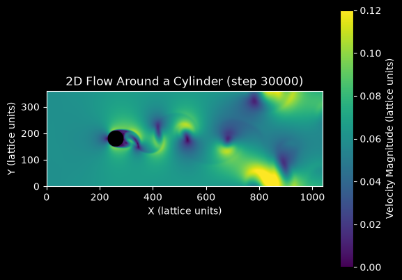

# Lattice Boltzmann Cylinder Flow Simulation

This script simulates 2D flow past a circular cylinder with the lattice Boltzmann method (D2Q9 lattice, BGK collision operator) and animates the velocity magnitude with Matplotlib. The lattice Boltzmann method evolves particle distribution functions on a regular lattice instead of the macroscopic variables, and it recovers the incompressible Navier-Stokes equations at low Mach number. A short demonstration is on YouTube: [](https://youtu.be/Jzsxy2BsQRM)

## Overview

- **Lattice**: 1040 × 360 nodes (`LATTICE_DIMENSIONS`), in lattice units where $\Delta x = \Delta t = 1$.
- **Cylinder**: radius $r = 30$ centred at $(260, 180)$.
- **Flow parameters**: inflow speed $U = 0.06$ (Mach number $U/c_s = 0.10$) and $Re = Ur/\nu = 350$ based on the radius (700 based on the diameter). This gives $\nu = 0.00514$ and relaxation parameter $\omega = 1.940$ ($\tau = 0.515$).
- **Scheme**: D2Q9 velocity set with the single-relaxation-time BGK collision.
- **Boundaries**:
  - inlet at $x = 0$: Zou/He velocity boundary with a uniform velocity carrying a $10^{-4}$ sinusoidal perturbation in $y$ that breaks the symmetry;
  - outlet at $x = n_x - 1$: zero-gradient;
  - top and bottom: periodic;
  - cylinder: full-way bounce-back (no slip).
- **Initial state**: equilibrium populations with the inflow velocity everywhere.
- **Visualisation**: velocity magnitude on a fixed colour range $[0, 2U]$, with the cylinder masked. The image is updated every 10 time steps, and the default 3000 frames give 30 000 time steps.

## Mathematical Background

### Lattice Boltzmann BGK Equation

The distribution functions $f_i$ of the discrete velocities $\mathbf{c}_i$ are streamed and relaxed towards equilibrium:

$$f_i(\mathbf{x} + \mathbf{c}_i,\, t + 1) = f_i(\mathbf{x}, t) - \omega\left(f_i(\mathbf{x}, t) - f_i^{eq}(\mathbf{x}, t)\right)$$

### D2Q9 Equilibrium and Moments

$$f_i^{eq} = w_i\,\rho\left(1 + 3\,\mathbf{c}_i\cdot\mathbf{u} + \frac{9}{2}(\mathbf{c}_i\cdot\mathbf{u})^2 - \frac{3}{2}|\mathbf{u}|^2\right), \qquad \rho = \sum_i f_i, \qquad \rho\,\mathbf{u} = \sum_i f_i\,\mathbf{c}_i$$

The weights are $w_0 = 4/9$ for the rest velocity, $1/9$ for the four axis directions and $1/36$ for the four diagonals. The lattice speed of sound is $c_s = 1/\sqrt3$.

### Viscosity and Reynolds Number

$$\nu = c_s^2\left(\tau - \tfrac12\right) = \frac{1}{3}\left(\frac{1}{\omega} - \frac12\right) \quad\Rightarrow\quad \omega = \frac{1}{3\nu + 1/2}, \qquad \nu = \frac{U r}{Re}$$

### Boundary Conditions

- **Zou/He inlet**: the velocity $\mathbf{u}$ is prescribed. The density follows from the known populations, and the unknown populations (those with $c_{ix} > 0$) are set by bouncing back the non-equilibrium part of their opposite $\bar\imath$:

  $$\rho = \frac{\sum_{c_{ix}=0} f_i + 2\sum_{c_{ix}<0} f_i}{1 - u_x}, \qquad f_i = f_i^{eq} + f_{\bar\imath} - f_{\bar\imath}^{eq}$$

- **Outlet**: the populations with $c_{ix} < 0$ at the last column are copied from the column before it.
- **Bounce-back**: at nodes inside the cylinder the post-collision populations are reversed, $f_i^{out} = f_{\bar\imath}^{in}$, which gives a no-slip wall on a staircase approximation of the circle.

### Accuracy and Stability

- The BGK model recovers the Navier-Stokes equations with compressibility errors of order $Ma^2$, about 1% here.
- With $\tau = 0.515$ the BGK collision is close to its stability limit $\tau \to 1/2$. Raising $Re$ further, or lowering the resolution, can make the simulation blow up.

## Implementation

- `compute_density`, `compute_velocity` and `equilibrium` evaluate the moments and $f^{eq}$ with vectorised `numpy.einsum`.
- `make_obstacle` returns the cylinder mask. `make_inflow_velocity` builds the perturbed inflow profile.
- `lbm_step(fin, obstacle, inflow_velocity)` performs one step in place: outflow condition, moments, Zou/He inlet, BGK collision (`RELAXATION_PARAMETER`), bounce-back (`NOSLIP` gives the opposite directions), and streaming with `np.roll`.
- `main` sets up the figure and advances `STEPS_PER_FRAME` time steps per frame, with `FuncAnimation` or, with `--no-show`, a plain loop.
- Parameters are module constants: `REYNOLDS_NUMBER`, `LATTICE_DIMENSIONS`, `CYLINDER_RADIUS`, `VELOCITY_LATTICE_UNITS`, `STEPS_PER_FRAME` and `N_FRAMES`.

## Usage

```bash
python main.py                                    # animate the default 3000 frames (30 000 time steps)
python main.py --steps 1000                       # shorter run: the wake is still symmetric
python main.py --no-show --output . --steps 3000  # headless, save the final frame as a PNG
```

`--steps N` sets the number of animation frames. Each frame is 10 lattice Boltzmann time steps. The symmetric recirculation bubble behind the cylinder becomes unstable slowly: the wake starts oscillating at around 15 000 time steps and sheds vortices from about 20 000. On a laptop a 30 000-step run takes roughly half an hour.

## Output



The final frame shows the velocity magnitude after 30 000 time steps:

- **Near the cylinder**: fast flow (yellow) passes around the cylinder, and a low-speed wake (purple) forms behind it.
- **Vortex shedding**: vortices are shed alternately from the upper and lower sides of the cylinder, forming a von Kármán vortex street.
- **Further downstream**: the street becomes irregular. At $Re_D = 700$ a real cylinder wake is already three-dimensional, and the 2D model also feels the periodic top and bottom boundaries (the cylinder blocks 17% of the domain height) and the simple zero-gradient outlet.

Shorter runs, for example the old default of 10 000 steps, still show a symmetric pair of recirculation zones behind the cylinder. The tiny inlet perturbation needs roughly 15 000 to 20 000 steps to grow into shedding.

## Related Notes

- [Practical lattice Boltzmann method](../../../notes/numerical/lattice_boltzmann/practical_lbm.md)
- [Lattice Boltzmann algorithm](../../../notes/numerical/lattice_boltzmann/lattice_boltzmann_algorithm.md)
- [From Boltzmann to lattice Boltzmann](../../../notes/numerical/lattice_boltzmann/from_boltzmann_to_lattice_boltzmann.md)
- [Flow over a cylinder project](../../../practice/manual_projects/flow_over_cylinder.md)
