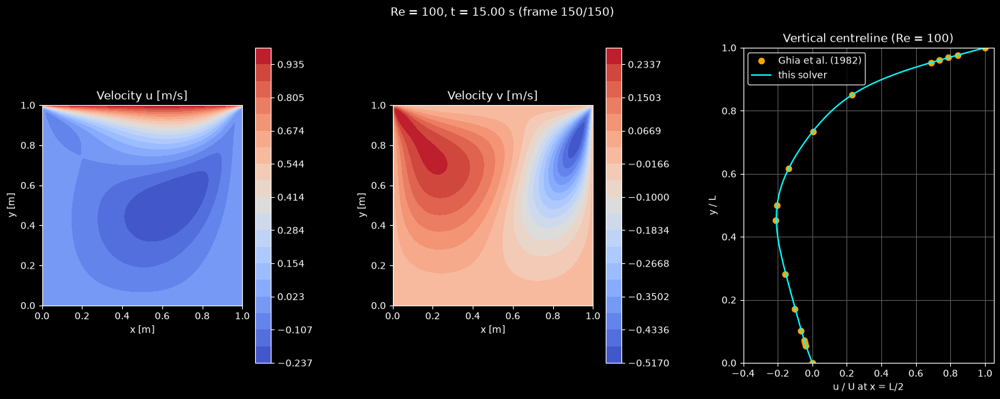

# Lid-Driven Cavity Flow Simulation

This script solves the 2D incompressible Navier-Stokes equations for flow in a square cavity driven by a moving lid at a Reynolds number of 100 and animates the velocity field. It uses an explicit projection method with central differences on a collocated 129 × 129 grid, and an optional panel compares the vertical-centreline velocity with the benchmark of Ghia, Ghia & Shin (1982). A video of an earlier version of the animation is on YouTube: [](https://youtube.com/shorts/mOMWcGnXtFQ)

## Overview

- **Problem**: unit square cavity ($L = 1$ m) with the top wall moving at $U = 1$ m/s and $\nu = 0.01$ m²/s, so $Re = UL/\nu = 100$. The fluid starts at rest.
- **Grid**: 129 × 129 collocated nodes (`N_POINTS`), the same resolution as Ghia et al.
- **Scheme**: forward-Euler predictor with second-order central differences, a pressure Poisson equation solved with 50 Jacobi sweeps per step, then a velocity correction.
- **Animation**: filled contours of $u$ and $v$ with Matplotlib `FuncAnimation`. Each frame advances 100 time steps of $\Delta t = 10^{-3}$ s, and the default 150 frames reach $t = 15$ s, when the flow is close to steady.
- **Validation** (`--compare-ghia`): adds a third panel with $u/U$ along $x = L/2$ against Table I of Ghia et al. (1982) for $Re = 100$, and prints the maximum and RMS differences every frame.

## Mathematical Background

### Governing Equations

$$\frac{\partial \mathbf{u}}{\partial t} + (\mathbf{u}\cdot\nabla)\mathbf{u} = -\frac{1}{\rho}\nabla p + \nu\nabla^2\mathbf{u}, \qquad \nabla\cdot\mathbf{u} = 0$$

### Projection Method

Each time step has three stages:

$$\mathbf{u}^* = \mathbf{u}^n + \Delta t\left[-(\mathbf{u}^n\cdot\nabla)\mathbf{u}^n + \nu\nabla^2\mathbf{u}^n\right]$$

$$\nabla^2 p = \frac{\rho}{\Delta t}\nabla\cdot\mathbf{u}^*$$

$$\mathbf{u}^{n+1} = \mathbf{u}^* - \frac{\Delta t}{\rho}\nabla p$$

The velocity boundary conditions are applied to both $\mathbf{u}^*$ and $\mathbf{u}^{n+1}$.

### Boundary Conditions

- Lid ($y = L$): $u = U$, $v = 0$. Other walls: $u = v = 0$.
- Pressure: $\partial p/\partial n = 0$ on all four walls. This fixes $p$ only up to a constant, so the mean of $p$ is subtracted after every sweep.

### Discretization

With grid spacing $h = L/128$:

$$\left.\frac{\partial f}{\partial x}\right|_{i,j} \approx \frac{f_{i+1,j}-f_{i-1,j}}{2h}, \qquad \nabla^2 f_{i,j} \approx \frac{f_{i+1,j}+f_{i-1,j}+f_{i,j+1}+f_{i,j-1}-4f_{i,j}}{h^2}$$

The Jacobi sweep for $\nabla^2 p = b$ is

$$p_{i,j}^{(k+1)} = \frac{1}{4}\left(p_{i+1,j}^{(k)}+p_{i-1,j}^{(k)}+p_{i,j+1}^{(k)}+p_{i,j-1}^{(k)} - h^2 b_{i,j}\right)$$

and starts from the pressure of the previous time step.

### Stability of the Explicit Scheme

With $\Delta t = 10^{-3}$ s all the usual limits are satisfied:

- Diffusion: $\nu\,\Delta t/h^2 = 0.16 \le 1/4$.
- Advection: the Courant number is $U\,\Delta t/h = 0.13 \le 1$, and $\Delta t \le 2\nu/U^2 = 0.02$ s for central differences with forward Euler.
- Cell Reynolds number: $Uh/\nu = 0.78 < 2$, so the central-difference advection term does not produce wiggles.

## Implementation

- `central_difference_x`, `central_difference_y` and `laplace` evaluate the stencils above on interior nodes.
- `apply_boundary_conditions` imposes the no-slip and lid velocities.
- `solve_pressure_poisson` runs `N_PRESSURE_POISSON_ITERATIONS` Jacobi sweeps with zero-gradient pressure walls and removes the mean.
- `time_step` performs the predictor, pressure solve and correction for one `TIME_STEP`.
- `centreline_u` extracts $u/U$ on the column $x = L/2$ and interpolates it to the Ghia et al. $y/L$ values. These are nodes of the same 129-point grid, rounded to four decimals.
- `main` parses the flags, builds the figure with `draw_contour`, and advances `STEPS_PER_FRAME` steps per animation frame.
- Physical and numerical constants (`LID_VELOCITY`, `KINEMATIC_VISCOSITY`, `DENSITY`, `TIME_STEP`, `N_FRAMES`) are at the top of the file. Changing `KINEMATIC_VISCOSITY` changes $Re$, and the Ghia data are only valid for $Re = 100$.

The 50 Jacobi sweeps do not fully converge the pressure within a single step during the start-up transient. The warm start carries the iteration over from step to step, so the pressure converges as the flow approaches steady state.

## Usage

```bash
python main.py                    # interactive animation, 150 frames (t = 15 s)
python main.py --compare-ghia     # add the centreline comparison with Ghia et al. (1982)
python main.py --steps 50         # shorter run: 50 frames (t = 5 s)
python main.py --no-show --output . --steps 150 --compare-ghia   # save the final frame as a PNG
```

`--steps N` sets the number of animation frames. Each frame is 100 time steps.

## Output



The figure shows the flow at $t = 15$ s:

- **$u$ contours** (left): the thin shear layer under the lid and the return flow in the lower half of the cavity.
- **$v$ contours** (right): upflow near the left wall and downflow near the right wall, which together form the primary clockwise vortex.
- **Centreline profile** (third panel, `--compare-ghia`): the computed $u/U$ at $x = L/2$ against Ghia et al. (1982). At $t = 15$ s the largest difference over the 17 tabulated points is 0.004 and the RMS difference is 0.002. These numbers stop changing at the third decimal place after about $t = 12$ s.

## Related Notes

- [Lid-driven cavity project with OpenFOAM and benchmark data](../../../practice/manual_projects/lid_driven_cavity.md)
- [Navier-Stokes equations](../../../notes/fluid_mechanics/governing_equations/navier_stokes.md)
- [Finite difference discretization](../../../notes/numerical/fdm/discretization.md)
- [Numerical stability](../../../notes/numerical/cfd/numerical_stability.md)
