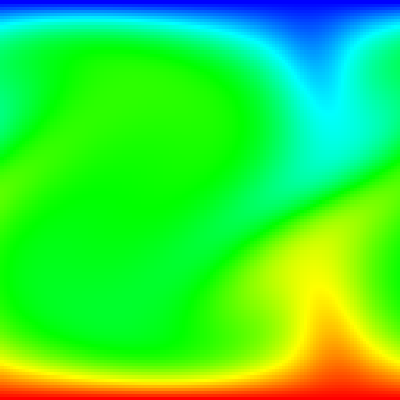

# Rayleigh-Bénard Convection Simulation

This script simulates Rayleigh-Bénard convection, the buoyancy-driven flow in a fluid layer heated from below and cooled from above, and draws the temperature field in real time with Pygame. It solves the 2D Boussinesq equations in vorticity-streamfunction form on a 128 × 128 grid at $Ra = 10^5$ and $Pr = 1$. A video of an earlier version is on YouTube: [](https://youtube.com/shorts/E_N-ld6Vfwo)

## Overview

- **Physics**: 2D Boussinesq fluid in free-fall units with $Ra = 10^5$ (`RAYLEIGH`) and $Pr = 1$ (`PRANDTL`).
- **Domain**: unit height and unit width, periodic in $x$, with no-slip isothermal walls at $T = 1$ (bottom) and $T = 0$ (top).
- **Initial state**: fluid at rest with the linear conduction profile $T = 1 - z$, plus seeded Gaussian noise of amplitude 0.01 that triggers the instability.
- **Streamfunction**: the Poisson equation is solved exactly each step with an FFT in $x$ and a discrete sine transform in $z$.
- **Time stepping**: forward Euler with first-order upwind advection and central-difference diffusion. The time step is capped by an advective Courant number of 0.4.
- **Display**: a 400 × 400 Pygame window updated every 20 time steps, with a blue → cyan → green → yellow → red colour map for $T \in [0, 1]$. On exit the script prints the elapsed time and the Nusselt number.

## Mathematical Background

### Rayleigh and Prandtl Numbers

$$Ra = \frac{g\beta\,\Delta T\,H^3}{\nu\kappa}, \qquad Pr = \frac{\nu}{\kappa}$$

where $g$ is the gravitational acceleration, $\beta$ the thermal expansion coefficient, $\Delta T$ the temperature difference across the layer height $H$, $\nu$ the kinematic viscosity and $\kappa$ the thermal diffusivity. For a layer between rigid plates, convection starts above $Ra_c \approx 1708$.

### Boussinesq Equations in Free-Fall Units

Lengths are scaled with $H$, velocities with $U_f = \sqrt{g\beta\Delta T H}$, times with $H/U_f$ and temperatures with $\Delta T$. In two dimensions $(x, z)$, with vorticity $\omega = \partial w/\partial x - \partial u/\partial z$ and streamfunction $\psi$:

$$\frac{\partial T}{\partial t} + \mathbf{u}\cdot\nabla T = \frac{1}{\sqrt{Ra\,Pr}}\,\nabla^2 T$$

$$\frac{\partial \omega}{\partial t} + \mathbf{u}\cdot\nabla \omega = \sqrt{\frac{Pr}{Ra}}\,\nabla^2 \omega + \frac{\partial T}{\partial x}$$

$$\nabla^2\psi = -\omega, \qquad u = \frac{\partial \psi}{\partial z}, \qquad w = -\frac{\partial \psi}{\partial x}$$

The buoyancy term $\partial T/\partial x$ spins up vorticity wherever hot and cold fluid sit side by side, so hot fluid rises and cold fluid sinks.

### Boundary Conditions

- $T = 1$ at $z = 0$ and $T = 0$ at $z = 1$.
- $\psi = 0$ on both walls, so there is no flow through them.
- No slip is imposed through Thom's formula for the wall vorticity, $\omega_{\text{wall}} = -2\psi_1/\Delta z^2$, where $\psi_1$ is the streamfunction one node inside the wall.

### Discretization and Stability

- Advection uses first-order upwind differences and diffusion uses the 5-point Laplacian, both advanced with forward Euler.
- The time step is $\Delta t = \min\left(2\times10^{-3},\; 0.4 / (\max|u|/\Delta x + \max|w|/\Delta z)\right)$.
- The explicit diffusion limit $\sqrt{Pr/Ra}\,\Delta t\,(2/\Delta x^2 + 2/\Delta z^2) \le 1/2$ allows $\Delta t \le 2.4\times10^{-3}$.

### Nusselt Number

The Nusselt number is the heat flux through the bottom wall relative to pure conduction:

$$Nu = -\left\langle \frac{\partial T}{\partial z}\right\rangle_{z=0}$$

The script evaluates it with a second-order one-sided difference. $Nu = 1$ means no convection.

## Implementation

- `initialize_fields` builds the conduction profile, adds seeded noise (`SEED`, `NOISE_AMPLITUDE`) and sets $\omega = 0$. Arrays are indexed `[j, i]` with `j = 0` at the bottom wall.
- `poisson_eigenvalues` and `solve_streamfunction` invert the discrete Laplacian exactly with `scipy.fft` (FFT in $x$, DST-I in $z$).
- `velocities`, `upwind_advection` and `laplacian` evaluate the spatial operators.
- `time_step` solves for $\psi$, chooses $\Delta t$, applies Thom's wall vorticity, advances $T$ and $\omega$, and resets the wall temperatures.
- `nusselt_number` computes $Nu$ at the bottom wall.
- `value_to_color` and `draw_grid` convert the temperature array to an RGB surface, with the hot wall drawn at the bottom of the window.
- `main` handles the flags, runs `STEPS_PER_FRAME` time steps per frame, and always calls `pygame.quit()` on exit.

## Usage

```bash
python main.py                                     # run until the window is closed
python main.py --steps 500                         # stop after 500 frames (t = 20)
python main.py --no-show --output . --steps 1000   # headless, save a screenshot at t = 40
```

`--steps N` sets the number of frames. Each frame is 20 time steps of at most 0.002 free-fall times. Convection starts at roughly $t \approx 15$, which is about 375 frames.

## Output



The screenshot shows the temperature field after 1000 frames ($t = 40$ free-fall times):

- **Thermal boundary layers** at the bottom (red) and top (blue) walls.
- **Plumes**: a hot plume rising from the bottom wall and a cold plume falling from the top wall, joined by a pair of counter-rotating convection rolls in the periodic domain.
- **Heat transport**: the run prints $Nu \approx 4.0$, compared with $Nu = 1$ before convection starts.

First-order upwind advection adds numerical diffusion. Treat the Nusselt number as qualitative; a quantitative comparison would need a finer grid and a higher-order scheme.

## Related Notes

- [Energy equation and the Boussinesq approximation](../../../notes/fluid_mechanics/governing_equations/energy.md)
- [Governing equations for CFD](../../../notes/numerical/cfd/governing_equations.md)
- [Navier-Stokes equations](../../../notes/fluid_mechanics/governing_equations/navier_stokes.md)
- [Numerical stability](../../../notes/numerical/cfd/numerical_stability.md)
