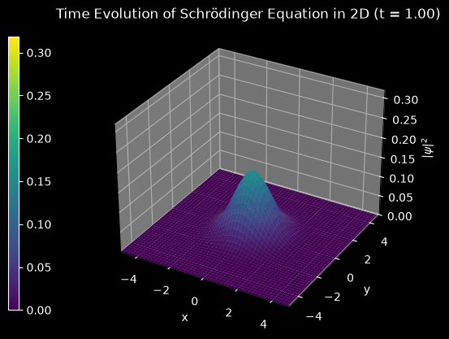

# 2D Schrödinger Equation Simulation

This script solves the time-dependent Schrödinger equation for a free particle in two dimensions with the split-step Fourier method and animates the probability density of the spreading wavepacket as a 3D surface. Watch the demo: [](https://youtu.be/Za9TGx75ElI?si=ikGQMCyG8am8Qyz-)

## Overview

- **Equation**: the 2D time-dependent Schrödinger equation with $\hbar = m = 1$, on a periodic square of side $L = 10$ with 100 × 100 points ($\Delta x = 0.1$).
- **Scheme**: Strang split-step Fourier method: a half kinetic step in Fourier space, a full potential step in real space, then another half kinetic step.
- **Initial state**: a Gaussian wavepacket at rest at the origin, normalised so that $\iint|\psi|^2\,dA = 1$.
- **Potential**: `potential(X, Y)` returns zero everywhere (free particle). Edit it to add a barrier or a well.
- **Animation**: $|\psi|^2$ drawn as a `viridis` 3D surface, with a fixed $z$ range and colour bar. Each frame is 5 time steps of $\Delta t = 0.01$, and the default 20 frames reach $t = 1$.
- **Norm check**: at the end the script prints the total probability and its change from the initial value.

## Mathematical Background

### Schrödinger Equation

$$i\hbar\frac{\partial\psi}{\partial t} = \left(-\frac{\hbar^2}{2m}\nabla^2 + V(x,y)\right)\psi$$

With $\hbar = m = 1$ this becomes $i\,\partial_t\psi = -\tfrac12\nabla^2\psi + V\psi$.

### Initial Wavefunction and Exact Free Evolution

$$\psi_0(x,y) = \frac{1}{\sqrt{\pi}}\,e^{-(x^2+y^2)/2}$$

For $V = 0$ the probability density stays Gaussian and spreads as

$$|\psi(x,y,t)|^2 = \frac{1}{\pi(1+t^2)}\exp\left(-\frac{x^2+y^2}{1+t^2}\right)$$

so the peak falls from $1/\pi \approx 0.318$ to $1/(2\pi) \approx 0.159$ at $t = 1$.

### Strang Split-Step Fourier Method

With $\mathbf{k}$ the discrete wavenumbers from `np.fft.fftfreq` and $k^2 = k_x^2 + k_y^2$, one time step is

$$\tilde\psi \leftarrow \tilde\psi\,e^{-ik^2\Delta t/4}, \qquad \psi \leftarrow \psi\,e^{-iV\Delta t}, \qquad \tilde\psi \leftarrow \tilde\psi\,e^{-ik^2\Delta t/4}$$

where $\tilde\psi$ is the 2D FFT of $\psi$. Each factor has modulus one, so the scheme conserves $\iint|\psi|^2\,dA$ up to round-off. The splitting is second-order accurate in time. For $V = 0$ the kinetic factors commute with the (identity) potential step, and the scheme is exact for the band-limited, periodic problem.

## Implementation

- `make_grid` builds the periodic grid $x_j = -L/2 + j\,\Delta x$, which has no duplicated end point, as the FFT requires.
- `initial_wavefunction` builds the normalised Gaussian. `potential` defines $V$.
- `squared_wavenumbers` returns $k^2$ on the FFT grid.
- `evolve` performs one Strang step.
- `probability_norm` computes $\sum|\psi|^2\,\Delta x^2$.
- `main` parses the flags, draws the surface and colour bar, and advances `SPEED_FACTOR` steps per frame with `FuncAnimation`, or with a plain loop when `--no-show` is given.
- Parameters are module constants: `DOMAIN_LENGTH`, `N_POINTS`, `TIME_STEP`, `FINAL_TIME` and `SPEED_FACTOR`.

## Usage

```bash
python main.py                                   # animate to t = 1 (20 frames)
python main.py --steps 60                        # 60 frames, t = 3
python main.py --no-show --output . --steps 20   # save the final frame as a PNG
```

`--steps N` sets the number of animation frames. Each frame is 5 time steps of 0.01. The domain is periodic, so for long runs ($t \gtrsim 5$) the spreading packet wraps around the edges.

## Output



The final frame shows $|\psi|^2$ at $t = 1$:

- **Spreading**: the wavepacket has widened by a factor $\sqrt2$ and its peak has dropped to about 0.159, half of the initial value. This agrees with the exact solution above to within $2\times10^{-6}$.
- **Norm**: the printed total probability is 1 to within about $10^{-15}$.

## Related Notes

- [Discretization techniques, including spectral methods](../../../notes/numerical/rom/discretization_techniques.md)
- [Finite difference discretization](../../../notes/numerical/fdm/discretization.md)
- [Numerical stability](../../../notes/numerical/cfd/numerical_stability.md)
