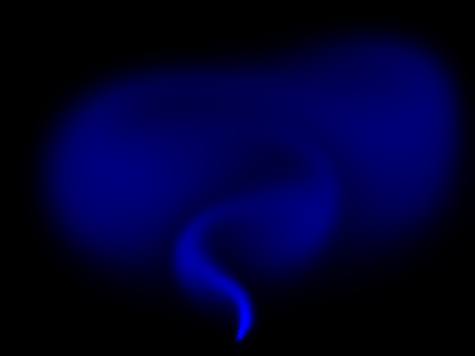

# Simplified Real-Time Fluid Dynamics Simulator

This script is an interactive 2D smoke simulation that uses Jos Stam's Stable Fluids algorithm (1999) to approximate the incompressible Navier-Stokes equations fast enough to run in real time in a Pygame window. The `FluidSimulation` class advances a velocity field and a passive density field on an Eulerian grid inside a closed box, using implicit diffusion, semi-Lagrangian advection and a pressure projection. A short demonstration is on YouTube: [](https://youtube.com/shorts/auwaTfkpIXo)

## Overview

- **Grid**: velocity components $(V_x, V_y)$ and density on a collocated 200 × 150 grid, drawn in an 800 × 600 window with 4 px cells.
- **Diffusion**: implicit (backward Euler) for velocity and density. The linear system is solved with 20 Jacobi iterations.
- **Advection**: semi-Lagrangian back-tracing with bilinear interpolation for velocity and density.
- **Projection**: the velocity is made divergence-free by a pressure Poisson solve (20 Jacobi iterations). It is applied after diffusion and again after advection.
- **Walls**: `set_bnd` enforces solid walls on all four sides.
- **Interaction**: a left click adds 1000 units of density and a random velocity kick of up to ±200 in each component, drawn from a seeded generator. With `--auto-inject`, or automatically with `--no-show`, a swaying plume is injected at the bottom centre every frame instead.
- **Display**: density is drawn in the blue channel as $\min(1000\,\rho, 255)$.

## Mathematical Background

### Governing Equations

$$\frac{\partial \mathbf{u}}{\partial t} = -(\mathbf{u}\cdot\nabla)\mathbf{u} - \nabla p + \nu\nabla^2\mathbf{u}, \qquad \nabla\cdot\mathbf{u} = 0$$

$$\frac{\partial \rho}{\partial t} = -(\mathbf{u}\cdot\nabla)\rho + D\,\nabla^2\rho$$

External sources (mouse clicks or the scripted plume) are added to $\mathbf{u}$ and $\rho$ before each step.

### Implicit Diffusion

$$(\mathbf{I} - \nu\,\Delta t\,\nabla^2)\,\mathbf{u}^{n+1} = \mathbf{u}^n$$

In `diffuse` this becomes the Jacobi update

$$x_{i,j} \leftarrow \frac{x^0_{i,j} + a\,(x_{i-1,j}+x_{i+1,j}+x_{i,j-1}+x_{i,j+1})}{1+4a}, \qquad a = \Delta t\,\nu\,N_x N_y$$

with $N_x, N_y$ the interior grid sizes (Stam's $a = \Delta t\,\nu N^2$ for a square grid of spacing $1/N$). The exact backward-Euler step is unconditionally stable. The system is diagonally dominant, so the fixed 20 Jacobi iterations converge towards it without ever amplifying the solution.

### Semi-Lagrangian Advection

$$q^{n+1}(\mathbf{x}) = q^n\!\left(\mathbf{x} - \Delta t_0\,\mathbf{u}(\mathbf{x})\right), \qquad \Delta t_0 = \Delta t\,N_x$$

The departure point is clamped to the interior and $q^n$ is interpolated bilinearly. The new value is a weighted average of old values, so the step is stable for any $\Delta t$.

### Pressure Projection

With $h = 1/W$ (where $W$ is the grid width), `project` solves

$$\nabla^2 q = \nabla\cdot\mathbf{u}^*$$

by Jacobi iterations of $q_{i,j} = \tfrac14\left(\text{div}_{i,j} + q_{i-1,j}+q_{i+1,j}+q_{i,j-1}+q_{i,j+1}\right)$, where $\text{div}_{i,j} = -\tfrac{h}{2}\left(V_{x,i+1}-V_{x,i-1}+V_{y,j+1}-V_{y,j-1}\right)$. It then corrects the velocity:

$$\mathbf{u} = \mathbf{u}^* - \nabla q$$

Here $q = \Delta t\,p/\rho$ absorbs the time step and density.

### Boundary Conditions (`set_bnd`)

- Horizontal velocity changes sign at the left and right walls, and vertical velocity at the top and bottom walls, so there is no flow through the walls.
- All other quantities have zero normal gradient.
- Each corner is the average of its two neighbours.

## Implementation

- `FluidSimulation.vel_step` runs `diffuse` → `project` → `advect` → `project`, swapping the `Vx0`/`Vy0` scratch arrays as in Stam's reference code.
- `FluidSimulation.dens_step` runs `diffuse` → `advect` for the density, and `step` calls both.
- `add_density` and `add_velocity` inject sources at a grid cell.
- `handle_events` processes window closing and left clicks. `inject_plume` adds the scripted source (`PLUME_DENSITY`, `PLUME_VELOCITY`, `PLUME_SWAY`).
- `draw_simulation` converts the density to a scaled surface.
- `main` parses the flags and runs one solver step per frame.
- Parameters are module constants: `DIFFUSION`, `VISCOSITY`, `TIME_STEP` (0.1), `SOLVER_ITERATIONS`, `CELL_SIZE` and `SCREEN_SIZE`.

## Usage

```bash
python main.py                                    # interactive: left-click to add smoke, runs until closed
python main.py --auto-inject                      # watch the scripted plume in a window
python main.py --no-show --output . --steps 300   # headless, scripted plume, save a screenshot
```

`--steps N` sets the number of frames, with one solver step per frame.

## Output



The screenshot shows the scripted plume after 300 frames:

- **Jet**: a bright, swaying jet rises from the source near the bottom of the box.
- **Smoke clouds**: the smoke rolls up into large vortices and spreads into diffuse clouds as it fills the upper part of the closed box.

Stable Fluids trades accuracy for robustness. Semi-Lagrangian advection and the few Jacobi iterations add strong numerical dissipation and leave a small residual divergence, so the result is visually plausible rather than a quantitative Navier-Stokes solution.

## Related Notes

- [Navier-Stokes equations](../../../notes/fluid_mechanics/governing_equations/navier_stokes.md)
- [Eulerian and Lagrangian descriptions of flow](../../../notes/fluid_mechanics/flow_kinematics/eulerian_lagrangian_flows.md)
- [Direct and iterative solvers](../../../notes/numerical/cfd/direct_and_iterative_solvers.md)
- [Numerical stability](../../../notes/numerical/cfd/numerical_stability.md)
