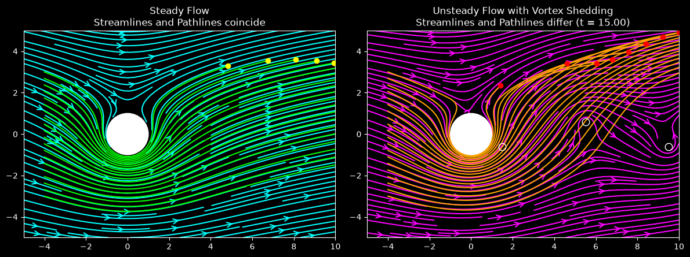

# Steady and Unsteady Pathlines Around a Cylinder with Vortex Shedding

This script compares streamlines and particle pathlines for steady potential flow past a cylinder with circulation and for an unsteady version of the same flow with a kinematic vortex-shedding model. In the steady case the pathlines trace the streamlines exactly. In the unsteady case the shed vortices change the flow while particles travel through it, so pathlines and instantaneous streamlines differ.

## Overview

- **Steady flow**: a uniform stream $U = 1$, a doublet and a counter-clockwise point vortex $\Gamma = 4\pi R U$ around a cylinder of radius $R = 1$. With this circulation the two surface stagnation points merge at the top of the cylinder.
- **Unsteady flow**: the same flow plus point vortices of strength $\mp\Gamma/2$ released alternately above and below the wake at $(1.5R, \pm 0.6R)$. A vortex is released every half shedding period, with the period set by a Strouhal number $St = fD/U = 0.2$ ($T = 10$).
- **Vortex motion**: each shed vortex is convected downstream at $0.8U$ and its strength ramps up over half a period. Image vortices keep the cylinder (approximately) impermeable.
- **Model limits**: this is a kinematic model. Vortex positions and strengths are prescribed and not computed from the Navier-Stokes or vortex-dynamics equations, and the Reynolds number does not appear.
- **Particles**: 20 particles start on the line $x = -4$, $-3 \le y \le 3$, and are advanced with classical RK4 ($\Delta t = 0.05$, 300 steps, $t = 15$). Particles that enter the cylinder are removed.
- **Animation**: two Matplotlib panels. Left: steady streamlines (cyan), pathlines (lime) and particles (yellow). Right: instantaneous streamlines at the current time (magenta), pathlines (orange), particles (red) and the shed vortices (white circles).

## Mathematical Background

### Potential Flow Past a Cylinder with Circulation

In complex form, with $z = x + iy$, the complex velocity is

$$u - iv = U\left(1 - \frac{R^2}{z^2}\right) - \frac{i\Gamma}{2\pi z}$$

In polar coordinates:

$$u_r = U\left(1 - \frac{R^2}{r^2}\right)\cos\theta, \qquad u_\theta = -U\left(1 + \frac{R^2}{r^2}\right)\sin\theta + \frac{\Gamma}{2\pi r}$$

On the surface $u_\theta = 0$ when $\sin\theta = \Gamma/(4\pi R U)$, which equals 1 for $\Gamma = 4\pi R U$. The stagnation points therefore coincide at $\theta = 90^\circ$.

### Shed Vortices and Their Images

Vortex $k$ is released at $t_k = kT/2$ and sits at

$$x_k(t) = 1.5R + 0.8\,U\,(t - t_k), \qquad y_k = \pm 0.6R$$

The upper row ($k$ even) is clockwise and the lower row ($k$ odd) is counter-clockwise. Its strength is

$$\gamma_k(t) = \mp\frac{\Gamma}{2}\min\left(1, \frac{t - t_k}{T/2}\right)$$

Each vortex induces a regularised (core radius $\delta = 0.3R$) velocity

$$u - iv = -\frac{i\gamma_k}{2\pi}\,\frac{\overline{(z - z_k)}}{|z - z_k|^2 + \delta^2}$$

By the circle theorem, an image vortex $-\gamma_k$ at $R^2/\bar z_k$ plus a vortex $+\gamma_k$ at the centre keep the cylinder a streamline for a point vortex. The images are unregularised, so with the regularised core the no-penetration condition holds only approximately. Vortices more than 5 units beyond the right edge of the plot are dropped.

### Streamlines and Pathlines

- A streamline is tangent to the velocity field at a fixed instant: $d\mathbf{x}/ds = \mathbf{u}(\mathbf{x}, t)$ with $t$ held fixed.
- A pathline is the trajectory of a particle: $d\mathbf{x}/dt = \mathbf{u}(\mathbf{x}, t)$.
- The two coincide only when $\mathbf{u}$ does not depend on $t$.

### RK4 Integration

$$\mathbf{k}_1 = \mathbf{u}(\mathbf{x}_n, t_n), \quad \mathbf{k}_2 = \mathbf{u}\left(\mathbf{x}_n + \tfrac{\Delta t}{2}\mathbf{k}_1, t_n + \tfrac{\Delta t}{2}\right), \quad \mathbf{k}_3 = \mathbf{u}\left(\mathbf{x}_n + \tfrac{\Delta t}{2}\mathbf{k}_2, t_n + \tfrac{\Delta t}{2}\right), \quad \mathbf{k}_4 = \mathbf{u}(\mathbf{x}_n + \Delta t\,\mathbf{k}_3, t_n + \Delta t)$$

$$\mathbf{x}_{n+1} = \mathbf{x}_n + \frac{\Delta t}{6}\left(\mathbf{k}_1 + 2\mathbf{k}_2 + 2\mathbf{k}_3 + \mathbf{k}_4\right)$$

## Implementation

- `base_velocity(x, y)` evaluates the steady potential flow and returns NaN inside the cylinder.
- `shed_vortices(t)` returns the positions and strengths of the vortices at time `t`. `vortex_velocity(x, y, vortices)` adds their induced velocity, including the images.
- `steady_velocity` and `unsteady_velocity(x, y, t)` are the two velocity fields.
- `rk4_step` advances all particles at once. `compute_pathlines(velocity, particles, dt, nt)` returns an array of shape `(nt + 1, n, 2)`.
- `draw_panel` draws the cylinder and a streamline plot. `main` precomputes both sets of pathlines, draws the steady panel once, and redraws the unsteady panel for every frame.
- Parameters are module constants: `R`, `U`, `GAMMA`, `STROUHAL`, `VORTEX_STRENGTH`, `SHED_POSITION`, `CONVECTION_SPEED`, `VORTEX_CORE`, `TIME_STEP`, `N_STEPS` and `NUM_PARTICLES`.

## Usage

```bash
python main.py                                    # animate 300 time steps (t = 15)
python main.py --steps 100                        # shorter run (t = 5)
python main.py --no-show --output . --steps 300   # save the final frame as a PNG
```

`--steps N` sets the number of time steps. Each step is one animation frame, and it also sets how far the pathlines are integrated.

## Output



The final frame at $t = 15$ shows:

- **Steady panel**: every lime pathline lies on a cyan streamline. Flow below the cylinder is faster because the counter-clockwise circulation adds to the free stream there, and the streamlines divide at the stagnation point on top.
- **Unsteady panel**: the orange pathlines cross the magenta instantaneous streamlines. They record the flow at earlier times, before the three shed vortices (white circles) had moved to their current positions, so the particle trajectories are deflected differently from the current streamline pattern.

## Related Notes

- [Streamlines, pathlines and streaklines](../../../notes/fluid_mechanics/flow_kinematics/flow_kinematics.md)
- [Potential flow: cylinder with circulation, point vortices and images](../../../notes/fluid_mechanics/inviscid_flow/potential_flow.md)
- [Boundary layers, separation and vortex shedding](../../../notes/fluid_mechanics/viscous_flow/boundary_layers.md)
- [Flow over a cylinder project](../../../practice/manual_projects/flow_over_cylinder.md)
